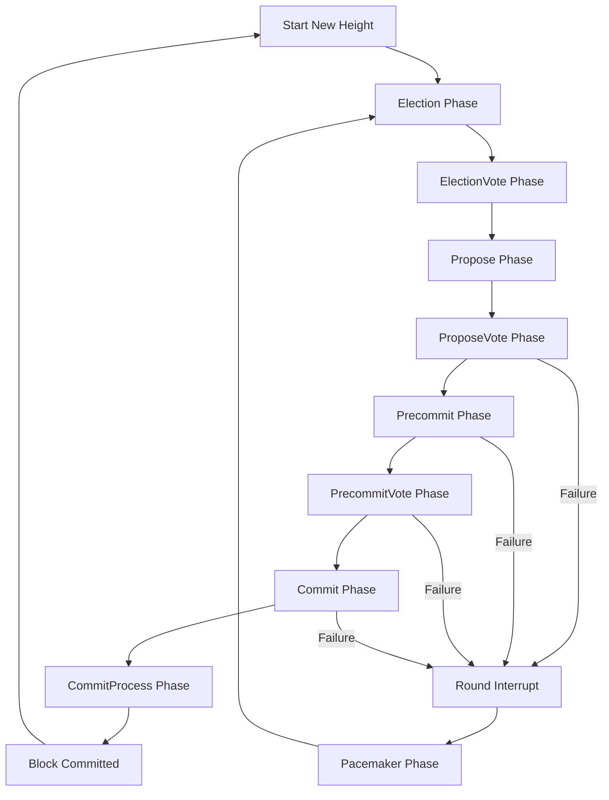

# Byzantine Fault Tolerant (BFT) Package

## What is BFT?

Byzantine Fault Tolerance (BFT) refers to a system's ability to continue operating correctly even when some components fail or act maliciously. The term originates from the Byzantine Generals Problem, a logical dilemma illustrating the challenges of reaching consensus in a distributed system where components may fail or provide misleading information.

In blockchain networks, BFT algorithms enable validators to reach agreement on the state of the ledger despite potential failures or malicious actors. These algorithms ensure that as long as a certain threshold of participants (typically more than two-thirds) behave honestly, the network can maintain both safety (all honest nodes agree on the same values) and liveness (the system continues to make progress).

## What is unique about NestBFT?

NestBFT is an innovative consensus algorithm designed specifically for the Canopy Network's multi-layered architecture. Unlike traditional BFT algorithms, NestBFT is engineered to operate in unreliable peer-to-peer environments, addressing challenges that many modern consensus protocols overlook by assuming network messages arrive without delay. Canopy employs NestBFT for both the base-chain and nested chain layers, creating a hierarchical consensus structure that enables efficient validation across nested chains.

Unlike many modern consensus protocols that assume peer-to-peer network messages arrive without delay, NestBFT is designed for unreliable peer-to-peer environments. It incorporates a novel pacemaker mechanism to address validator coordination challenges while offering immediate safety and finality.

NestBFT utilizes a star communication pattern where validators primarily communicate through a designated leader rather than directly with each other. This approach significantly reduces the number of [messages](msg.md) that need to be exchanged during consensus, resulting in improved scalability. In traditional BFT algorithms with all-to-all communication, the number of messages grows quadratically with the number of validators (O(n²)). With NestBFT's star pattern, message complexity is reduced to linear (O(n)), allowing the system to support larger validator sets without communication overhead becoming prohibitive.

## The Role of NestBFT in the Canopy Blockchain

NestBFT serves as the core consensus engine for the Canopy Network, enabling secure and efficient agreement on the state of both the base chain and nested chains. By providing a unified consensus layer, NestBFT allows validators to participate in multiple chains while reusing the same staked collateral, significantly improving capital efficiency.

The algorithm's design supports Canopy's plugin-based architecture, where validators interact with nested chain nodes through bilateral APIs. This approach offloads state machine operation and block storage to the nested chain software while managing the consensus and peer-to-peer layers at the base-chain level.

NestBFT's resilience against grinding attacks, DDoS, and long-range attacks makes it particularly well-suited for Canopy's multi-chain environment. The protocol's immediate finality property ensures that once transactions are confirmed, they cannot be reversed, providing strong security guarantees for nested chains.

This architecture also facilitates a predefined path for nested chains to eventually graduate to independence, providing flexibility for projects as they mature.

## Processes

### Consensus Phases

NestBFT implements a comprehensive consensus process consisting of eight core phases and two recovery phases. The process begins with leader election using a Verifiable Random Function (VRF) to select candidates, followed by voting to determine the leader. The elected leader then proposes a block, which undergoes multiple rounds of validation and voting by replicas. 

The consensus progresses through propose, precommit, and commit phases, each requiring supermajority agreement from validators. This multi-phase approach ensures both safety and liveness of the network. If errors occur during consensus, the recovery phases—Round Interrupt and Pacemaker—allow replicas to synchronize their state and restart the process, maintaining the network's resilience against failures.

The design prioritizes safety during network partitions and includes mechanisms to prevent malicious leaders from stalling consensus indefinitely. This structured approach enables NestBFT to achieve immediate finality while maintaining robustness in unreliable network conditions.

### Consensus Engine

The NestBFT consensus engine is the central component that orchestrates the entire consensus process. It manages the state machine that transitions through the various consensus phases and coordinates the actions of validators during block production and validation.

The engine maintains the current view of the consensus state, including the current height, round, and phase. It processes incoming messages from other validators, verifies their validity, and updates the consensus state accordingly. When conditions for transitioning to the next phase are met (such as receiving a sufficient number of votes), the engine triggers the appropriate actions.

For leaders, the engine handles proposal creation, [vote collection](vote.md), and quorum certificate generation. For replicas, it manages proposal validation, vote generation, and block commitment. The engine also implements the timeout mechanisms that ensure liveness by allowing the system to progress even when some validators are unresponsive.

### BLS Signatures

BLS (Boneh-Lynn-Shacham) signatures are a cryptographic innovation that NestBFT leverages to achieve significant efficiency improvements over traditional digital signature schemes. Unlike earlier signature algorithms like ECDSA or Ed25519, BLS signatures can be aggregated, allowing multiple signatures to be combined into a single, compact signature that can be verified against the corresponding public keys. This property is particularly valuable in consensus protocols where collecting signatures from many validators is a common operation.

In NestBFT, BLS signatures enable O(1) space complexity for quorum certificates by aggregating individual validator signatures into a single multisignature. This dramatically reduces the size of consensus messages and blockchain storage requirements. The verification process is also more efficient, as a single verification operation can validate the participation of multiple validators. NestBFT implements BLS signature aggregation for all voting phases, allowing the leader to collect individual signatures from validators and combine them into compact proofs of supermajority support.

Key aspects of BLS Signatures:
- Signature aggregation reduces message size and storage requirements
- Enables efficient verification of supermajority support
- Provides non-interactive aggregation without requiring signer coordination
- Maintains cryptographic security while improving performance
- Supports threshold signatures for distributed key generation
- Reduces bandwidth consumption in consensus message exchange

### The [Election](election.md) Process

The Election Process in NestBFT combines Verifiable Random Functions (VRFs) with sortition to achieve a fair, unpredictable, and Sybil-resistant leader selection mechanism. Validators use VRFs to generate provably random values based on their private keys and consensus state. These values serve as lottery tickets, where lower values increase the chance of becoming a leader candidate. The VRF outputs are verifiable by other validators, ensuring that the randomness cannot be manipulated while maintaining deterministic verification.

Sortition in NestBFT refers to the stake-weighted selection process that ensures validators' influence in the leader election is proportional to their staked CNPY tokens. This approach prevents Sybil attacks by making it impossible to gain additional influence by splitting stake across multiple validator identities. If no VRF candidates emerge, the protocol falls back to a stake-weighted pseudorandom selection mechanism that maintains fairness while ensuring liveness. This sophisticated election process provides both unpredictability to prevent targeted attacks and fairness to maintain validator incentives.

Key aspects of the Election Process:
- VRFs provide verifiable, unpredictable randomness for candidate selection
- Stake-weighted sortition ensures influence proportional to economic commitment
- Fallback mechanisms guarantee liveness even when VRF candidates are absent
- Resistance to grinding attacks through unpredictable leader selection
- Efficient verification of election results through cryptographic proofs
- Balance between randomness and determinism for security and predictability
- Sybil resistance through stake-weighted influence

### Quorum Certificates

Quorum Certificates (QCs) in NestBFT are cryptographic proofs that a supermajority of validators has endorsed a specific consensus message. These certificates contain the original message along with an aggregated BLS signature representing more than 2/3 of the total voting power. QCs serve as irrefutable evidence that consensus has been reached at a particular phase, enabling validators to safely progress to subsequent phases.

NestBFT uses QCs at multiple points in the consensus process, including after [proposal validation](prop.md), precommit, and commit phases. Each QC builds upon previous ones, creating a chain of cryptographic evidence that ensures both safety and liveness. When a validator receives a valid QC, it can immediately verify the supermajority support without needing to communicate with other validators. This property enables efficient consensus progression and provides the foundation for NestBFT's immediate finality guarantees.

Key aspects of Quorum Certificates:
- Cryptographic proof of supermajority validator support
- Enables immediate verification of consensus progress
- Chained structure creates auditable consensus history
- Compact representation through BLS signature aggregation
- Prevents conflicting decisions through supermajority requirements
- Facilitates safe view changes during recovery phases
- Provides the foundation for immediate transaction finality

### The Voting Mechanism

The Voting Mechanism in NestBFT enables validators to express their support for [proposals](prop.md) through cryptographic signatures. Each [vote](vote.md) represents a validator's endorsement of a specific [message](msg.md), with the validator's voting power determined by their staked CNPY tokens. The protocol organizes votes by height, round, phase, and payload hash, ensuring that validators only vote on identical proposals. This structure prevents equivocation and maintains consensus integrity.

NestBFT implements a star communication pattern for voting, where validators send their votes to the current leader rather than broadcasting to all participants. The leader aggregates these votes and, upon collecting a supermajority (more than 2/3 of voting power), creates a quorum certificate that proves sufficient support. This certificate is then broadcast to all validators as evidence of consensus progress. This approach significantly reduces network communication overhead while maintaining Byzantine fault tolerance guarantees.

Key aspects of the Voting Mechanism:
- Stake-weighted voting power ensures economic alignment with security
- Cryptographic signatures provide non-repudiable proof of validator support
- Structured vote organization prevents equivocation
- Clear supermajority thresholds for consensus progress
- Efficient verification of voting results through BLS signature aggregation

### Safety and Liveness Mechanisms

NestBFT incorporates sophisticated safety and liveness mechanisms to ensure the protocol maintains correct operation even in challenging network conditions or when facing Byzantine behavior. Safety guarantees that honest validators will never commit conflicting blocks at the same height, preserving the integrity of the blockchain. This is achieved through the locking mechanism, where validators become "locked" on blocks that have received sufficient support, preventing them from voting for conflicting proposals.

Liveness mechanisms ensure that the protocol continues to make progress despite temporary failures or network issues. NestBFT implements timeout-based round changes that prevent a malicious or faulty leader from stalling consensus indefinitely. The Pacemaker phase synchronizes validators to the highest observed round, enabling the protocol to recover from failures and continue making progress. These mechanisms work together to provide a robust consensus system that prioritizes safety while maintaining practical liveness under realistic network conditions.

Key aspects of Safety and Liveness Mechanisms:
- Locking mechanism prevents conflicting commits at the same height
- Timeout-based round changes prevent indefinite stalling
- Pacemaker synchronization aligns validators after failures
- View change protocol enables recovery from leader failures
- Prioritization of safety during network partitions
- Practical liveness guarantees under realistic network conditions
- Resistance to various Byzantine attack vectors

## Security Mechanisms

Canopy employs innovative security mechanisms to ensure the reliability and stability of its nested chains. The NestBFT consensus algorithm provides robust protection against various attack vectors through its carefully designed phases and cryptographic techniques.

### Byzantine Fault Tolerance

NestBFT can tolerate up to one-third of validators being Byzantine (malicious or faulty). This means that as long as more than two-thirds of the validators follow the protocol correctly, the system will maintain both safety and liveness.

### Sybil Resistance

The stake-weighted leader election process prevents Sybil attacks by ensuring that influence in the consensus process is proportional to economic stake rather than node count.

### [Double-Signing Prevention](evidence.md)

The protocol includes mechanisms to detect and punish validators who sign conflicting blocks at the same height, protecting against equivocation attacks.

### Fork Prevention

The locking mechanism and quorum certificates ensure that once a block has been certified by a supermajority, no conflicting block can be certified at the same height, preventing blockchain forks.

### DDoS Mitigation

The star communication pattern reduces the attack surface for DDoS attacks by limiting the number of connections each validator needs to maintain.

### [Accountability](evidence.md)

All [messages](msg.md) in NestBFT are signed, creating an audit trail that can be used to identify and punish misbehaving validators.

### Timing Attack Resistance

The protocol includes timeouts and view changes to prevent malicious leaders from stalling consensus indefinitely.

### Network Partition Handling

NestBFT prioritizes safety during network partitions, ensuring that conflicting blocks cannot be committed even if the network is temporarily split.

### Long-Range Attack Prevention

The finality provided by NestBFT prevents long-range attacks that attempt to rewrite history from a point far in the past.

These security features work together to create a robust consensus system that can withstand various attacks while maintaining the integrity and availability of the Canopy blockchain and its nested chains.
