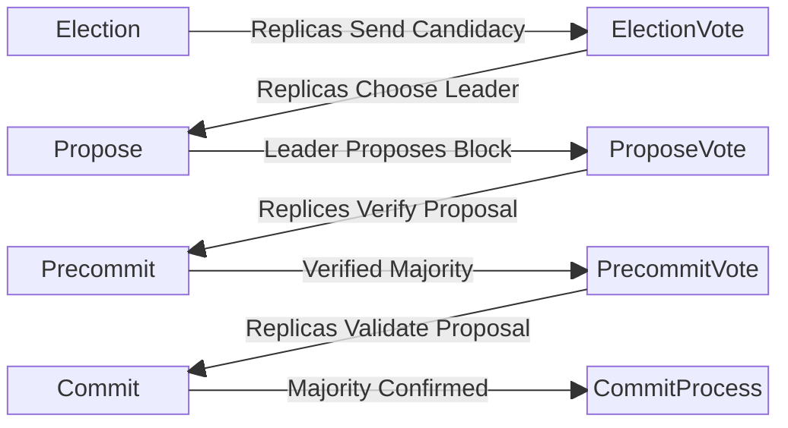
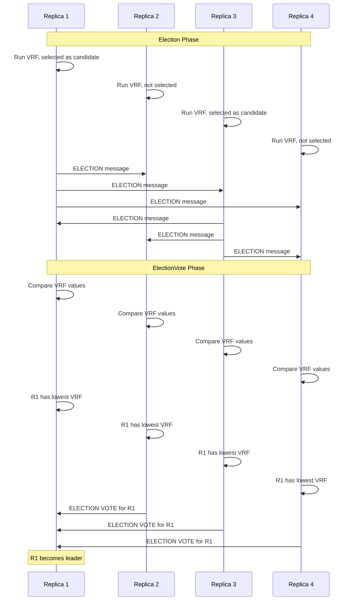
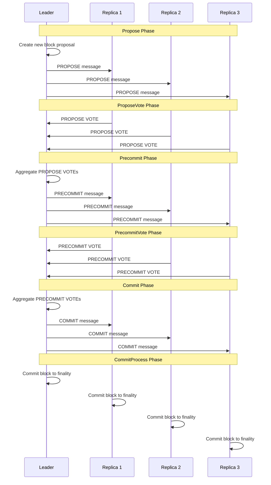
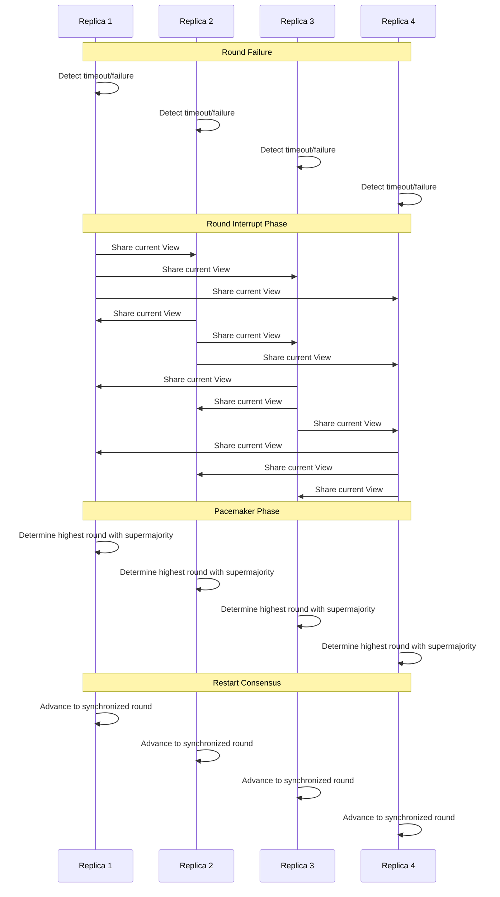

# Documentation for `bft.go`

# Description

## `bft` Type

The `BFT` struct is a critical component in the Canopy project, designed to
implement the NestBFT consensus algorithm and manage the consensus process among
the nodes. This structure is responsible for driving the consensus forward and
ensuring trustless and efficient operation of NestBFT-based blockchains. Here is
a detailed breakdown of its purpose and components:

1. **Consensus State and Management**:
   - The `BFT` struct maintains a `View` of the consensus process, which
     includes key fields such as `Height`, `Round`, and `Phase`. These fields
     track the current period of the consensus, enabling nodes to stay
     synchronized and coordinate the progression through the phases.

2. **Voting and Proposal Handling**:
   - Recording votes received from replica validators and proposals originating
     from leader validators.

3. **Validator and Proposer Information**:
   - The struct contains the public keys of the current proposer and the set of
     validators in the consensus, enabling the verification of message
     authenticity and leader identification for each round.

4. **Quorum Certificates and Locks**:
   - The `HighQC` field stores the highest known quorum certificate for the
     current height, ensuring safety and liveness in the consensus process. The
     node can lock on a proposal to prevent conflicting decisions.

5. **Block and Result Management**:
   - It tracks the current block and its hash, along like rewards and slash
     recipients.

6. **Leader Election and Security**:
   - Coordinates leader elections using sortition seed data and VRF to mitigate
     grinding and DDoS attacks. Additionally, the `VDFService` contributes to
     security by introducing computational delays that safeguard against
     manipulation attempts such as long-range attacks.

7. **Byzantine Fault Tolerance**:
   - Evidence of faulty or malicious validator behavior is collected to
     potentially penalize or exclude them from the consensus process, ensuring
     robustness against Byzantine faults.

8. **Phase Management**:
   - The `PhaseTimer` and its associated methods manage the timing for each
     phase of the consensus, ensuring nodes move forward appropriately after
     waiting the necessary time for messages.

In summary, the `BFT` struct encapsulates the entire state and core logic
required by the NestBFT consensus algorithm. It ensures a secure, efficient, and
fault-tolerant operation of the Canopy blockchain through a comprehensive
approach to consensus management, leader election, fault tolerance, and
security.

## Consensus Phase Overview

The consensus process is broken down into 8 core phases and 2 recovery phases.
Each phase represents the smallest unit of the concensus process. Each round
consists of multiple phases, and each height may consist of multiple rounds.
These phases are executed sequentially and upon successful completion achieve
consensus on the next block.

At the beginning of each new block height the process starts again at the
Election phase and the round is reset to 0. If the a round of consensus fails
the core sequence will exit and execution will jump to the recovery phases.

### Phase Summaries

- **Election:**
  - Each replica runs a Verifiable Random Function (VRF); if selected as a
    candidate, the replica broadcasts an ELECTION messsage accouncing it's
    candidacy.

- **ElectionVote:**
  - After receiving and verifying ELECTION messages, each replica selects a
    leader by sending ELECTION VOTE messages to a candidate. If no candidates exist,
    a stake-weighted pseudorandom selection is used.

- **Propose:**
  - Should a replica collect at least a super-majority of ELECTION VOTE
    messages, it will act as the leader and propose a new block with a PROPOSE
    message to the replicas.

- **ProposeVote:**
  - Each replica validates the PROPOSE message by verifying the aggregate
    signature. If valid, the replica sends a PROPOSE VOTE message, endorsing
    this proposal.

- **Precommit:**
  - After collecting PROPOSE VOTE messages from majority of replicas, the
    leader sends a PRECOMMIT message including the quorum support for this
    proposal.

- **PrecommitVote:**
  - Each replica validates the PRECOMMIT message by verifying the aggregate
    signature. If valid, the replica sends PRECOMMIT VOTE message to the leader,
    endorsing the aggregate signature.

- **Commit:**
  - The leader collects PRECOMMIT VOTES from +2/3 of the replicas, each
    including a signature from the sender. The leader sends a COMMIT message
    attaching +2/3 signatures from the PRECOMMIT VOTE messages.

- **CommitProcess:**
  - Each replica validates the COMMIT message by verifying the aggregate
    signature. If valid, the replica commits the block to finality and resets
    the BFT for the next height.

The two recovery phases address situations where errors cause a premature exit from a round:

- **Round Interrupt**:
  - In this phase concensus is halted and reset. Each replica shares its current
    View with all other replicas. This allows replicas to synchronize in the
    Pacemaker phase.

- **Pacemaker**:
  - This phase synchronizes each replica to the highest round that a
    super-majority has observed, allowing the consensus process to restart with
    the Election phase.

# Key Concepts


#### View

The `View` field within the `BFT` struct is a component tracking the current
period of the consensus process, defined by `Height`, `Round`, and `Phase`.

The `View` aids in synchronizing validators by providing a consistent reference
point for the current state of the blockchain. It ensures that all validators
are aligned regarding the block height, round, and phase they are operating in.
This alignment allows validators to correctly interpret proposals, cast votes,
and validate the results of the consensus process.

The `View` is included with every message sent between nodes and is required
during the recovery phases, where it is used to synchronize all replicas to
highest round seen by the super-majority of nodes.

#### Super-Majority

A `super-majority` refers to a threshold of agreement among the participating
replicas that is greater than a simple majority. Specifically, it requires more
than two-thirds (+2/3) of the voting power or votes from the replicas to agree
on a proposal or vote to be considered in consensus.

The `super-majority` threshold is applied in various phases of the consensus
process, such as during the ELECTION, PROPOSE, PRECOMMIT, and COMMIT phases,
where the leader collects votes from +2/3 of the replicas to justify consensus
on an election or proposal. This mechanism ensures that the system can function
effectively despite potential faulty or Byzantine nodes.

#### Proposal Locks

Once a proposal is supported by a quorum certificate, replicas will `lock` onto
the proposal. If consensus is not achieved in a specific round, the locked
proposal is preserved for future rounds. This ensures that even if the current
round does not reach consensus, the proposal is not discarded. Instead, it
remains a valid proposal for subsequent rounds. The leader in the next round can
propose this same proposal again, as it already has quorum support.

#### Quorum Certificates

Replicas use the Quorum Certificate (QC) to share important information with
other replicas. This information may include the current view of a replica, a
vote, or a super-majority consensus that validates an action.

Quorum Certificates (QCs) demonstrate that a specified majority of replicas (at
least two-thirds) have verified and agreed on a particular aspect of the
consensus process. These certificates confirm that consensus has been reached
without requiring constant direct communication among all replicas.

# Core Phases

## Election Phase

The election phase utilizes a sortition process in conjunction with a Verifiable
Random Function (VRF) to ensure the selection of leaders is fair, uniform, and
unpredictable. This process relies on unique and non-manipulatable inputs of
seed data, which are crucial in resisting manipulation and providing a robust
defense against potential biases. The use of VRF ensures that the selection
process is both random and publically verifiable.

Validators create a digital signature on the sortition seed data using their
private key. The integer value of this signature is the random component in the
election process. This combined with their voting power, determines their
candidacy.

The stake of a validator influences this process, as a higher stake
increases the probability of becoming a candidate. This stake-weighted method
ensures that validators with larger contributions to the network have a greater
likelihood of selection, aligning the incentives of network participants with
the security and integrity of the blockchain.

#### Sortition Seed Data

The integrity of the sortition seed data is paramount, as any manipulation could
lead to predictable and biased leader selection. By ensuring that the seed data
cannot be manipulated by the previous round's leader, the protocol maintains
fairness and unpredictability in leader selection.

Two seed data fields in particular ensure this integrity, `round` and
`LastProposerAddresses`.

The inclusion of the `round` field in the sortition data helps ensure that the
same leader is not selected in consecutive rounds. This is achieved because the
Verifiable Random Function (VRF) output signature changes with each round,
reducing the probability of repeated leader selection. This mechanism helps
mitigate risks associated with potentially malicious or faulty leaders.

NestBFT distinguishes itself from other protocols by utilizing the
`LastProposerAddresses` field within its sortition seed data. This approach
avoids reliance on manipulable inputs, such as the last block hash, which are
susceptible to bias and grinding attacks. By eliminating these vulnerabilities,
NestBFT ensures a fairer and less predictable leader selection process.

## Election Vote Phase

During this phase, each replica reviews candidate messages from the previous
phase to select a leader. The candidate with the lowest Verifiable Random
Function (VRF) output is chosen as the leader. If no candidate messages are
received, the process defaults to a stake-weighted pseudorandom selection to
ensure a leader is chosen.

Once a replica determines which replica it will vote for, it sends a signed
election vote to that replica. In the subsequent phase, each replica aggregates
the received votes. The replica that receives more than two-thirds of the votes
uses this super-majority to justify acting as the leader.

The signed election vote includes the highest Quorum Certificate (HighQC), the
highest Verifiable Delay Function (HighVDF), and any Byzantine evidence.

## Propose Phase

During this phase the leader is tasked with proposing the next block to the
network. After collecting the necessary election votes to justify their role as
leader, the elected replica either unlocks a previously locked proposal or
creates a new one.

If a locked proposal exists from a previous round, the leader uses that proposal
as the next proposal. If no lock is found, the leader constructs a new block
proposal. The leader pulls transactions from the mempool and validates the VDF,
mitigating long-range attacks.

The proposal includes the new block and associated results (reward and slash
recipients). The leader then distributes the proposal, backed by the aggregate
signature proving the quorum accepts this proposer as the leader.

## Propose Vote Phase

The PROPOSE VOTE phase involves several steps where replicas validate the
proposal put forward by the leader. Each replica follows a systematic approach
to ensure the proposal's validity:

1. **Proposal Validation**: Each replica receives the PROPOSE message from the
   leader and must validate it by checking the aggregate signature. This step
   confirms that the leader's role is justified by having received votes from at
   least 2/3 of the replicas.

2. **Proposal Unlock**: If a locked proposal exists for the current height, the
   replica must apply the safe node predicate conditions to decide whether it is
   safe to unlock and use the received proposal.

3. **State Application and Verification**: Replicas process the proposed block
   using their state machines, confirming that both the header and results match
   those in the original proposal. This guarantees that the replica has achieved
   the same outcomes as the leader, allowing the replica to consider the
   proposal valid.

4. **Signature Voting**: If the proposal is deemed valid, the replica sends a
   signature to the leader, endorsing the validity of this proposal. In the next
   phase the leader will collect these votes from replicas to establish
   consensus on this proposal.

## Precommit Phase

In the Precommit Phase, the leader's objective is to verify that the proposed
block has the support of a super-majority of replicas. The leader gathers
propose votes from more than two-thirds of the replicas, each vote accompanied
by a signature from the sender. This collection of votes serves as evidence that
a super-majority of the quorum believes the proposal is valid.

Once the leader has collected the necessary votes, a PRECOMMIT message is sent
to all replicas. This message includes the aggregate signature derived from the
propose votes, which serves as justification that the proposal has achieved
super-majority consensus approval.

## Precommit Vote Phase

In the PRECOMMIT-VOTE phase of the NestBFT consensus algorithm, each replica is
tasked with verifying the PRECOMMIT message. This involves ensuring that the
proposal comes from the expected proposer and that it is the expected proposal.

The replicas achieve this by validating the aggregate signature contained within
the PRECOMMIT message. In addition, if the aggregate signature is valid each
replica will `lock` the proposal, allowing some optimization for error recovery.

Once the PRECOMMIT message is verified, each participating replica sends a vote
back to the leader, signalling this replica has endorsed the consensus behind
the proposal.

## Commit Phase

During the COMMIT phase of the NestBFT consensus algorithm, the leader collects
PRECOMMIT VOTES from more than two-thirds (i.e., +2/3) of the replicas. Each of
these votes includes a signature from the sender, which the leader then uses to
construct a COMMIT message. This message attaches the +2/3 signatures from the
PRECOMMIT VOTE messages, which serves as justification that a super-majority of
the quorum believes the proposal is valid.

Once the leader has prepared the COMMIT message, it is sent to all validators.
Upon receiving the COMMIT message, each replica validates it by verifying the
aggregate signature provided. If the validation is successful, each replica will
then commit the block to finality.

## Commit Process Phase

The COMMIT PROCESS phase each replica verifies the aggregate signature included
in the COMMIT message to ensure that it is from the expected proposer and that
the proposal is valid. Once the aggregate signature is verified, the proposal
signifies that +2/3 of the quorum agrees that a super-majority believes the
proposal is valid.

Upon successful verification, the block is gossiped throughout the network and
committed to the local store. This step finalizes the block within the chain at
the current height. Following the commitment, the replicas then reset the BFT
process for the next block height, restarting the consensus process at round 0 and the Election phase.

# Recovery Phases

## Round Interrupt

The ROUND INTERRUPT phase occurs in response to a failure in the BFT cycle,
resulting in a premature exit from a round. This leads to the initiation of a
new round and an extension of the sleep time between phases. This extended sleep
time aims to mitigate any async network issues that may have arisen during the
current round.

Furthermore, this round sends a pacemaker message to all other replicas. This
message includes a Quorum Certificate that contains the current View's header,
allow the pacemaker round to synchronize all replicas.

## Pacemaker

After the ROUND INTERRUPT phase, the PACEMAKER phase begins. In this phase, each
replica evaluates the views exchanged during the previous phase to determine the
highest round observed by a super-majority. The replicas then transition to this
round. The PACEMAKER phase reinitializes the consensus process and synchronizes
the replicas, ensuring they operate within the same round recognized by a
super-majority.

Once the Pacemaker phase is complete, the consensus process restarts at the
Election phase, electing a new leader and potentially unlocking a proposal that
was locked in this round.

# Phase Times and Total Block Time

In NestBFT, block times are managed by setting the duration for each phase in the `config.json` file. The initial phase time configurations are as follows:

```json
{
  "electionTimeoutMS": 2000,
  "electionVoteTimeoutMS": 2000,
  "proposeTimeoutMS": 3000,
  "proposeVoteTimeoutMS": 3000,
  "precommitTimeoutMS": 2000,
  "precommitVoteTimeoutMS": 2000,
  "commitTimeoutMS": 2000,
  "commitProcessMS": 3000
}
```

Each phase duration can be modified to suit the application's requirements. The
total block time is the aggregate of all phase durations. To extend the overall
block time without changing individual phase durations, you can increase the
`commitProcessMS`. This method allows for control over the total block time
without modifying existing phase times.

# Locking & Safe Node Predicates

During the precommit vote phase, replicas will lock onto a proposal that has
been verified by the leader as having the majority vote behind it.

Should a round interrupt occur, the consensus process will reset to the election
phase, with replicas retaining the locked proposal. During the next propose
phase, this locked proposal will be used as the proposal for the round.

In the propose vote phase, replicas will recognize that they still have a locked
proposal and will run the safe node predicate check to determine if they can
unlock. It is safe to unlock the proposal if:

- **SAFETY**: The block hash and result hash for the locked proposal and the
  received proposal are the same.
- **LIVENESS**: The round number in the received proposal is higher than that in
  the locked proposal.

# NestBFT Sequence Diagrams



### Leader Election Process



### Block Proposal and Commitment



### Recovery Process


