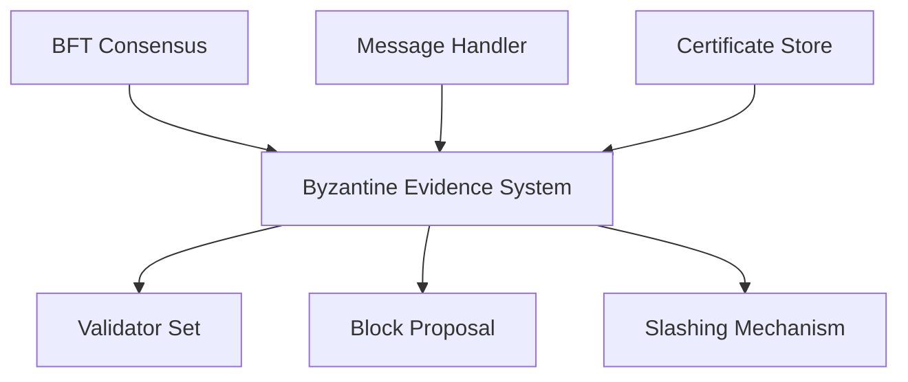

# evidence.go - Byzantine Fault Detection and Evidence Handling

This file implements mechanisms for detecting and handling Byzantine behavior in the Canopy blockchain's consensus protocol. It focuses on identifying validators who violate protocol rules, particularly those who "double sign" by voting for conflicting proposals in the same consensus round.

## Overview

The Byzantine evidence system is designed to:

- Detect validators who sign contradictory messages for the same consensus view
- Collect and validate evidence of protocol violations
- Process evidence to identify specific validators who should be penalized
- Prevent duplicate evidence from being processed multiple times
- Support historical evidence validation for past consensus rounds
- Identify nodes not participating correctly in the consensus process
- Track PartialQCs (Quorum Certificates with insufficient signatures) as evidence of potential faulty behavior

Byzantine behavior detection is critical for blockchain security as it allows the network to identify and penalize validators who attempt to compromise consensus safety.

## Core Components

### ByzantineEvidence

The central structure that collects evidence of Byzantine behavior during consensus. It primarily contains:

- DoubleSignEvidences: A collection of evidence showing validators signing contradictory messages
- Mechanisms to validate that proposed slashing actions match the actual evidence

Double signing is a serious violation where a validator signs two different messages for the same consensus view, potentially allowing conflicting blocks to be finalized and breaking blockchain safety.

### DoubleSignEvidence

This component represents proof that validators have signed contradictory messages. It contains:

- Two conflicting votes (VoteA and VoteB) signed by the same validator(s)
- Validation logic to ensure the evidence is legitimate
- Checks to prevent processing of expired or invalid evidence

The system can detect double signing in two main scenarios:
1. When a leader sends a PartialQC (insufficient signatures) that conflicts with a valid QC
2. When a leader candidate receives election votes from validators who also voted for the true leader

### Evidence Collection and Processing

The system includes mechanisms for:

- Adding new evidence to the collection with deduplication
- Processing evidence to extract the identities of Byzantine validators
- Validating evidence against the current validator set
- Ensuring evidence hasn't expired (is not too old)
- Checking that slashing proposals match the actual evidence

Evidence collection happens continuously as nodes observe the network, with special attention to partial quorum certificates and election votes where double signing is most likely to be detected.

## Component Interactions

The Byzantine evidence system interacts with several other components:

- The BFT consensus engine provides the context in which evidence is collected
- The validator set is used to verify signatures and identify Byzantine actors
- Evidence is included in block proposals to be processed by the network
- The message handler feeds potential evidence to the system
- Valid evidence triggers the slashing mechanism
- The certificate store provides historical certificates for comparison

## Security Mechanisms

The evidence system implements several security features:

1. **Evidence expiration**: Old evidence is rejected to prevent replaying ancient violations
2. **Deduplication**: Prevents the same evidence from being processed multiple times
3. **Comprehensive validation**: Multiple checks ensure evidence is legitimate before penalties are applied
4. **Partial QC tracking**: Identifies potential Byzantine behavior even when it doesn't result in immediate consensus failures
5. **Cross-validation**: Ensures that proposed slashing actions match the actual evidence

These mechanisms ensure that only legitimate evidence leads to penalties, protecting honest validators from false accusations while allowing the network to identify and respond to actual Byzantine behavior.
