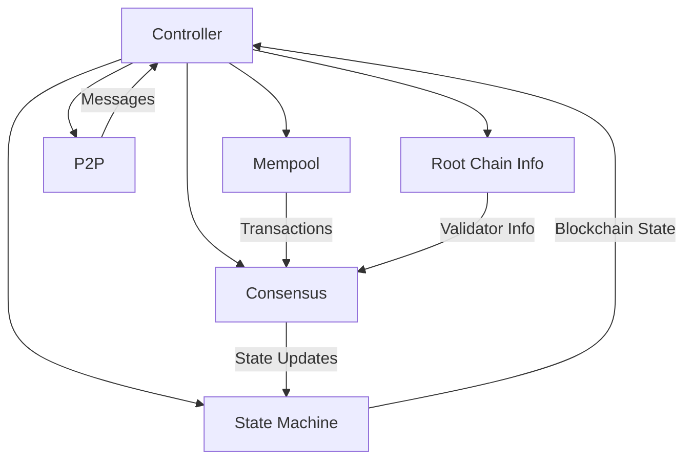

# Package Controller

The Controller package serves as the central coordination hub for a Canopy blockchain node. It
orchestrates the interactions between various system components and manages the node's lifecycle
from initialization through operation to shutdown.

## Overview

The Controller acts as a "bus" between the core modules of the Canopy blockchain:

- Blockchain state management (FSM)
- Transaction processing and mempool
- Byzantine Fault Tolerant (BFT) consensus
- Peer-to-peer networking
- Root chain interactions

This package is responsible for ensuring these components work together seamlessly to maintain
blockchain consensus, process transactions, and communicate with peers and parent chains.

## Core Components

### Controller Structure

The Controller contains references to all major subsystems and coordinates their interactions:

- Node identity (address, keys)
- Configuration settings
- Core blockchain components (FSM, Mempool, Consensus, P2P)
- Root chain management
- Synchronization status

### Block Processing System

The block processing system handles how blocks are:

- Received and validated from the network
- Created during the proposal phase
- Committed to the blockchain
- Distributed to other nodes

This system ensures all nodes maintain consensus on the blockchain state through BFT consensus.

### Consensus Management

The consensus management system:

- Synchronizes nodes with the current blockchain state
- Routes consensus messages between validators
- Manages validator committees
- Handles block requests and responses
- Reports on consensus status

### Transaction System

The transaction system:

- Processes locally generated transactions
- Validates incoming transactions from peers
- Maintains the mempool of pending transactions
- Gossips valid transactions to peers
- Tracks failed transactions for reporting

### Certificate Result System

The Certificate Result system handles the post-consensus outcomes:

- Calculates reward distributions to network participants
- Processes cross-chain swap orders
- Manages slashes for Byzantine behavior
- Creates checkpoints for cross-chain verification
- Tracks chain lifecycle status

## Security Features

The Controller implements several security measures:

- Thread safety through mutex locks and atomic operations
- Byzantine Fault Tolerance for consensus security
- Reputation system to penalize malicious or faulty peers
- Rate limiting to prevent DoS attacks
- Message signing and verification
- VDF iteration verification to prevent unsafe forks
- Cross-chain checkpointing for long-range attack prevention

## Usage

The Controller is the primary entry point when initializing a Canopy blockchain node. After
configuration and initialization of the core components `(FSM, P2P, etc.)`, the Controller's
`Start()` method begins node operation, which continues until `Stop()` is called.

## Related Components

The Controller interacts closely with several other major Canopy components which in turn interact
with each other at various levels:

- **FSM (Finite State Machine)**: Maintains blockchain state and processes transactions
- **BFT (Byzantine Fault Tolerance)**: Manages consensus between validators
- **P2P (Peer to Peer)**: Handles network communication between nodes
- **Crypto**: Provides cryptographic primitives for security operations
- **Store**: Persists blockchain data to disk storage

Together, these components form a complete blockchain node capable of participating in the Canopy network.
