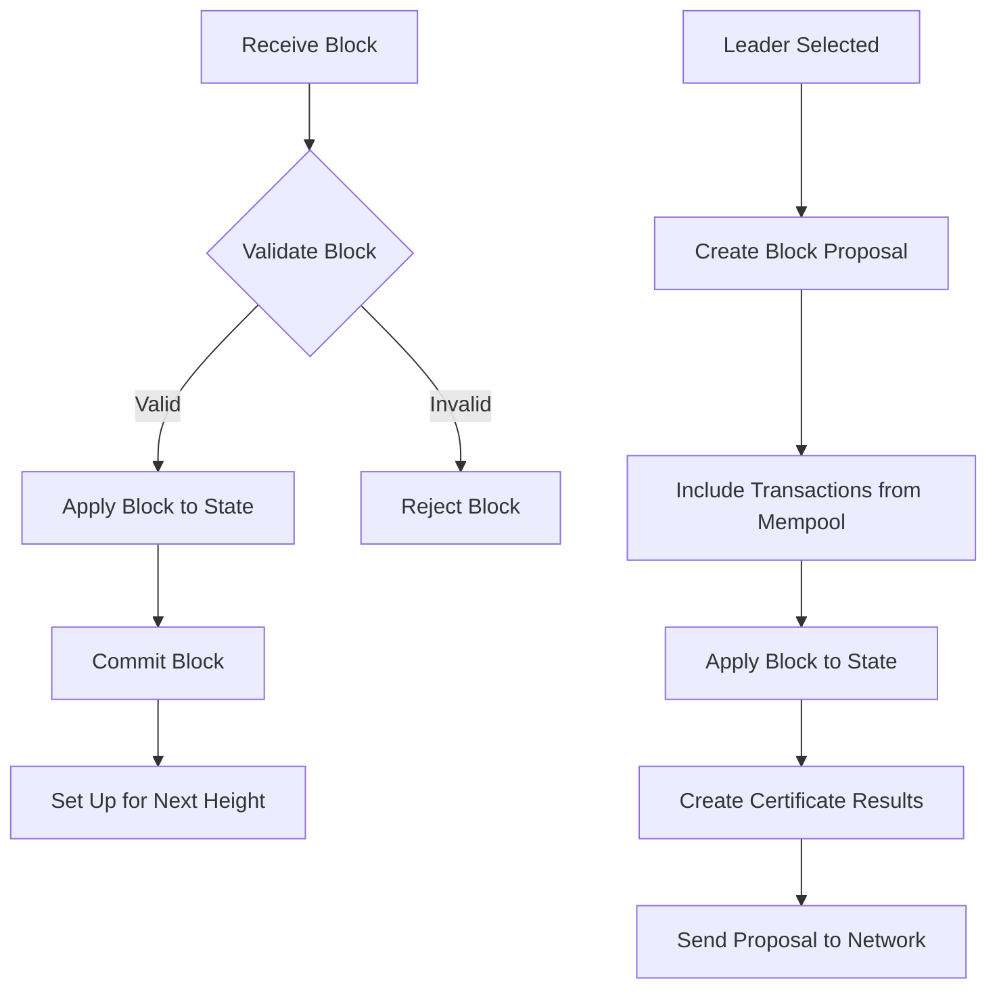
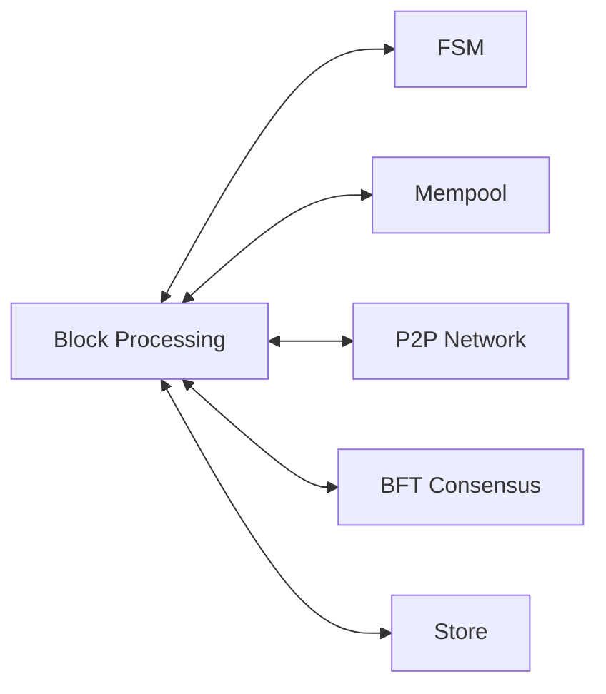

# block.go - Block Processing and distribution

This file contains the high-level functionality for block processing, proposal creation, and
consensus management in the Canopy blockchain. It handles how blocks are received, validated,
proposed, and committed to the blockchain.

## Overview

The block.go file implements important blockchain operations including:

- Listening for and processing incoming blocks from the network
- Creating and validating block proposals
- Committing finalized blocks to the blockchain
- Gossiping blocks to other nodes in the network
- Managing the consensus process

## Core Components

### Block Listener

The block listener continuously monitors the network for incoming block messages. When a new block
is received, it:

- Validates the block to ensure it follows network rules
- Processes the block if valid
- Gossips the block to other peers in the network
- Handles synchronization if the node falls out of sync with the network

### Block Proposal System

The proposal system is responsible for creating new blocks when a node is selected as a leader. It:

- Collects transactions from the mempool
- Creates a block with valid transactions
- Applies the block against the state machine to generate results
- Produces certificate results that include rewards, slashes, and other consensus information
- Prepares the block for validation by other nodes

### Block Validation

When a node receives a block proposal, it must validate it before accepting it. The validation
process:

- Checks the basic structure of the block
- Verifies the block against the current state
- Ensures the block's results match what would be produced locally
- Validates any Byzantine fault evidence included in the proposal
- Confirms the block follows all consensus rules

### Block Commitment

Once a block has been validated by a quorum of validators (a supermajority of two-thirds of the network), it can
be committed to the blockchain. The commitment process:

- Applies the block to the state machine
- Indexes the block and its transactions
- Removes the block's transactions from the mempool
- Atomically writes all changes to the database
- Sets up the controller for the next block height

### Certificate Management

Certificates are cryptographic proofs that a block has been validated by a quorum of validators. The
system:

- Creates certificates for valid blocks
- Validates certificates from other nodes
- Uses certificates to finalize blocks
- Handles certificate results which include rewards and penalties

## Processes

## Component Interactions

The block processing system interacts with several other components:

- Finite State Machine (FSM): Applies blocks to the state and validates transactions
- Mempool: Provides transactions for new blocks and removes committed transactions
- P2P Network: Receives and sends blocks to other nodes
- BFT Consensus: Manages the Byzantine Fault Tolerant consensus process
- Store: Persists blocks and state changes to the database

## Security Features

The block processing system includes several security features:

- Byzantine Fault Tolerance: Can tolerate up to 1/3 of nodes being malicious
- Reputation System: Penalizes peers that send invalid blocks
- Verifiable Delay Functions (VDF): Provides unpredictable but verifiable randomness
- Checkpoints: Protects against long-range attacks during synchronization
- Quorum Certificates: Ensures blocks are only committed when validated by a supermajority of
  two-thirds of the network
- Committee Validation: Ensures only authorized validators participate in consensus
