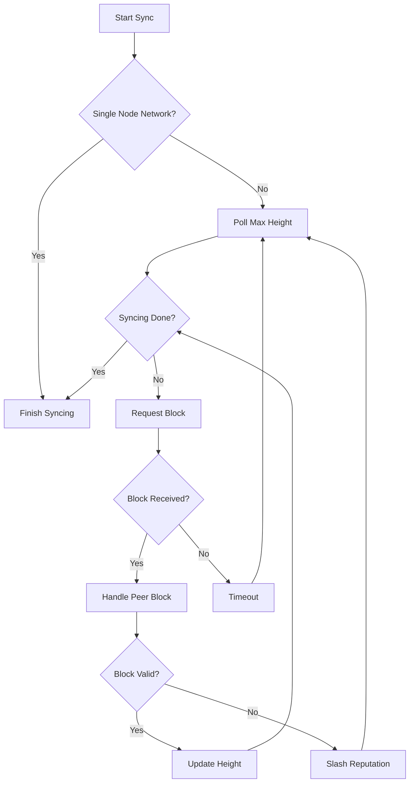
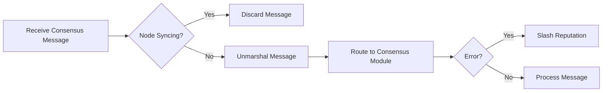

# consensus.go - Blockchain Synchronization and Consensus Management

This file contains the high-level functionality for maintaining agreement on blocks in the Canopy
blockchain. It handles synchronization with peers and manages consensus messaging between
validators.

## Overview

The consensus.go file is responsible for:

- Synchronizing a node with the current blockchain state
- Managing consensus message routing between validators
- Handling block requests and responses
- Maintaining connections with committee members
- Providing status information about the consensus process

## Core Components

### Synchronization System

The synchronization system allows nodes to catch up with the current blockchain state. When a node
falls behind or joins the network, it:

1. Polls peers to determine the current maximum height and VDF iterations
2. Requests blocks one at a time from peers
3. Verifies each block by checking if the certificate was signed by a 2/3 majority
4. Commits valid blocks to the state machine
5. Continues until it reaches the maximum peer height

The system includes safeguards against malicious peers by tracking reputation and validating VDF iterations to prevent unsafe forks.

### Consensus Message Routing

This component handles the routing of consensus messages between validators in a committee. It:

- Listens for incoming consensus messages
- Routes messages to the appropriate internal handlers
- Signs outgoing messages before transmission
- Sends messages to specific validators or the current proposer

The system distinguishes between sending to self (internal routing) and sending to peers (via P2P
network).

### Block Request Handling

This component manages block requests from syncing peers:

- Listens for incoming block requests
- Rate-limits requests to prevent DoS attacks
- Retrieves requested blocks from local storage
- Sends block responses back to requesters

It includes reputation management to penalize peers that exceed rate limits or send invalid requests.

### Committee Management

The system maintains connections with committee members:

- Updates the P2P module with the current validator set
- Ensures connections to all validators in the committee
- Determines if the node is operating in a single-node network
- Manages the transition between syncing and consensus participation

### Status Reporting

Provides detailed information about the current consensus state:

- Current view and phase
- Syncing status
- Block and result hashes
- Proposer information
- Vote counts and status

This information is useful for monitoring and debugging the consensus process.

## Processes

### Blockchain Synchronization Process

### Consensus Message Flow

## Security Features

The file implements several security measures:

- Reputation management to penalize malicious or faulty peers
- Rate limiting to prevent DoS attacks on block requests
- VDF iteration verification to prevent unsafe forks
- Message signing to ensure authenticity
- Timeout handling to prevent stalling during synchronization
- Validation of block certificates to ensure 2/3 majority consensus

These security features help maintain the integrity of the blockchain by protecting against various
attack vectors and ensuring that only valid blocks are added to the chain.
