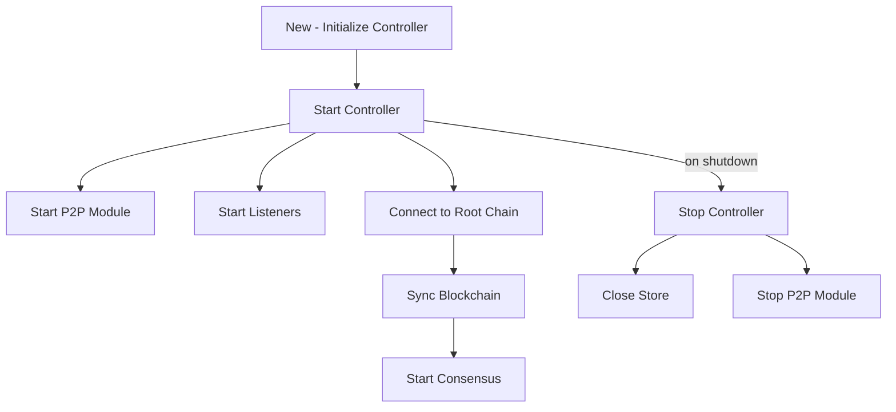
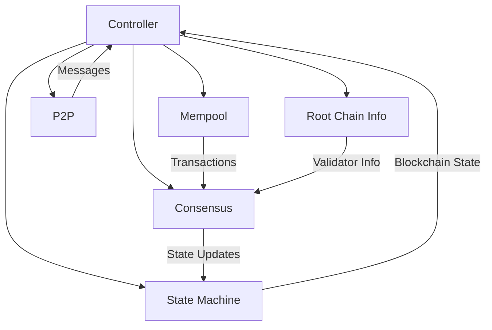

# controller.go - Node Management and Coordination

The Controller package serves as the central coordination point for a Canopy blockchain node. It
manages the interactions between various modules and orchestrates the node's lifecycle.

## Overview

The Controller acts as a "bus" or manager between different components of a Canopy blockchain node,
including:

- Blockchain state management
- Transaction processing
- Consensus mechanisms
- Peer-to-peer networking
- Root chain interactions

It handles initialization, startup, operation, and shutdown of a node, ensuring all components work
together harmoniously.

## Core Components

### Controller Structure

The Controller is the central management entity for a Canopy node. It contains references to all
major subsystems and coordinates their interactions. Key elements include:

- Node identity (address, public/private keys)
- Configuration settings
- Core blockchain components
- Root chain information
- Synchronization status

### State Machine (FSM)

The Finite State Machine (FSM) is responsible for maintaining and updating the blockchain state. It
processes transactions, applies state transitions, and ensures the integrity of the blockchain. The
Controller interacts with the FSM to:

- Query blockchain parameters
- Load certificates and block data
- Access governance parameters
- Retrieve validator information

### Mempool

The Mempool holds pending transactions that haven't yet been included in a block. It serves as a staging area for transactions before they're processed by the consensus mechanism and added to the blockchain.

### Consensus

The consensus module (BFT - Byzantine Fault Tolerance) manages the agreement process between
validators. It ensures that all nodes in the network reach agreement on the state of the blockchain,
even in the presence of faulty or malicious nodes.

### P2P Networking

The P2P module handles all network communication between nodes. It manages connections to peers,
message routing, and data synchronization. The Controller uses P2P to:

- Send and receive transactions
- Request and share blocks
- Exchange consensus messages
- Synchronize with the network

### Root Chain Integration

The Controller maintains a connection to the "root chain" (a parent blockchain that the current
chain may depend on). It retrieves important information like:

- Validator sets
- Order books
- Lottery winners
- Double-signing validation

## Processes

### Node Lifecycle

### Message Handling

The Controller sets up listeners for different types of messages:

- Transaction messages
- Block requests
- Consensus messages

Each message type is handled in a separate goroutine, allowing for concurrent processing, although
each message is processed sequentially with the use of locks to ensure consistency.

## Component Interactions

## Security Features

The Controller implements several security measures:

- Thread safety through mutex locks
- Atomic operations for synchronization status
- Secure handling of cryptographic keys
- Validation of messages from the network
- Verification of validator legitimacy
- Double-signing detection and handling

The Controller also manages the connection to the root chain, which provides additional security
through cross-chain validation of important parameters like validator sets.
