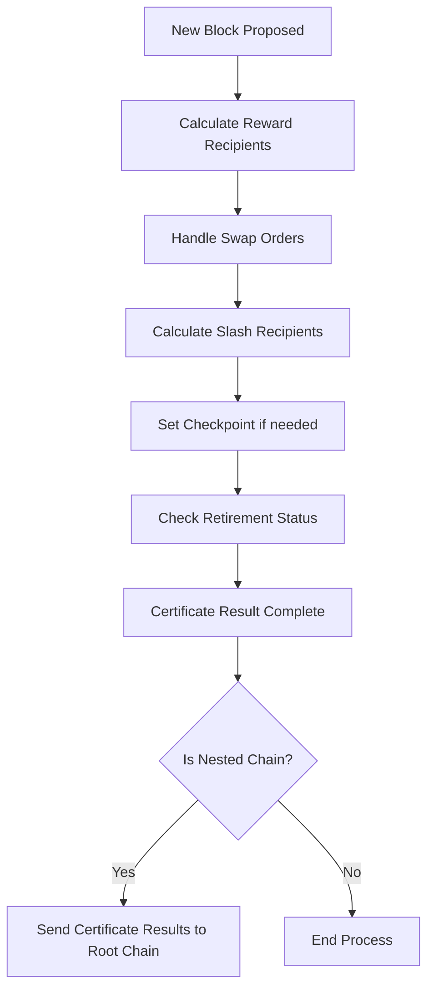
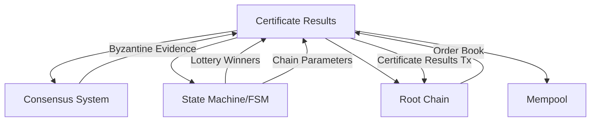

# result.go - Certificate Result Management

This file implements the Certificate Result logic for the Canopy blockchain, which handles the
distribution of rewards, processing of swaps, and management of slashes within the blockchain
network.

## Overview

The Certificate Result system is designed to handle:

- Calculation and distribution of block rewards to various participants
- Processing swap orders between chains
- Managing slashes for Byzantine behavior
- Creating checkpoints for cross-chain verification
- Handling chain retirement status

## Core Components

### Certificate Results

The central concept in this file is the Certificate Result, which is a data structure that captures
the outcome of a successful consensus round. It contains information about:

- Who receives rewards and in what percentages
- Which validators should be slashed for Byzantine behavior
- Swap orders that need to be processed
- Checkpoint information for cross-chain verification
- Chain retirement status

### Reward Distribution

The reward distribution system allocates block rewards to different participants in the network:

- The block proposer initially gets 100% of the rewards
- Delegates receive a cut from the proposer's allocation
- In nested chains, additional participants (nested validators and delegates) also receive portions
- The system ensures that no participant can receive more than what's available

### Cross-Chain Communication

This file handles important aspects of cross-chain communication:

- Certificate Results are sent to the root chain when a nested chain completes consensus
- Swap orders are processed between chains
- Checkpoints are created periodically to verify the state of nested chains on their root chain

### Byzantine Fault Tolerance

The system includes mechanisms to handle Byzantine behavior:

- Double-signing evidence is processed to identify malicious validators
- Slashing information is included in the Certificate Results to penalize Byzantine actors
- This helps maintain the security and integrity of the consensus process

### Chain Lifecycle Management

The file includes functionality to manage the lifecycle of chains:

- Periodic checkpoints are created to record the chain's state
- The system can mark a chain as "retired" based on consensus parameters
- This allows for orderly chain retirement when necessary

## Processes

The Certificate Result creation process follows these steps:

## Component Interactions

The Certificate Results system interacts with several other components:

## Security Features

The Certificate Results system includes several security features:

- Validation of reward distributions to prevent over-allocation
- Processing of Byzantine evidence to identify and slash malicious validators
- Truncation of lock orders to prevent spam attacks
- Cross-chain verification through periodic checkpoints
- Proper error handling to ensure system stability even when components fail
