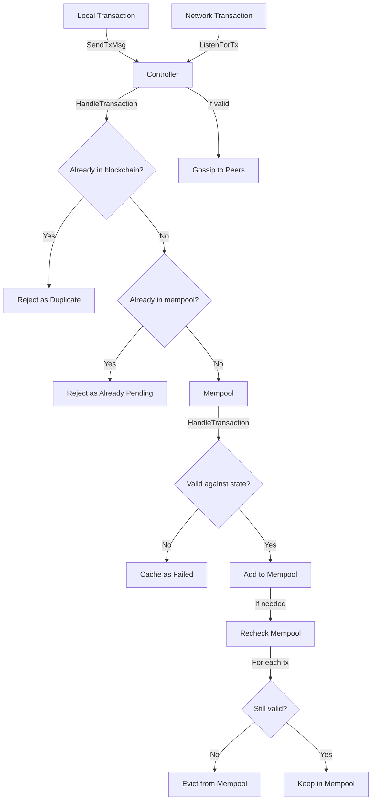
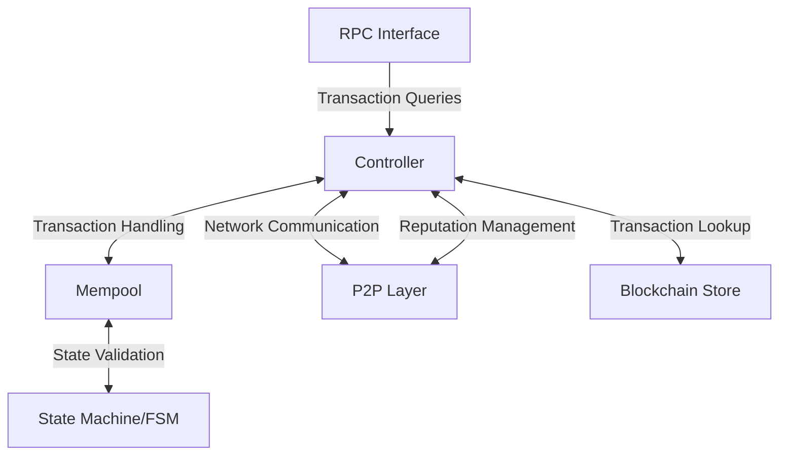

# tx.go - Transaction Processing and Memory Pool Management

This file implements the logic for transaction sending, handling, and memory pooling in the Canopy
blockchain. It's a critical component that manages how transactions flow through the network and are
stored before being included in blocks.

## Overview

The transaction handling system is designed to:

- Process locally generated transactions
- Listen for and validate incoming transactions from the network
- Maintain a memory pool (mempool) of valid transactions
- Gossip valid transactions to peers
- Track failed transactions for reporting
- Prioritize transactions based on fees

## Core Components

### Controller

The Controller manages the overall transaction flow in the blockchain. It:

- Sends locally generated transactions to the network
- Listens for incoming transactions from peers
- Validates transactions before adding them to the mempool
- Manages peer reputation based on transaction validity
- Gossips valid transactions to other peers
- Prevents duplicate transaction processing

### Mempool

The Mempool is a temporary storage area for valid but unconfirmed transactions. It:

- Maintains an ordered list of transactions (typically by fee)
- Validates transactions against the current blockchain state
- Evicts invalid transactions when state changes
- Prioritizes transactions with higher fees
- Handles special transaction types (like certificate results)
- Maintains a cache of transaction results for efficient verification
- Tracks failed transactions for reporting purposes

### Transaction Validation

The validation system ensures only valid transactions enter the mempool:

- Checks if transactions already exist in the blockchain
- Verifies transactions against the current state
- Uses an ephemeral copy of the state machine to validate without affecting the main chain
- Rechecks all mempool transactions when necessary
- Evicts transactions that become invalid due to state changes

## Processes

## Component Interactions

The transaction handling system interacts with several other components:

## Security Features

The transaction handling system includes several security measures:

- Reputation system for peers that penalizes those sending invalid transactions
- Duplicate transaction detection to prevent replay attacks
- Fee-based prioritization to prevent spam
- Transaction validation against current state to prevent invalid state transitions
- Mempool rechecking to ensure only valid transactions remain when state changes
- Caching of failed transactions for monitoring and debugging
- Thread safety through locking mechanisms
