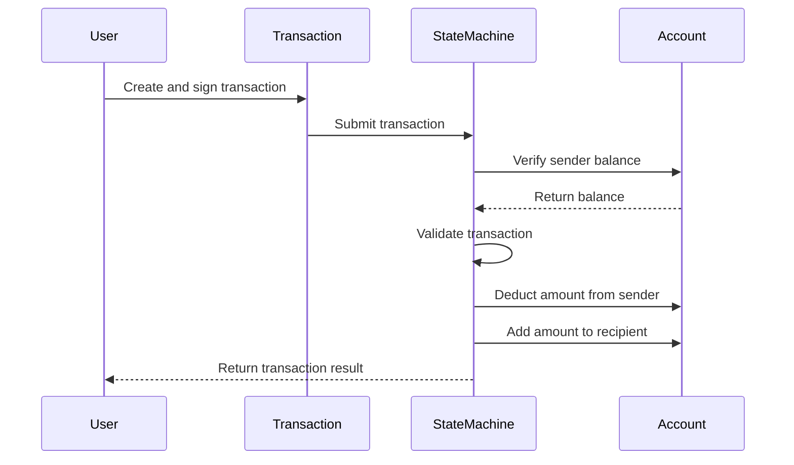
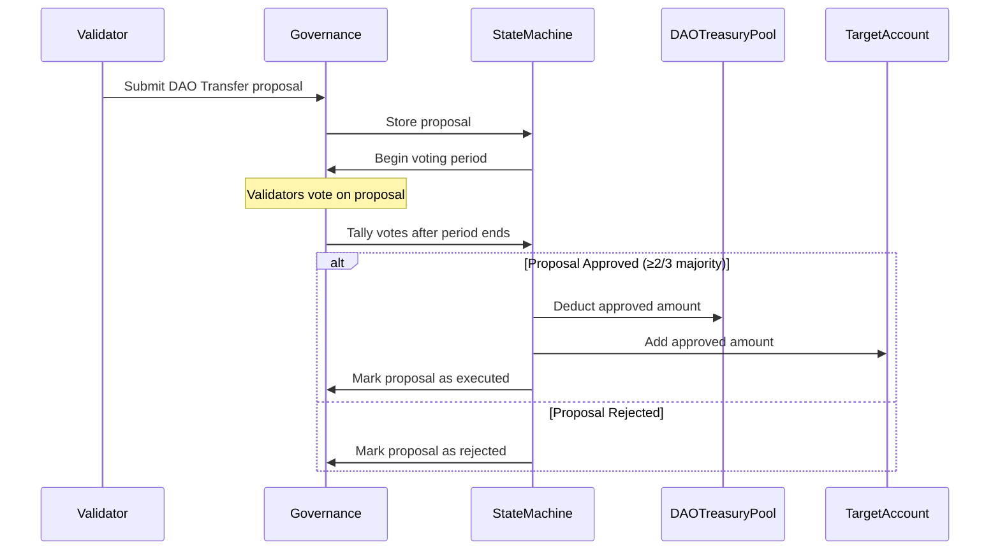
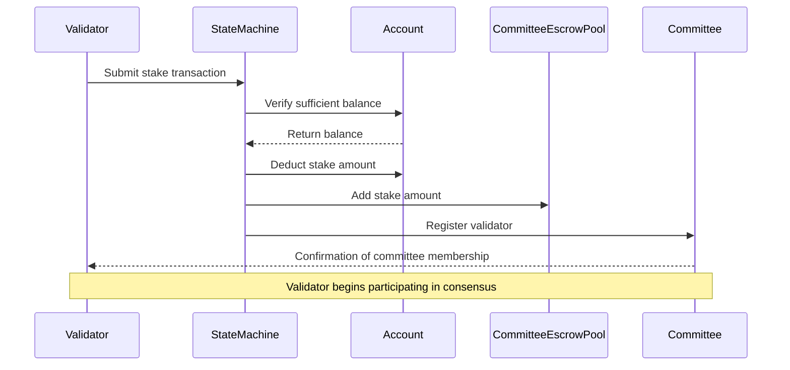
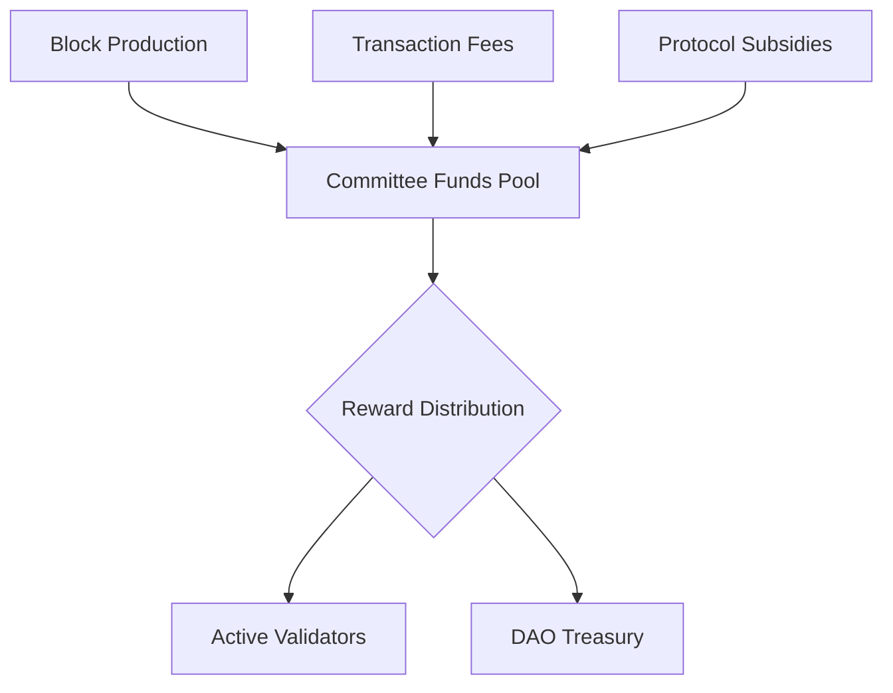

# Finite State Machine (FSM) Package

The FSM package is the core protocol component responsible for maintaining and updating the state of the Canopy blockchain as it progresses. It represents the collective state of all accounts, validators, and other relevant data stored on the blockchain. This document provides a comprehensive overview of the FSM module, its components, and how they interact within the Canopy ecosystem.

The FSM can be best understood as the rules by which the blockchain ledger changes. If you think of transactions as commands and the blockchain database as the ledger, the FSM is the protocol that interprets those commands to change the ledger. It serves as both the entry point and the only mechanism through which the blockchain state can be modified, with the exception of automatic state changes that occur at block boundaries.

## What is a Finite State Machine?

A Finite State Machine (FSM) is a computational model used to represent and control execution flow. It consists of:

1. A finite set of states
2. A finite set of inputs (events)
3. A transition function that maps state-input pairs to states
4. An initial state
5. A set of final states (optional)

In the context of blockchain, an FSM manages the transition from one blockchain state to another as new blocks are added. It ensures that all state transitions follow predefined rules and maintains consistency across the network.

## The Role of FSM in Canopy

In the Canopy blockchain, the FSM module serves as the rules by which the blockchain ledger changes. It is the entry point and the only mechanism through which the blockchain state (ledger) can be modified. The FSM:

1. **State Management**: Maintains the current state of all accounts, validators, and other blockchain data
2. **Transaction Processing**: Validates and applies transactions to modify the state
3. **Rule Enforcement**: Ensures all operations follow the protocol rules
4. **Consensus Support**: Providing the state information needed for consensus mechanisms
5. **Governance Implementation**: Executing governance decisions that affect the blockchain state

The FSM ensures deterministic execution - given the same input (transactions) and starting state, all nodes will arrive at the identical resulting state, which is crucial for blockchain consensus.

## Core Components

### State Machine

The State Machine is the central component of the FSM package, responsible for maintaining and updating the blockchain's state. It tracks and manages the collective state of all accounts, validators, pools, and other relevant data as the blockchain progresses.

The State Machine processes transactions, applies state transitions according to protocol rules, and ensures that all nodes in the network reach consensus on the current state. It serves as the authoritative record of all balances, stakes, and other critical blockchain data.

Every time a new block is added to the blockchain, the State Machine updates its state based on the transactions contained in that block. This ensures that all nodes in the network maintain an identical view of the blockchain's state.

Key aspects of this component include:
- Deterministic execution of state transitions
- Management of the blockchain's global state
- Processing and validation of transactions
- Implementation of protocol rules and constraints
- Support for querying current state information
- Handling of automatic state changes at block boundaries

### Accounts

Accounts are fundamental structures within the Canopy blockchain that hold funds and can participate in transactions. Each account has a unique 20-byte address (derived from a public key for collision resistance) and a balance, similar to a bank account but managed by the blockchain instead of a centralized institution.

Accounts can send and receive the native cryptocurrency through transactions, and their balances are tracked and updated by the State Machine. The address serves as the identifier for the account, allowing the system to route transactions to the correct recipient.

Unlike traditional financial systems, blockchain accounts are pseudonymous - they're identified by cryptographic addresses rather than personal information. This provides a level of privacy while still maintaining transparency of all transactions on the public ledger.

Key aspects of this component include:
- 20-byte addresses for unique identification
- Balance tracking of the native cryptocurrency
- Ability to send and receive transactions
- Cryptographic security through public-private key pairs
- Participation in governance through voting
- Pseudonymous operation on the blockchain

### Pools

Pools are specialized structures similar to accounts but without individual owners. They hold funds that are managed directly by the blockchain protocol according to predefined rules. Unlike accounts which are controlled by private keys, pools operate based on protocol logic and governance decisions.

Each pool has a unique ID rather than an address and serves specific purposes within the Canopy ecosystem. Examples include the DAO Treasury Pool for governance-controlled funds, Committee Funds Pool for validator rewards, and Committee Escrow Pool for staked tokens.

Pools play a crucial role in the tokenomics of Canopy, as they serve as the only destination for newly minted tokens. This design ensures that token distribution follows protocol rules rather than arbitrary decisions.

Key aspects of this component include:
- Unique ID-based identification
- Protocol-controlled fund management
- Specialized purposes like treasury, rewards, and escrow
- Destination for all newly minted tokens
- Governance-controlled distribution mechanisms
- Support for various economic functions of the blockchain

### Committees

Committees are quorums of validators that participate in the Byzantine Fault Tolerant (BFT) consensus process for specific chains within the Canopy ecosystem. They provide shared security services to both the Root-Chain and any Nested Chains they choose to support.

When validators stake tokens for a Committee, they connect with other committee members via the P2P layer. Together, they execute consensus for their assigned chain, producing immediately final blocks. This design allows for specialized security allocation, as validators can choose which chains to secure.

The Root-Chain itself functions as a Nested-Chain, leveraging the network's shared security model. This innovative approach allows validators to secure sub-chains without necessarily validating the Root-Chain itself, creating a flexible security architecture.

Key aspects of this component include:
- Quorums of validators providing BFT consensus
- Shared security across multiple chains
- Validator choice in chain security allocation
- P2P coordination between committee members
- Production of immediately final blocks
- Certificate Result Transactions submitted to the Root-Chain
- Reward distribution for consensus participation

### Validators

Validators are special participants in the Canopy network who stake tokens and run nodes to secure the blockchain. They play a crucial role in the consensus mechanism by validating transactions, producing blocks, and maintaining network security.

Validators can join committees to provide security for specific chains, earning rewards for their participation. They must maintain high uptime and follow protocol rules to avoid being slashed (penalized). Validators can also participate in governance by voting on proposals and polls.

The staking mechanism creates economic incentives for validators to act honestly, as they have financial stake in the network's proper operation. This alignment of incentives is fundamental to the security of proof-of-stake blockchains like Canopy.

Key aspects of this component include:
- Staking tokens as security deposit
- Participation in consensus committees
- Block production and transaction validation
- Earning rewards for network participation
- Risk of slashing for malicious behavior
- Voting rights in governance decisions
- Ability to pause or unstake from the network

### Governance

Governance in Canopy provides mechanisms for on-chain decision-making and protocol evolution. It enables stakeholders to propose, vote on, and implement changes to the blockchain without requiring hard forks.

Canopy implements two distinct governance mechanisms:

1. **Polling**: An on-chain sentiment gathering tool where Accounts and Validators can vote on community proposals. Polls don't execute actions directly but provide valuable feedback on community preferences. They come in two transaction types:
   - StartPoll: Begins an on-chain poll with a specified end block
   - VotePoll: Allows stakeholders to signal approval or disapproval

2. **Proposals**: Formal governance actions that can change parameters or distribute funds. They require approval from two-thirds of the Root-Chain committee's voting power to be finalized. Proposals come in two types:
   - Change Parameter: Updates on-chain governance parameters without software changes
   - DAO Transfer: Distributes treasury funds from the DAO pool to specified accounts

This dual approach allows for both informal community input and formal protocol changes, creating a comprehensive governance system that balances flexibility with security.

Key aspects of this component include:
- On-chain voting mechanisms for community input
- Parameter change capability without software updates
- Treasury fund distribution through governance
- Two-thirds majority requirement for proposal approval
- Separation between sentiment gathering and execution
- Transparent and verifiable voting records
- Governance parameter adjustments "on-the-fly"

### Supply Tracker

The Supply Tracker monitors and manages the total token supply in the Canopy ecosystem. It keeps track of all tokens in circulation, including those held in accounts and pools, ensuring accurate accounting of the blockchain's native cryptocurrency.

This component is essential for maintaining transparency about the token supply and enabling economic analysis of the network. It tracks minting of new tokens, burning of existing tokens, and transfers between accounts and pools.

By maintaining an accurate record of the total supply, the Supply Tracker supports the economic stability of the network and provides crucial information for governance decisions related to monetary policy.

Key aspects of this component include:
- Tracking of total token supply
- Monitoring of token minting and burning
- Accounting for tokens across accounts and pools
- Support for economic analysis and transparency
- Verification of supply-related protocol rules
- Data provision for governance decisions

## Component Interactions

### Transactions Modifying Accounts

When a user initiates a transaction to transfer tokens, the process involves multiple components working together. First, the user creates and cryptographically signs a transaction specifying the recipient address and amount. This transaction is submitted to the State Machine, which verifies that the sender has sufficient balance by checking their account.

If the validation passes, the State Machine updates both the sender's and recipient's accounts, deducting the amount from one and adding it to the other. This state change is recorded in the blockchain, making it permanent and transparent.

The transaction processing ensures atomicity - either the entire transaction succeeds, or it fails completely without partial changes. This maintains the integrity of account balances and prevents issues like double-spending.

### Governance Affecting Pool Distribution

Governance plays a crucial role in managing the distribution of funds from pools. When a validator submits a DAO Transfer proposal to distribute funds from the DAO Treasury Pool, the proposal is stored by the State Machine and enters a voting period.

During this period, validators in the Root-Chain committee cast their votes. After the voting period ends, the State Machine tallies the votes. If the proposal receives approval from at least two-thirds of the voting power, it executes the transfer by deducting the approved amount from the DAO Treasury Pool and adding it to the target account.

This governance-controlled distribution ensures that community funds are allocated according to the consensus of stakeholders, providing transparency and democratic control over shared resources.

### Staking Process for Validators

The staking process enables validators to participate in consensus and earn rewards. When a validator decides to stake tokens, they submit a stake transaction to the State Machine, which verifies they have sufficient balance in their account.

Upon verification, the State Machine deducts the stake amount from the validator's account and adds it to the Committee Escrow Pool. The validator is then registered with their chosen committee and begins participating in the consensus process for that committee's assigned chain.

This staking mechanism creates "skin in the game" for validators, as their staked tokens can be slashed if they behave maliciously. This economic security model aligns validator incentives with the network's health and integrity.

### Reward Distribution System

The reward distribution system in Canopy incentivizes validators to secure the network. Rewards accumulate in the Committee Funds Pool from multiple sources, including transaction fees, block rewards, and protocol subsidies.

At regular intervals, these rewards are distributed to active validators based on their participation and stake. A portion of the rewards may also be directed to the DAO Treasury to fund community initiatives and development.

This economic model ensures that validators are compensated for their service to the network while also building a community treasury for long-term sustainability. The distribution rules are governed by protocol parameters that can be adjusted through governance proposals.

## Conclusion

The FSM package forms the backbone of the Canopy blockchain, managing state transitions and enforcing protocol rules. Its components work together to maintain the integrity and security of the blockchain while enabling flexible governance and economic incentives.

By understanding the FSM and its components, developers can better interact with the Canopy blockchain and build applications that leverage its capabilities. The deterministic nature of the FSM ensures that all nodes in the network reach consensus on the state, providing a reliable foundation for decentralized applications.
