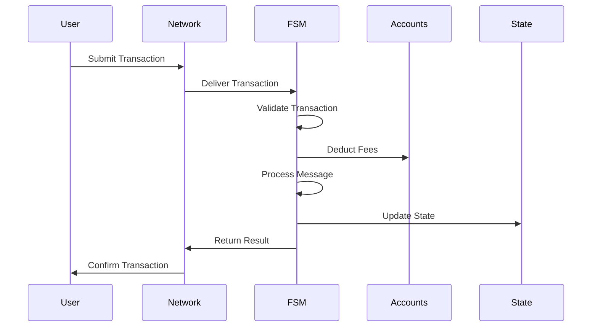
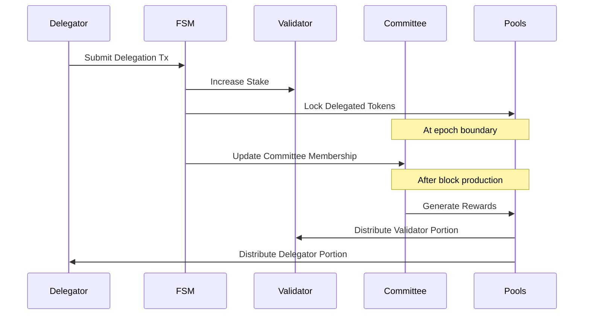
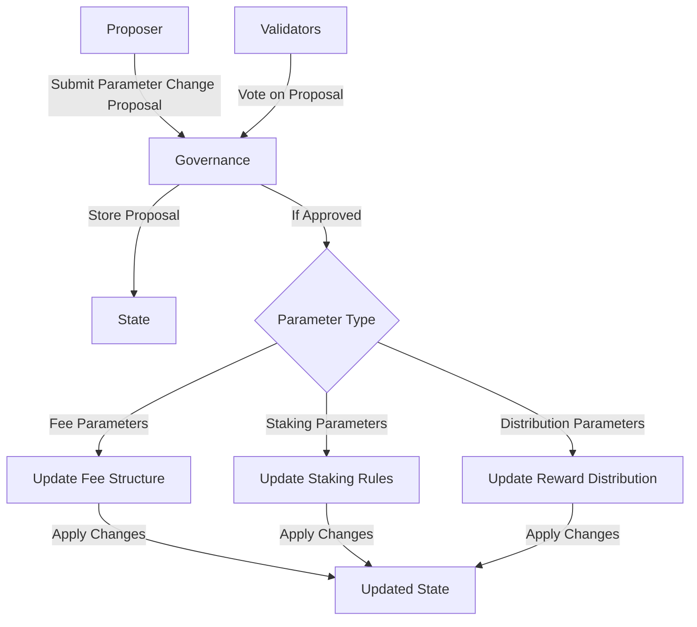
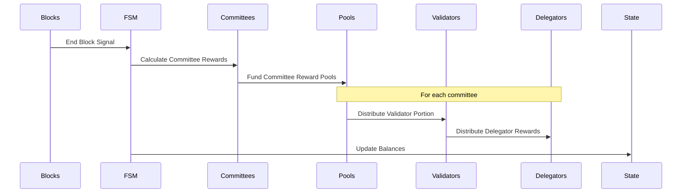

# Finite State Machine (FSM) Package

The FSM package is the core protocol component responsible for maintaining and updating the state of the Canopy blockchain as it progresses. It represents the collective state of all accounts, validators, and other relevant data stored on the blockchain. This document provides a comprehensive overview of the FSM module, its components, and how they interact within the Canopy ecosystem.

The FSM can be best understood as the rules by which the blockchain ledger changes. If you think of transactions as commands and the blockchain database as the ledger, the FSM is the protocol that interprets those commands to change the ledger. It serves as both the entry point and the only mechanism through which the blockchain state can be modified, with the exception of automatic state changes that occur at block boundaries.

## What is a Finite State Machine?

A Finite State Machine (FSM) is a computational model used to represent and control execution flow. It consists of:

1. A finite set of states
2. A finite set of inputs (events)
3. A transition function that maps state-input pairs to states
4. An initial state
5. A set of final states (optional)

In the context of blockchain, an FSM manages the transition from one blockchain state to another as new blocks are added. It ensures that all state transitions follow predefined rules and maintains consistency across the network.

## The Role of FSM in Canopy

In the Canopy blockchain, the FSM module serves as the rules by which the blockchain ledger changes. It is the entry point and the only mechanism through which the blockchain state (ledger) can be modified. The FSM:

1. **State Management**: Maintains the current state of all accounts, validators, and other blockchain data
2. **Transaction Processing**: Validates and applies transactions to modify the state
3. **Rule Enforcement**: Ensures all operations follow the protocol rules
4. **Consensus Support**: Providing the state information needed for consensus mechanisms
5. **Governance Implementation**: Executing governance decisions that affect the blockchain state

The FSM ensures deterministic execution - given the same input (transactions) and starting state, all nodes will arrive at the identical resulting state, which is crucial for blockchain consensus.

## Core Components

### State

The State component is the foundational element of the FSM, representing the collective data of the blockchain at any given point in time. It encompasses all accounts, validators, committees, pools, and other critical information that defines the current status of the blockchain network.

The State component acts as a persistent database that tracks every change to the blockchain's condition. It maintains a record of all account balances, validator stakes, governance parameters, and other essential data points. This comprehensive record allows the blockchain to maintain consistency and integrity across all nodes in the network.

When transactions are processed or blocks are finalized, the State component is updated to reflect these changes. It serves as the source of truth for the entire blockchain, providing a reliable reference point for all operations and queries. The State's integrity is paramount, as any inconsistency could lead to network splits or consensus failures.

Key aspects of this component include:
- Persistent storage of all blockchain data
- Versioning to track changes over time
- Efficient retrieval mechanisms for quick access to data
- Atomicity guarantees for state transitions
- Snapshot capabilities for backup and recovery
- Deterministic execution to ensure network-wide consistency

### Transactions

Transactions are the primary mechanism through which users interact with the blockchain and initiate state changes. They represent user-initiated actions such as transferring tokens, staking, voting on governance proposals, or interacting with smart contracts.

Each transaction in Canopy contains a payload (message), a fee allocation, and cryptographic signatures to verify authenticity. When a transaction is submitted to the network, it undergoes rigorous validation before being included in a block. This validation ensures that the transaction adheres to the protocol rules, the sender has sufficient funds for the operation and fees, and the cryptographic signatures are valid.

Once validated, transactions are processed by the FSM, which interprets the contained messages and applies the corresponding state changes. This processing is deterministic, meaning that given the same transaction and starting state, all nodes will produce identical resulting states. This property is crucial for maintaining consensus across the network.

Key aspects of this component include:
- Cryptographic verification of transaction authenticity
- Fee calculation and deduction mechanisms
- Message interpretation and execution
- Atomic state updates to ensure consistency
- Transaction indexing for historical queries
- Error handling and failure recovery
- Transaction result generation for client feedback

### Accounts

Accounts are fundamental entities within the Canopy blockchain that represent participants in the network. Each account is identified by a unique 20-byte address (160 bits for collision resistance) and maintains a balance of tokens that can be used for various operations.

Accounts serve as the entry point for user interaction with the blockchain. They can send and receive transactions, participate in governance, delegate to validators, and perform other protocol-defined actions. Each account's state is tracked within the FSM, including its balance, transaction history, and any associated metadata.

The account system in Canopy is designed to be flexible and extensible, allowing for different types of accounts with varying capabilities. This design enables the protocol to support a wide range of use cases while maintaining security and consistency.

Key aspects of this component include:
- Unique addressing scheme for account identification
- Balance tracking and management
- Transaction authorization through cryptographic signatures
- Account metadata storage and retrieval
- Support for different account types and capabilities
- Efficient state updates during transaction processing
- Account enumeration and querying capabilities

### Committees

Committees are specialized validator sets responsible for consensus on nested chains within the Canopy ecosystem. They represent groups of validators who have been selected to participate in the Byzantine Fault Tolerant (BFT) consensus process for specific chains.

When a validator stakes tokens, they become eligible to provide shared security services to any Nested Chain they choose. The quorum of validators that participate in the BFT process for a particular nested chain forms a committee. Once staked for a committee, validators connect with other committee members via the P2P layer to execute consensus, producing immediately final nested-chain blocks.

Committees play a crucial role in Canopy's shared security model, allowing multiple chains to benefit from the security provided by a common set of validators. This approach enhances the overall security of the ecosystem while enabling specialized chains to focus on their specific use cases.

Key aspects of this component include:
- Validator selection and committee formation
- Reward distribution for consensus participation
- Committee-specific staking and unstaking mechanisms
- Cross-committee coordination and communication
- Security guarantees through BFT consensus
- Committee membership tracking and updates
- Performance monitoring and accountability measures

### Pools

Pools are specialized account-like structures that hold funds managed directly by the blockchain protocol rather than individual users. Unlike regular accounts, pools don't have an owner with private keys; instead, they have a unique identifier and operate based on predefined blockchain rules.

Pools serve as repositories for protocol-managed funds, such as rewards, treasury allocations, and escrow holdings. They play a crucial role in Canopy's tokenomics by facilitating the controlled distribution of tokens according to protocol rules. Importantly, new tokens are never minted directly to accounts but are first minted to pools and then distributed according to protocol-defined mechanisms.

The pool system enables transparent and predictable token distribution while maintaining protocol security. By separating protocol-managed funds from user accounts, pools provide a clear distinction between user-controlled and protocol-controlled assets.

Key aspects of this component include:
- Protocol-controlled fund management
- Transparent token distribution mechanisms
- Support for different pool types (DAO Treasury, Committee Funds, Committee Escrow)
- Automated distribution based on protocol rules
- Balance tracking and reporting
- Governance-controlled fund allocation
- Integration with reward and incentive systems

### Governance

Governance is the mechanism through which the Canopy blockchain can evolve and adapt over time through community decision-making. Canopy implements two distinct on-chain governance mechanisms: Polling and Proposals.

Polling allows the community to gather sentiment by executing on-chain votes involving both accounts and validators. While polls don't directly execute actions, they serve as valuable tools for gauging community opinion on potential changes or initiatives.

Proposals, on the other hand, enable concrete changes to the blockchain's operation. Canopy supports two types of proposals: Change Parameter proposals that update governance parameters without software changes, and DAO Transfer proposals that distribute treasury funds from the DAO pool to specified accounts. Proposals require approval from two-thirds of the voting power of the Root-Chain committee to be finalized.

This dual governance approach allows for both informal community input and formal protocol changes, creating a balanced system that can respond to community needs while maintaining stability and security.

Key aspects of this component include:
- On-chain voting mechanisms for both polling and proposals
- Parameter change implementation without software updates
- Treasury fund distribution through governance
- Voting power calculation based on stake
- Proposal lifecycle management (submission, voting, execution)
- Governance parameter storage and retrieval
- Voting record maintenance for transparency

### Genesis

The Genesis component defines the initial state of the blockchain at its creation. It establishes the starting point from which all subsequent state transitions occur, setting the foundation for the entire blockchain's operation.

Genesis configuration includes the initial token distribution, validator set, governance parameters, and other critical protocol settings. This initial state is agreed upon by all participants before the blockchain launches, ensuring that all nodes start from the same baseline.

The Genesis component is particularly important because it establishes the economic and governance models that will guide the blockchain's development. It sets the initial conditions that influence how the network will grow and evolve over time.

Key aspects of this component include:
- Initial token allocation and distribution
- Founding validator set configuration
- Baseline governance parameter establishment
- Protocol constants definition
- Network identifier and metadata
- Starting block height and timestamp
- Bootstrap mechanism for network initialization

### Swap

The Swap component facilitates token exchanges between different assets within the Canopy ecosystem. It provides a mechanism for users to convert between various token types, enhancing liquidity and enabling more complex financial interactions.

Swaps are executed through specialized transactions that specify the input token, output token, and desired exchange parameters. The FSM processes these transactions by interacting with liquidity pools, calculating exchange rates, and executing the token transfers according to predefined formulas.

This component enables decentralized exchange functionality directly within the blockchain protocol, eliminating the need for trusted intermediaries. By incorporating swap functionality into the core protocol, Canopy provides a seamless and secure trading experience while maintaining the benefits of decentralization.

Key aspects of this component include:
- Automated market maker (AMM) functionality
- Liquidity pool management and incentives
- Price discovery and slippage calculation
- Fee collection and distribution
- Multi-asset swap routing
- Oracle integration for price feeds
- Swap history tracking and reporting

### Automatic

The Automatic component encompasses processes that occur without manual intervention, operating according to predefined protocol rules at specific blockchain events. These automated processes ensure that certain critical functions are performed consistently and reliably without requiring user action.

Examples of automatic processes include fee deductions during transaction processing, reward distributions at the end of epochs, validator set updates, and slashing for protocol violations. These operations occur at predetermined points in the blockchain's operation, such as at block boundaries or epoch transitions.

The Automatic component plays a crucial role in maintaining the blockchain's economic model and security guarantees. By automating critical functions, it ensures that the protocol operates predictably and consistently, even as the network scales and evolves.

Key aspects of this component include:
- Begin and end block functionality
- Automated reward calculation and distribution
- Scheduled parameter updates
- Epoch transition handling
- Validator set rotation and updates
- Slashing for protocol violations
- System maintenance operations

### Byzantine

The Byzantine component addresses the challenges of achieving consensus in a distributed system where some participants may behave maliciously or fail unpredictably. Named after the Byzantine Generals Problem, this component implements mechanisms to ensure that the network can reach agreement even in the presence of faulty or malicious nodes.

Canopy's Byzantine fault tolerance is achieved through its consensus mechanism, which allows the network to continue operating correctly as long as a certain threshold of validators (typically two-thirds) remain honest. This resilience is crucial for maintaining the integrity and security of the blockchain in a permissionless environment.

The Byzantine component includes mechanisms for detecting and penalizing malicious behavior, such as double-signing blocks or prolonged unavailability. These mechanisms, collectively known as "slashing," create economic disincentives for validators to violate protocol rules.

Key aspects of this component include:
- Byzantine Fault Tolerant consensus implementation
- Fault detection and evidence handling
- Slashing conditions and penalty calculation
- Validator jailing and unbonding mechanisms
- Network partition resilience
- Liveness and safety guarantees
- Recovery procedures for consensus failures

## Component Interactions

### Transaction Processing Flow

When a user initiates a transaction, it follows a structured path through the FSM:

1. The user creates and signs a transaction containing a message and fee allocation
2. The transaction is submitted to the network and included in a block
3. The FSM validates the transaction, checking signatures and format
4. If valid, the FSM deducts fees from the sender's account
5. The FSM processes the message contained in the transaction
6. State changes resulting from the message are applied atomically
7. A transaction result is generated and returned to the user

This process ensures that all state changes are validated, consistent, and properly recorded in the blockchain's history.

### Staking and Delegation Flow

The staking and delegation process illustrates how multiple components interact:

1. A delegator submits a delegation transaction to stake tokens with a validator
2. The FSM processes the transaction, increasing the validator's total stake
3. The delegated tokens are locked in a pool to secure the network
4. At epoch boundaries, committee memberships are updated based on stake
5. When committees produce blocks, rewards are generated in committee pools
6. Rewards are distributed to validators and their delegators according to their stake

This flow demonstrates how accounts, validators, committees, and pools work together to implement Canopy's proof-of-stake consensus and reward system.

### Governance Parameter Change

Governance parameter changes showcase the interaction between governance and other components:

1. A proposer submits a parameter change proposal
2. The proposal is stored in the state and enters the voting period
3. Validators vote on the proposal using their staked voting power
4. If approved by a sufficient majority, the FSM identifies the parameter type
5. The relevant parameters are updated in the state
6. Future operations use the new parameters without requiring a software update

This process allows the blockchain to evolve its economic and governance rules based on community decisions, demonstrating the flexibility of the FSM architecture.

### Committee Reward Distribution

The committee reward distribution process demonstrates automatic operations:

1. At the end of each block, the FSM triggers reward calculations
2. Committee rewards are calculated based on participation and performance
3. Reward pools are funded with newly minted tokens
4. For each committee, rewards are distributed to validators based on their stake
5. Validators share rewards with their delegators according to commission rates
6. All balance changes are atomically updated in the state

This automatic process ensures that network participants are properly incentivized for their contributions to consensus and security.

## Conclusion

The FSM package is the heart of the Canopy blockchain, managing state transitions and enforcing protocol rules. Its components work together to provide a secure, flexible, and efficient platform for decentralized applications and financial services. By understanding the FSM's architecture and component interactions, developers can better leverage Canopy's capabilities and contribute to its ecosystem.

The deterministic nature of the FSM ensures that all nodes in the network reach the same state given the same inputs, which is essential for blockchain consensus. This property, combined with the modular design of the FSM components, creates a robust foundation for building a scalable and adaptable blockchain platform.
