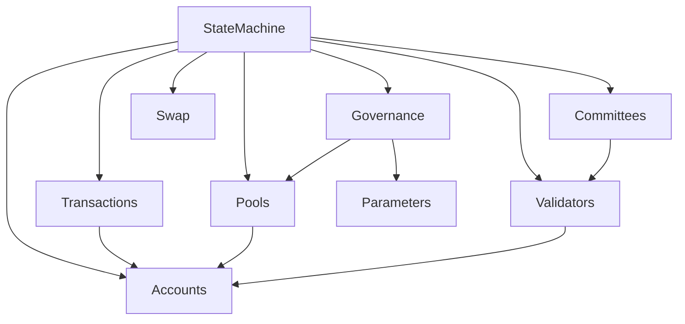
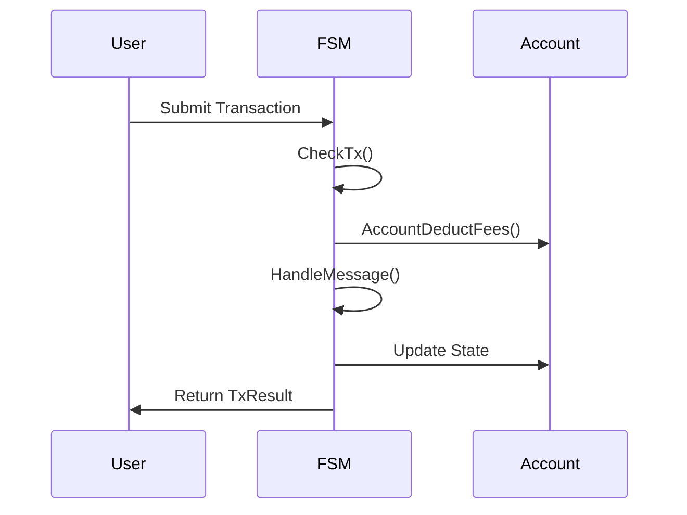
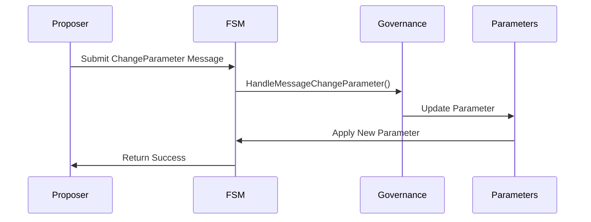

# Finite State Machine (FSM) Package

The FSM package is a core component of the Canopy blockchain, responsible for maintaining and updating the state of the blockchain as it progresses. This document provides a comprehensive overview of the FSM module, its components, and how they interact within the Canopy ecosystem.

## What is a Finite State Machine?

A Finite State Machine (FSM) is a computational model used to represent and control execution flow. It consists of:

1. A finite set of states
2. A finite set of inputs (events)
3. A transition function that maps state-input pairs to states
4. An initial state
5. A set of final states (optional)

In the context of blockchain, an FSM manages the transition from one blockchain state to another as new blocks are added. It ensures that all state transitions follow predefined rules and maintains consistency across the network.

## The Role of FSM in Canopy

In the Canopy blockchain, the FSM module serves as the rules by which the blockchain ledger changes. It is the entry point and the only mechanism through which the blockchain state (ledger) can be modified. The FSM:

1. **State Management**: Maintains the current state of all accounts, validators, and other blockchain data
2. **Transaction Processing**: Validates and applies transactions to modify the state
3. **Rule Enforcement**: Ensures all operations follow the protocol rules
4. **Consensus Support**: Providing the state information needed for consensus mechanisms
5. **Governance Implementation**: Executing governance decisions that affect the blockchain state

The FSM ensures deterministic execution - given the same input (transactions) and starting state, all nodes will arrive at the identical resulting state, which is crucial for blockchain consensus.

## Genesis and Initialization

The FSM initializes in one of two ways:
1. **Normal Operation**: Loading the previous block and setting the state machine height to the store height
2. **Genesis**: If height is zero, initializing from a Genesis file

The Genesis file is a state snapshot in JSON format that defines the initial state of the blockchain. It contains:
- Initial account balances
- Validator configurations
- Protocol parameters
- Other initialization data

In pre-mainnet environments, Genesis files typically include allocations for early investors, founders, and testnet participants. Post-mainnet, a re-Genesis might be used to start fresh from a certain point while maintaining continuity of state.

## State Transitions and Block Processing

The FSM handles state transitions through a well-defined process centered around block application:

### Block Application Process

1. **BeginBlock**: Executes automatic state changes at the beginning of each block, including:
   - Funding committee reward pools (minting new cryptocurrency)
   - Checking protocol versions to enforce upgrades
   - Handling certificate results for the chain

2. **Transaction Application**: Processes all transactions within the block:
   - Validates each transaction (signatures, replay protection)
   - Deducts transaction fees
   - Routes messages to appropriate handlers
   - Updates state according to transaction type
   - Generates transaction results and a Merkle root
   - Creates Merkle roots to ensure block contents are consistent across nodes

3. **EndBlock**: Executes automatic state changes at the end of each block:
   - Distributes committee rewards based on certificate results
   - Updates the last proposer for election seed refreshing
   - Handles validator stake management (forced unstaking, returning tokens)
   - Manages stake for validators who have finished unstaking

4. **State Finalization**: Generates the block header containing:
   - State root (Merkle root of the resulting state)
   - Transaction root (Merkle root of all transactions)
   - Validator roots (for current and next validator sets)
   - Other metadata (height, time, hash, etc.)

This process ensures that all nodes in the network can independently apply the same rules to the same inputs and arrive at an identical state.

### Transaction Processing Details

Transactions are first applied in memory and only committed to the database later. The process includes:

1. **Deduplication**: Checking for same-block duplicate transactions
2. **Replay Protection**: Validating that transactions haven't been processed before
3. **Signature Verification**: Ensuring the transaction was signed by authorized keys
4. **Fee Handling**: Verifying and deducting transaction fees
5. **Message Routing**: Directing the transaction to the appropriate handler based on type

## Key Components

The StateMachine struct is the central component of the FSM package:

```go
type StateMachine struct {
    store lib.RWStoreI
    ProtocolVersion    uint64
    NetworkID          uint32
    height             uint64
    totalVDFIterations uint64
    slashTracker       *SlashTracker
    proposeVoteConfig  GovProposalVoteConfig
    Config             lib.Config
    Metrics            *lib.Metrics
    log                lib.LoggerI
}
```

This structure maintains the entire state of the blockchain and provides methods for interacting with and modifying that state according to the protocol rules.

## Core Components and Their Relationships



### Transactions

Transactions are the primary mechanism for state changes in the Canopy blockchain. The FSM handles transactions through a well-defined process:

1. **Validation (CheckTx)**: Verifies transaction structure, signatures, and basic requirements
2. **Fee Deduction**: Deducts transaction fees from the sender's account
3. **Message Handling**: Routes the transaction payload to the appropriate handler based on message type
4. **State Update**: Applies the changes to the blockchain state
5. **Result Generation**: Returns the transaction result

The FSM supports various message types including:
- **Send**: Token transfers between accounts (subtracting from sender, adding to recipient)
- **Stake/Unstake**: Validator operations (locking/unlocking tokens, registering/deregistering validators)
- **Pause/Unpause**: Temporarily stopping/resuming validator services without unstaking
- **Governance**: Parameter changes, DAO treasury transfers (requiring proposal approval)
- **Certificate Results**: Handling nested chain reporting back to root chain
- **Order Management**: Creating, editing, and deleting token swap orders

Key functions:
- `ApplyTransaction()`: Processes transactions and updates state
- `CheckTx()`: Validates transaction structure and signatures
- `HandleMessage()`: Routes messages to appropriate handlers based on message type

### Accounts

Accounts are fundamental entities in the Canopy blockchain, representing users, contracts, or other entities that can hold tokens and interact with the blockchain.

Account addresses are 20-byte (160-bit) identifiers, providing strong collision resistance to prevent multiple private keys corresponding to the same address. Each account maintains:
- Balance information (amount)
- Address (derived from public key hash)
- Other account-specific data

Account data is stored using length-prefixed keys for efficient retrieval and iteration. The prefix system partitions different types of data in the store, similar to a database schema in a file system database.

The FSM provides comprehensive account management through functions like:
- `GetAccount()`: Retrieves account information by address
- `GetAccounts()`: Returns all accounts in the state
- `GetAccountsPaginated()`: Returns a paginated list of accounts
- `SetAccount()`: Updates or creates an account in the state
- `AccountAdd()`: Adds tokens to an account
- `AccountSubtract()`: Removes tokens from an account
- `AccountDeductFees()`: Deducts transaction fees from accounts



### Pools

Pools are special accounts used for token distribution and management. Unlike regular accounts, pools:
- Have no private key associated with them
- Can have tokens minted directly to them
- Are identified by an ID rather than an address
- Are managed programmatically by the protocol

They serve as intermediaries for various token operations:
- Reward distribution
- Fee collection
- Staking deposits
- Protocol subsidies
- DAO treasury

The key principle is that tokens are never minted directly to user accounts - they are always minted to pools first, then distributed according to protocol rules. This provides better accounting and control over token supply.

Pools are structurally similar to accounts but serve different purposes in the token economy of Canopy. Since they are managed programmatically, there is no risk of funds being lost due to lost private keys.

### Committees

Committees (or validator sets) are groups of validators responsible for consensus on the Canopy blockchain. The FSM manages committee formation, rewards, and slashing:

- Committee selection based on stake (ordered highest to lowest)
- Reward distribution to committee members at end of block
- Subsidized committees that receive newly minted tokens
- Pseudo-random selection for lottery winners (stake-weighted)
- Committee retirement mechanisms for graceful shutdown

Committees are central to the nested chain functionality, with validators registered to perform consensus services. The committee data tracks:
- Payment percentages for reward distribution
- Last updated heights (both root and chain)
- Chain ID for identification

Key functions include:
- `FundCommitteeRewardPools()`: Mints new tokens to protocol-subsidized committees
- `DistributeCommitteeRewards()`: Distributes rewards based on payment percentages
- `GetCommitteeMembers()`: Retrieves validators registered for a specific committee
- `UpdateCommittees()`: Updates committee membership when validator stake changes

### Governance

The governance component allows the Canopy blockchain to evolve through on-chain decision-making. It handles:

- Parameter change proposals
- Voting mechanisms
- Proposal execution
- DAO treasury management

The FSM implements governance decisions by updating system parameters and executing approved proposals.



### Swap

The swap component facilitates token exchanges and liquidity provision. It manages:

- Order creation and matching
- Liquidity pools
- Price discovery
- Fee collection

The FSM provides functions for creating, editing, and deleting orders, as well as managing the order matching process.

### State

The state component is the core data store of the FSM. It maintains:

- Current blockchain height
- Protocol version
- Network ID
- Total VDF iterations
- Configuration parameters

The state is updated with each block and provides the foundation for all other FSM operations.

### Automatic

The Automatic component refers to processes that occur without manual intervention, such as automated fee deductions, reward distributions, begin and end block functionality. These processes ensure that the blockchain operates smoothly without requiring constant user input.

Automatic processes include:
- Block rewards distribution
- Validator set updates
- Parameter adjustments based on predefined rules
- Fee distribution to relevant pools

### Byzantine

The Byzantine component handles fault tolerance and security measures to protect against malicious or faulty validators. It includes:

- Slashing mechanisms for validator misbehavior:
  - Double signing (signing multiple blocks at the same height)
  - Non-signing (failing to participate in consensus)
- Evidence processing with time limitations (minimum evidence height)
- Maximum slash thresholds to prevent cascading failures
- Burning of slashed tokens (reducing total supply)
- Removal from committees when severely slashed

The slashing mechanism is crucial for maintaining the security of the Byzantine Fault Tolerance algorithm by disincentivizing behaviors that could compromise consensus safety. When validators are slashed:
1. Their stake is reduced by a percentage defined in governance parameters
2. The slashed amount is burned (removed from total supply)
3. If stake is depleted, the validator is removed from all committees
4. The validator's committee memberships are updated with new stake amounts

## Technical Implementation

The StateMachine struct is the central component of the FSM package, containing:

```go
type StateMachine struct {
    store lib.RWStoreI
    ProtocolVersion    uint64
    NetworkID          uint32
    height             uint64
    totalVDFIterations uint64
    slashTracker       *SlashTracker
    proposeVoteConfig  GovProposalVoteConfig
    Config             lib.Config
    Metrics            *lib.Metrics
    log                lib.LoggerI
}
```

This structure maintains the entire state of the blockchain and provides methods for interacting with and modifying that state according to the protocol rules.

### Supply Tracking

The FSM includes a supply tracker that monitors token distribution across the network:

- Total supply of tokens in existence
- Staked tokens (locked by validators)
- Delegated tokens (staked by delegates)
- Committee-specific stake amounts
- Delegated-only stake (for calculating validator-only stake)

This tracking is essential for:
- Consensus operations
- Governance decision-making
- Community sentiment analysis
- Subsidy threshold monitoring

### Database Transactions

The FSM uses database transactions to ensure atomicity and consistency:

- Changes are applied in memory first via a database transaction
- Transactions can be committed or discarded
- The `TxnWrap()` function enables easy rollback if errors occur
- Keys are "dirty" in memory until committed to the database

This approach allows for validation of state changes before they become permanent, enhancing the robustness of the system.

## Key Storage Mechanisms

### Length-Prefixed Keys

The FSM uses length-prefixed keys for efficient storage and retrieval:
- Each key segment is prefixed with its length
- Allows for efficient partitioning of data types
- Enables reverse-engineering of keys during iteration
- Facilitates range queries over specific data types

### Iteration and Execution

The FSM provides powerful iteration capabilities:
- `Iterator()`: Creates forward lexicographical iterators
- `RevIterator()`: Creates reverse lexicographical iterators
- `IterateAndExecute()`: Executes a callback for each key-value pair
- Pagination support for large data sets

### Time Machine Functionality

The FSM includes a "time machine" feature that allows:
- Creating a read-only view of the blockchain at a specific height
- Loading historical committee information
- Retrieving past blocks and certificates
- Examining state evolution over time

This feature is crucial for applications that need to query historical state without affecting the current state.

## Conclusion

The FSM package is the heart of the Canopy blockchain, responsible for maintaining state consistency and enforcing protocol rules. By implementing a deterministic state machine, it ensures that all nodes in the network can independently arrive at the same state given the same inputs, which is essential for blockchain consensus.

Through its various components - transactions, accounts, pools, committees, governance, and more - the FSM provides a comprehensive framework for blockchain state management that is both flexible and secure.

As the core protocol component determining blockchain state transitions, the FSM serves as the operational ruleset for all transactions affecting the ledger, making it a critical component for developers to understand regardless of their specific role in the ecosystem.
