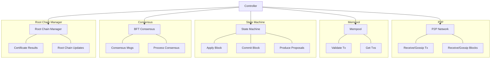

# Package controller

## Overview

The Controller module in Canopy serves as the central orchestration layer that coordinates communication and interactions between various components of the blockchain system. It acts as a bus between the Byzantine Fault Tolerance (BFT) consensus, Peer-to-Peer (P2P) networking, Finite State Machine (FSM), and storage modules to create a functional blockchain node.

The Controller implements various interfaces required by these components and manages critical operations such as:

1. **Consensus Management**: Coordinates the consensus process to ensure agreement on blocks
2. **Transaction Processing**: Validates, stores, and propagates transactions
3. **Block Processing**: Handles block creation, validation, and commitment
4. **P2P Communication**: Manages network communication for blocks, transactions, and consensus messages
5. **Certificate Management**: Creates and processes certificate results for cross-chain communication
6. **Mempool Management**: Maintains a pool of valid transactions waiting to be included in blocks

## Core Components

The Controller module consists of several key components that work together to provide a cohesive blockchain node implementation:

### 1. Controller

The main Controller struct serves as the central coordinator, holding references to all other components and implementing interfaces required by the BFT consensus system. It manages the node's lifecycle including initialization, starting, stopping, and coordinating interactions between modules.

### 2. Mempool

The Mempool component manages pending transactions, ensuring they are valid against the current state before being proposed in blocks. It maintains an ephemeral copy of the blockchain state to validate transactions without affecting the main state.

### 3. Certificate Results

The Certificate Results processing system handles the creation and validation of certificate results, which include information about rewards, slashes, and other cross-chain communications.

## Component Interaction

## Key Responsibilities

1. **Message Routing**: Handles routing of messages between modules including transactions, blocks, and consensus messages

2. **State Coordination**: Ensures the FSM state and mempool remain consistent and valid

3. **Consensus Facilitation**: Provides BFT with required information for consensus decisions

4. **Cross-Chain Communication**: Manages the interaction between chains in the network

5. **Network Synchronization**: Handles syncing of blockchain data between nodes

In essence, the Controller acts as the "brain" of the Canopy node, orchestrating all operations and ensuring proper flow of information between components to maintain the integrity and functionality of the blockchain.
