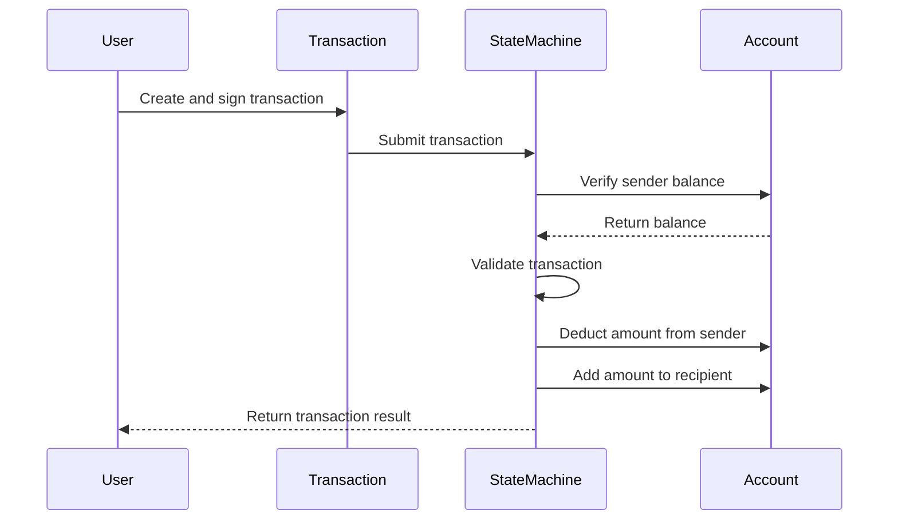
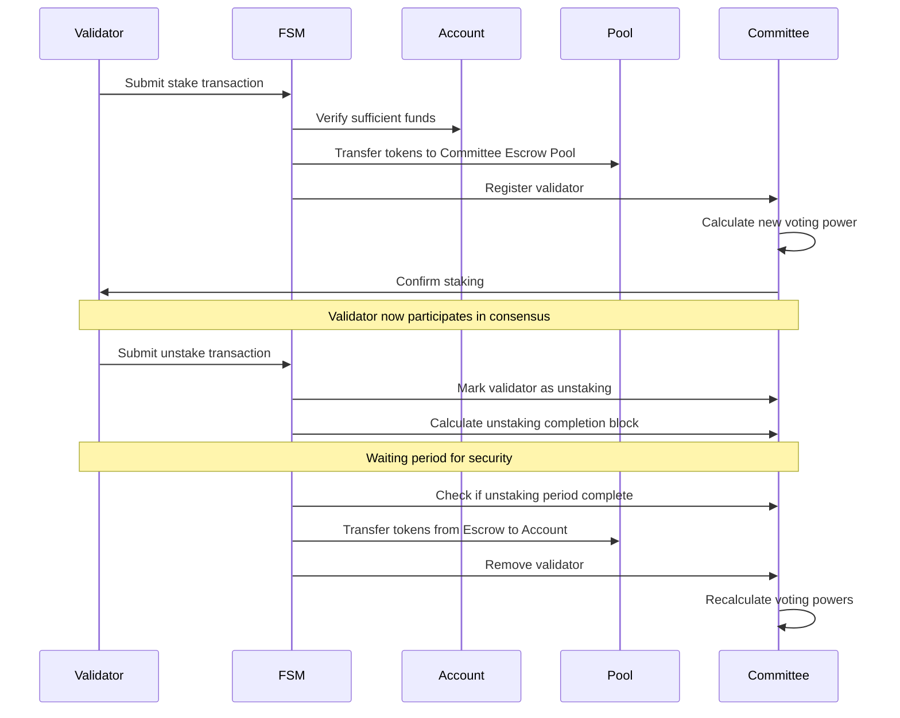

# Finite State Machine (FSM) Package

The FSM package is the core protocol component responsible for maintaining and updating the state of the Canopy blockchain as it progresses. It represents the collective state of all accounts, validators, and other relevant data [stored](key.md) on the blockchain. This document provides a comprehensive overview of the FSM module, its components, and how they interact within the Canopy ecosystem.

The FSM can be best understood as the rules by which the blockchain ledger changes. If you think of transactions as commands and the blockchain database as the ledger, the FSM is the protocol that interprets those commands to change the ledger. It serves as both the entry point and the only mechanism through which the blockchain state can be modified, with the exception of automatic state changes that occur at block boundaries.

## What is a Finite State Machine?

A Finite State Machine (FSM) is a computational model used to represent and control execution flow. It consists of:

1. A finite set of states
2. A finite set of [inputs (events)](message.md)
3. A transition function that maps state-input pairs to states
4. An initial state
5. A set of final states (optional)

In the context of blockchain, an FSM manages the transition from one blockchain state to another as new blocks are added. It ensures that all state transitions follow predefined rules and maintains consistency across the network.

## The Role of Canopy's Finite State Machine

In the Canopy blockchain, the FSM module serves as the rules by which the blockchain ledger changes. It is the entry point and the only mechanism through which the blockchain state (ledger) can be modified. The FSM:

1. **State Management**: Maintains the current state of all accounts, validators, and other blockchain data
2. **Transaction Processing**: Validates and applies transactions to modify the state
3. **Rule Enforcement**: Ensures all operations follow the protocol rules
4. **Consensus Support**: Providing the state information needed for consensus mechanisms
5. **Governance Implementation**: Executing governance decisions that affect the blockchain state

The FSM ensures deterministic execution - given the same input (transactions) and starting state, all nodes will arrive at the identical resulting state, which is crucial for blockchain consensus.

## Core Components

### [The State Machine](state.md)

The state machine type is the fundamental backbone of the Canopy blockchain, responsible for maintaining and updating the collective state as the blockchain progresses. It represents a comprehensive snapshot of the entire blockchain at any given moment, including all accounts, validators, pools, and other critical data structures.

The state machine acts as a persistent database that tracks every change that occurs on the blockchain. When transactions are processed or blocks are finalized, the state machine updates accordingly, ensuring that all nodes in the network maintain an identical view of the blockchain's current condition.

What makes the state machine particularly powerful is its ability to provide a deterministic representation of the blockchain. This means that given the same sequence of transactions and starting from the same initial state, any node in the network will arrive at exactly the same resulting state. This property is essential for achieving consensus in a distributed system.

The state machine also provides mechanisms for querying current values, such as account balances, validator information, or governance parameters. These queries allow applications built on top of Canopy to access the information they need without having to process the entire blockchain history.

Key aspects of the state machine:
- Deterministic state transitions ensuring network-wide consistency
- Persistent storage of all blockchain data
- Efficient querying mechanisms for accessing current state values
- Support for complex data structures beyond simple key-value pairs
- Atomic updates that maintain data integrity during state changes
- Versioning capabilities that allow for historical state access

### [Accounts](account.md)

Accounts are fundamental entities that hold and transfer value within the Canopy blockchain. Each account represents a participant in the network with the ability to hold tokens and initiate transactions.

In Canopy, accounts are identified by unique 20-byte addresses (160 bits) derived from public keys, providing strong collision resistance. This addressing scheme ensures that each account is uniquely identifiable while maintaining a practical address length for use in transactions and user interfaces.

Each account maintains a balance of tokens that can be increased through receiving transfers or rewards, and decreased through sending transfers, paying fees, or other protocol interactions. The account balance is a core part of the blockchain state and is updated atomically during transaction processing to maintain consistency.

Accounts serve as the primary interface through which users interact with the Canopy blockchain. They can initiate various transaction types, including token transfers to other accounts, staking operations for validator participation, governance actions like voting on proposals, and interactions with nested chains.

The security of accounts is maintained through public-key cryptography, with transactions requiring valid signatures from the private key corresponding to the account's address. This ensures that only the legitimate owner of an account can authorize transactions that affect its balance or state.

### [Committees](committee.md)

Committees are validator sets responsible for consensus across the Canopy network. Committees represent quorums of validators that participate in the Byzantine Fault Tolerant (BFT) consensus process for specific chains within the Canopy ecosystem.

In Canopy's architecture, validators can provide shared security services to any nested chain they choose to participate in. When a validator stakes for a particular Committee, they connect with other Committee members through the P2P layer. Together, these validators execute consensus for their designated nested chain.

The Committee structure is particularly powerful because it enables specialized security for different chains without requiring validators to secure the entire network. The root chain itself functions as just another nested chain, leveraging the network's shared security model. This design allows validators to secure specific sub-chains without being required to validate the root chain itself.

For each nested chain block, the elected leader within a Committee submits a certificate result transaction to the Canopy root chain, encapsulating the results of the quorum's consensus process. This certificate serves as proof that the Committee has reached agreement on the state of their nested chain.

Committees also handle the formation, management, and dissolution of these validator quorums, ensuring that each Committee maintains sufficient security properties while allowing validators the flexibility to participate in multiple Committees simultaneously.

Key aspects of Canopy committees:
- Management of validator sets for different chains within the Canopy ecosystem
- Tracking of Committee membership and voting power distribution
- Handling of validator staking and unstaking processes for Committees
- Distribution of rewards to Committee members for their consensus participation
- Implementation of slashing conditions for Byzantine behavior within Committees
- Support for cross-Committee communication and coordination

### [Pools](account.md)

Pools are special fund repositories that operate based on predefined blockchain rules rather than individual control. Unlike accounts which are controlled by private keys, pools are controlled directly by the protocol itself, making them crucial for automated token distribution and protocol-level fund management.

Pools serve as the primary mechanism for token minting and distribution in the Canopy ecosystem. Rather than minting tokens directly to accounts, new tokens are always minted to pools first, and then distributed according to protocol rules. This approach provides a clear audit trail and ensures that token creation follows governance-approved mechanisms.

Each pool has a unique identifier and maintains a balance of funds, similar to an account but without an associated address. The protocol defines specific rules for how funds enter and exit each pool, creating a transparent and predictable system for token economics.

Canopy implements several important pools, including the DAO Treasury Pool for governance-controlled funds, Committee Funds Pool for validator rewards, and Committee Escrow Pool for staked tokens. These pools work together to create a balanced economic system that incentivizes desired behaviors while maintaining protocol security.

The pools interact closely with governance mechanisms, allowing the community to influence how funds are distributed from certain pools. For example, governance proposals can trigger transfers from the DAO Treasury Pool to fund community initiatives or protocol improvements.

Key aspects of pools include:
- Protocol-controlled fund repositories without individual ownership
- Structured token minting and distribution pathways
- Support for multiple specialized pools with different purposes
- Integration with governance for community-directed fund allocation
- Transparent accounting of protocol funds and their movements
- Automated distribution mechanisms based on protocol rules

### [Transactions](transaction.md)

Transactions are the primary mechanism through which changes are made to the blockchain state. Transactions represent user-initiated actions that modify the state according to predefined rules, serving as the interface between users and the blockchain.

Each transaction in Canopy contains specific instructions for how the state should change, along with cryptographic signatures that prove the transaction was authorized by the appropriate parties. When a transaction is included in a block and processed by the FSM, it triggers a series of state transitions that update account balances, validator information, or other relevant data.

Transactions in Canopy support various operations, including token transfers between accounts, validator staking and unstaking, governance actions, and interactions with nested chains. Each transaction type follows specific validation rules to ensure it can be executed correctly and securely.

The transaction processing flow involves several steps: validation to ensure the transaction is well-formed and properly signed, execution to apply the transaction's effects to the state, and finalization to commit the changes permanently. This process is deterministic, meaning that all nodes processing the same transaction will arrive at identical state changes.

Fee mechanisms are built into the transaction system to prevent spam and compensate validators for their work in processing transactions. These fees are automatically deducted from the sender's account and distributed according to protocol rules.

Key aspects transactions in Canopy:
- Cryptographically secured user instructions for state changes
- Support for multiple transaction types with different purposes
- Deterministic execution ensuring network-wide consistency
- Fee mechanisms to prevent spam and compensate validators
- Validation rules to ensure transactions are well-formed and authorized
- Atomic execution to maintain state integrity during processing

### [Validators](validator.md)

Validators are the entities responsible for securing the Canopy network through participation in consensus. Validators stake tokens as collateral, process transactions, produce blocks, and maintain network security in exchange for rewards.

In Canopy's architecture, validators play a crucial role in the Byzantine Fault Tolerant (BFT) consensus process. They verify transactions, propose and vote on blocks, and ensure that the network reaches agreement on the state of the blockchain. The security of the entire system depends on having a sufficient number of honest validators with adequate stake.

Validators in Canopy have the flexibility to participate in multiple committees, providing security to different nested chains based on their preferences and capabilities. This allows for specialization while maintaining the overall security of the network. Validators stake tokens as a form of economic security, putting their own assets at risk if they behave maliciously.

The validator lifecycle includes several states: staking to join the validator set, active participation in consensus, optional pausing for maintenance, and unstaking to exit completely. During the unstaking period, validators must wait for a governance-controlled number of blocks before their bond is fully returned, during which they remain eligible for slashing if evidence of past misbehavior is discovered.

The Validators component tracks important metrics for each validator, including their voting power (proportional to their stake), uptime, and participation in consensus. These metrics influence reward distribution and help users make informed decisions about which validators to delegate to.

Key aspects of Canopy validators:
- Management of validator registration, staking, and unstaking processes
- Tracking of validator participation and performance metrics
- Implementation of slashing conditions for Byzantine behavior
- Support for validator pausing and maintenance operations
- Distribution of rewards based on validator contributions
- Governance mechanisms for adjusting validator parameters

## Core Concepts in Canopy

### Subsidization

Subsidization is the creation and distribution of newly minted tokens to support various protocol functions and incentivize desired behaviors. It implements the token emission schedule and ensures that subsidies are distributed according to governance-approved parameters.

In Canopy, subsidization serves multiple purposes: it provides rewards for validators securing the network, funds the DAO treasury for community initiatives, and supports other protocol-level incentives. Rather than minting tokens directly to recipients, all newly created tokens first flow through designated pools, creating a transparent and auditable path for token distribution.

The subsidization rate follows a predetermined schedule that may include gradual reduction over time, similar to Bitcoin's halving mechanism. This approach creates predictable token economics while allowing for some flexibility through governance adjustments to distribution parameters.

Committee subsidization is particularly important, as it provides the economic incentives for validators to secure nested chains. The subsidization component calculates appropriate reward amounts based on factors like committee size, total stake, and network parameters, then distributes these rewards to the relevant committee pools.

Governance plays a crucial role in the subsidization process, allowing the community to adjust parameters like distribution percentages between different pools or modify the overall emission schedule within predefined bounds. This creates a balance between predictability and adaptability in the token economic system.

Key aspects of subsidization:
- Implementation of token emission schedules and distribution rules
- Management of subsidy flows through designated protocol pools
- Support for committee-specific reward calculations and distributions
- Integration with governance for parameter adjustments
- Transparent accounting of all subsidization activities
- Mechanisms for adjusting incentives to maintain network security

### Block Rewards

The block rewards system handles the distribution of incentives to participants in the Canopy ecosystem, particularly validators who contribute to network security through consensus participation. It ensures that rewards are calculated fairly and distributed according to protocol rules.

In Canopy, rewards come from multiple sources: newly minted tokens through subsidization, transaction fees collected from users, and other protocol-level incentives. These rewards are first collected in designated pools, then distributed to eligible validators based on their contributions and stake.

The reward distribution process follows a deterministic algorithm that considers factors like validator uptime, voting power, and participation in specific committees. This creates a predictable and fair system that properly incentivizes desired behaviors while maintaining transparency.

Committee rewards are particularly important in Canopy's multi-chain architecture. Validators receive rewards for participating in committee consensus, with reward amounts varying based on the specific committee and its importance to the network. This allows for specialized incentives that align with the security needs of different nested chains.

Governance mechanisms allow the community to adjust reward parameters, such as the distribution percentages between different validator activities or the relative reward weights for different committees. This creates flexibility while maintaining the core incentive structure of the network.

Key aspects of the block reward system:
- Calculation of rewards based on validator contributions and stake
- Distribution of rewards from designated pools to eligible participants
- Support for committee-specific reward structures
- Transparent accounting of all reward activities
- Governance mechanisms for adjusting reward parameters

### [Slashing](byzantine.md)

Slashing implements the penalty mechanisms that discourage malicious or negligent behavior by validators. It detects violations of protocol rules, calculates appropriate penalties, and executes the slashing of stake as a consequence for these violations.

In Canopy, slashing serves as a critical security mechanism that creates economic consequences for behaviors that could harm the network. When a validator engages in activities like double-signing (voting for conflicting blocks), extended downtime, or other protocol violations, canopy identifies these infractions and imposes penalties proportional to their severity.

The slashing process involves several steps: detection of the violation through evidence submission or automatic monitoring, verification that the violation occurred and is attributable to a specific validator, calculation of the appropriate penalty amount based on governance parameters, and execution of the slash by removing tokens from the validator's stake.

Slashed tokens may be burned (removed from circulation) or redirected to designated pools like the DAO Treasury, depending on governance decisions. This creates additional economic consequences beyond the direct loss to the validator and ensures that the slashing mechanism contributes to the overall token economics of the network.

To protect against long-range attacks, validators remain subject to slashing for a governance-defined period even after they begin the unstaking process. This ensures that validators cannot escape penalties for past misbehavior by quickly unstaking their tokens.

Governance plays an important role in the slashing mechanism, allowing the community to adjust parameters like slash amounts for different violations or the duration of the slashing liability period. This creates a balance between deterrence and fairness in the penalty system.

Key aspects of slashing in Canopy:
- Detection and verification of protocol violations by validators
- Calculation of penalties based on violation type and severity
- Execution of slashes by removing tokens from validator stakes
- Management of slashed token destinations (burning or redirection)
- Extended slashing liability during the unstaking period
- Governance mechanisms for adjusting slashing parameters

### [Supply Tracking](account.md)

The Supply Tracker component maintains accurate accounting of all tokens in the Canopy ecosystem, tracking their creation, destruction, and movement between different parts of the system. It provides a comprehensive view of the token supply and its distribution across accounts and pools.

In Canopy, the Supply Tracker serves as the authoritative source of information about the total token supply, including circulating supply (tokens available for transactions), staked supply (tokens bonded by validators), and reserved supply (tokens held in protocol pools). This information is crucial for understanding the token economics of the network and verifying that token creation and destruction follow protocol rules.

The tracking process involves monitoring all operations that affect the token supply, including minting through subsidization, burning through slashing or fee mechanisms, and transfers between accounts and pools. Each of these operations is recorded with appropriate metadata to maintain a complete audit trail.

The Supply Tracker provides important metrics for network participants, including the current inflation rate, the percentage of tokens staked versus circulating, and the distribution of tokens across different protocol pools. These metrics help users make informed decisions about participation in the network.

By maintaining accurate supply information, the Supply Tracker also supports governance processes that depend on understanding the current state of the token economy. This includes decisions about adjusting subsidization rates, modifying fee structures, or allocating funds from protocol pools.

Key aspects of the supply tracker include:
- Tracking of total, circulating, staked, and reserved token supplies
- Monitoring of all token creation and destruction events
- Recording of token movements between accounts and pools
- Calculation of key economic metrics like inflation rate and stake ratio
- Support for governance decisions related to token economics
- Verification that token operations follow protocol rules

### [Chain Genesis](genesis.md)

The Genesis component defines the initial state of the Canopy blockchain at its launch, establishing the starting point from which all subsequent state transitions occur. It represents the foundation of the blockchain and encodes the fundamental parameters and initial distribution of resources.

In Canopy, the genesis state includes several critical elements: initial accounts and their token balances, the initial validator set with their stakes and powers, protocol pools with their starting balances, and governance parameters that control various aspects of the network's operation. This comprehensive initial state ensures that the blockchain begins with a well-defined configuration.

The genesis process involves creating a special "genesis block" that does not reference any previous blocks and contains the complete initial state. This block serves as the anchor for the blockchain and is agreed upon by all participants before the network launches. Once the network is live, the genesis state cannot be altered except through the normal state transition rules defined by the protocol.

Genesis configuration is particularly important for establishing the economic and governance foundations of the network. It defines the initial token distribution, which influences the decentralization and power dynamics of the network from the start. It also sets baseline parameters for important protocol functions like staking requirements, reward rates, and governance thresholds.

For testing and development purposes, Canopy supports the creation of custom genesis states that can be used to launch test networks with specific configurations. This allows developers to experiment with different initial conditions and parameter settings without affecting the main network.

Key aspects of this component include:
- Definition of the initial blockchain state at network launch
- Configuration of initial accounts, validators, and token distribution
- Establishment of baseline protocol parameters and governance settings
- Creation of the genesis block as the anchor for the blockchain
- Support for custom genesis configurations for testing and development
- Immutability of genesis state after network launch

### [Governance](gov.md)

The Governance component enables on-chain decision-making processes that allow the Canopy community to control protocol parameters and resource allocation without requiring software upgrades. It implements mechanisms for proposal submission, voting, and execution of approved changes.

Canopy features two distinct on-chain governance mechanisms: Polling for gathering community sentiment, and Proposals for making binding changes to the protocol. These mechanisms work together to create a comprehensive governance system that balances efficiency with community input.

Polling serves as a non-binding sentiment gathering tool, allowing any account or validator to initiate an on-chain vote on any topic. Polls have a defined end block and require a higher fee to prevent spam. While polls don't directly execute any actions, they provide valuable signals about community preferences that can inform subsequent binding proposals.

Proposals come in two varieties: Change Parameter proposals for updating governance parameters without software changes, and DAO Transfer proposals for distributing funds from the DAO Treasury pool. Proposals require approval from two-thirds of the voting power of the Root-Chain committee to be finalized and executed.

The governance process follows a structured flow: proposal submission with a deposit to prevent spam, a voting period during which eligible participants can cast their votes, a tallying phase to determine the outcome, and execution of approved proposals through automatic state changes. This process ensures that governance actions are transparent, fair, and follow predetermined rules.

Governance parameters themselves can be adjusted through the governance process, allowing the system to evolve over time based on community needs. This creates a flexible framework that can adapt to changing circumstances while maintaining stability through well-defined processes.

Key aspects of governance in Canopy:
- Dual governance mechanisms for sentiment gathering and binding decisions
- Support for parameter changes and treasury fund distribution
- Structured proposal lifecycle from submission to execution
- Voting mechanisms with appropriate security and weight calculations
- Automatic execution of approved governance actions
- Self-modifying capability through governance parameter adjustments

### [Swap](swap.md)

The Swap component facilitates the exchange of tokens between different accounts or between accounts and pools within the Canopy ecosystem. It implements the rules and mechanisms for these exchanges, ensuring they occur atomically and according to protocol-defined parameters.

In Canopy, swaps serve multiple purposes: they enable direct peer-to-peer token exchanges, support protocol-level operations like staking and unstaking, and facilitate interactions with liquidity pools or other financial primitives built into the protocol. Each swap operation follows specific validation rules to ensure it can be executed correctly and securely.

The swap process involves several steps: validation to ensure the swap is well-formed and authorized by the relevant parties, execution to move tokens between the specified accounts or pools, and finalization to commit the changes permanently to the blockchain state. This process is atomic, meaning that either the entire swap succeeds or it fails completely, preventing partial or inconsistent state changes.

Swaps can be initiated through various transaction types, including direct transfer transactions, staking operations, governance actions, or specialized swap transactions. Each type follows its own rules while leveraging the common swap infrastructure to ensure consistent and secure token movements.

Swapping works closely with accounts and pools to manage the actual token movements, updating balances atomically and ensuring that all operations follow protocol rules. It also interacts with other components like Validators and Governance that depend on token movements for their operations.

Key aspects of this component include:
- Atomic token exchange operations between accounts and pools
- Support for various swap types with different purposes and rules
- Validation mechanisms to ensure swaps are authorized and valid
- Integration with other components that depend on token movements
- Deterministic execution ensuring network-wide consistency
- Transaction fee handling for swap operations

### [Automatic State Changes](automatic.md)

Automatic state changes are processes that occur without manual intervention, executing predetermined operations at specific blockchain events like block beginnings and endings. It ensures that critical protocol functions continue reliably without requiring explicit transactions.

In Canopy, automatic state changes serve several important purposes: they distribute rewards to validators at regular intervals, apply inflation through token minting according to the emission schedule, execute approved governance decisions when their time comes, and perform housekeeping operations like pruning expired data or updating cumulative metrics.

The begin-block and end-block functionality is particularly important, as it defines operations that occur automatically at the boundaries of each block. Begin-block operations typically include setup tasks for the new block, while end-block operations handle finalization tasks like reward distribution, validator set updates, and parameter changes from executed governance proposals.

Automatic state changes follow deterministic rules, ensuring that all nodes in the network will execute exactly the same operations given the same blockchain state. This determinism is crucial for maintaining consensus across the network, as automatic operations modify the blockchain state just like regular transactions.

Key aspects of this component include:
- Execution of predetermined operations at block boundaries
- Distribution of rewards and application of inflation
- Implementation of approved governance decisions
- Housekeeping operations for blockchain maintenance
- Deterministic execution ensuring network-wide consistency

### [Byzantine Behavior Detection](byzantine.md)

Byzantine behavior is an action by validators or other participants that deviate from the protocol rules, whether due to malicious intent or technical failures. It ensures that the network can maintain consensus and security even in the presence of such behavior.

In Canopy, Byzantine fault tolerance is a critical property that allows the network to function correctly as long as no more than one-third of the validator voting power is compromised. The Byzantine component supports this property through detection mechanisms for common Byzantine behaviors, evidence handling for proven violations, and penalty systems to discourage such behaviors.

Common Byzantine behaviors addressed by byzantine behavior detection include double-signing (voting for conflicting blocks), equivocation (sending different messages to different peers), extended downtime (failing to participate in consensus), and various forms of censorship or selective message propagation. Each of these behaviors has specific detection mechanisms and appropriate penalties.

The evidence handling process involves collecting cryptographic proof of Byzantine behavior, validating this evidence to ensure it's legitimate, and processing it to apply the appropriate penalties through slashing. Evidence can be submitted by any validator who observes Byzantine behavior, creating a distributed detection system.

Key aspects of this component include:
- Detection mechanisms for various forms of Byzantine behavior
- Evidence collection, validation, and processing workflows
- Integration with the Slashes component for penalty application
- Protection against long-range and other sophisticated attacks
- Threshold mechanisms for critical operations
- Contribution to the overall Byzantine fault tolerance of the network

## [Component Interactions](state.md)

### How Transactions Modify Accounts

When a user initiates a transaction to transfer tokens, the process involves multiple components working together. First, the user creates and cryptographically signs a transaction specifying the recipient address and amount. This transaction is submitted to the State Machine, which verifies that the sender has sufficient balance by checking their account.

If the validation passes, the State Machine updates both the sender's and recipient's accounts, deducting the amount from one and adding it to the other. This state change is recorded in the blockchain, making it permanent and transparent.

The transaction processing ensures atomicity - either the entire transaction succeeds, or it fails completely without partial changes. This maintains the integrity of account balances and prevents issues like double-spending.

### Staking Sequence

The staking process in Canopy involves a carefully orchestrated sequence of interactions between validators and several FSM components. This sequence ensures secure validator participation while maintaining the economic security of the network.

When a validator decides to stake tokens and join a committee, they submit a stake transaction to the FSM. The FSM first verifies that the validator's account has sufficient funds for the stake amount. Once verified, the tokens are transferred from the validator's account to the Committee Escrow Pool, where they remain locked as collateral against Byzantine behavior.

After the tokens are escrowed, the validator is registered with the appropriate committee, and their voting power is calculated based on their stake amount. The committee then confirms the staking, and the validator begins participating in consensus for that committee's chain. This might involve connecting to other committee members via the P2P layer and starting to propose and vote on blocks.

If a validator needs temporary maintenance, they can submit a pause transaction, which temporarily removes them from consensus participation without unstaking their tokens. This status can continue for a governance-defined maximum period before automatic unstaking occurs.

When a validator decides to exit completely, they submit an unstake transaction. The committee marks the validator as unstaking and calculates the completion block based on governance parameters. During this waiting period (which might be several days or weeks), the validator no longer participates in consensus but their tokens remain escrowed and subject to slashing for any previously committed violations.

Once the unstaking period completes, the FSM transfers the tokens from the Escrow Pool back to the validator's account (minus any slashes that occurred), and removes the validator from the committee. The committee then recalculates voting powers for the remaining validators to maintain proper consensus weights.

This entire sequence balances the need for flexible validator participation with the security requirements of a Byzantine-resistant consensus system.
