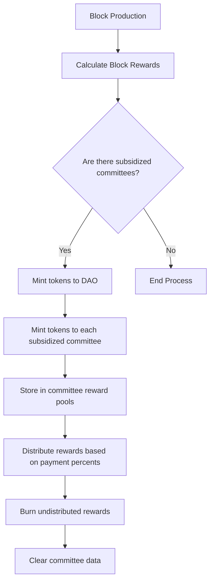

# committee.go - Committee Management in Canopy Blockchain

This file contains the logic for managing committees, which are validator sets responsible for consensus on nested chains within the Canopy blockchain. It handles committee rewards, membership, delegation, and the distribution of block rewards to qualifying committees.

## Overview

This file is designed to handle:

- Committee membership and validator selection
- Block reward distribution to subsidized committees
- Committee reward distribution based on participation
- Delegation management for committees
- Committee retirement and lifecycle management
- Lottery-based validator selection for rewards
- Committee data storage and retrieval

## Core Components

### Committee Subsidization

Committees in Canopy can be "subsidized" by the protocol, meaning they receive a portion of the block rewards. A committee qualifies for subsidization when the percentage of stake committed to it exceeds a threshold defined in the validator parameters. This mechanism works like a popularity contest or vote, where validators and delegators can "re-stake" their tokens to support specific committees without additional cost (beyond the risk of slashing).

The system automatically includes the root chain as a subsidized committee, ensuring it always receives native token payments to its pool. When a committee is marked as "retired," it becomes permanently ineligible for subsidization.

### Block Rewards and Halvenings

The protocol implements a halving mechanism similar to Bitcoin, where the block reward is reduced by half at regular intervals (defined by `BlocksPerHalvening`). The total mint amount for each block is calculated based on the initial token amount and the number of halvenings that have occurred.

From this total mint amount, a percentage is allocated to the DAO (Decentralized Autonomous Organization) based on governance parameters. The remaining amount is distributed equally among all subsidized committees.

### Committee Rewards Distribution

When committees earn rewards, they are stored in a reward pool specific to each committee. These rewards are distributed based on "payment percents" that are determined through Quorum Certificate results. The distribution process:

1. Retrieves the committee data and reward pool
2. Distributes rewards according to payment percentages
3. Burns any undistributed rewards by removing them from total supply
4. Clears the committee data while preserving essential information

### Validator and Delegate Management

The system maintains two types of participants in committees:
1. Committee members - validators directly participating in consensus
2. Delegates - users who stake tokens to support validators

Both validators and delegates can be part of multiple committees by "re-staking" their tokens. The system tracks membership and stake amounts for both types of participants, allowing for efficient committee operations and reward distribution.

### Lottery-Based Reward Selection

The protocol implements a lottery system to select validators or delegates for rewards. The selection is weighted based on stake, using an "un-grindable" pseudorandom mechanism that relies on previous block proposers to ensure fairness. This prevents manipulation of the selection process.

## Processes

## Security & Integrity Mechanisms

- Stake-weighted pseudorandom selection prevents manipulation of the lottery system.
- Committee retirement mechanism allows graceful shutdown of committees that are no longer needed.
- Validation of committee data heights prevents replay attacks or outdated data submission.
- Automatic burning of undistributed rewards prevents inflation.
- Slashing risk for validators provides economic security for the re-staking mechanism.
