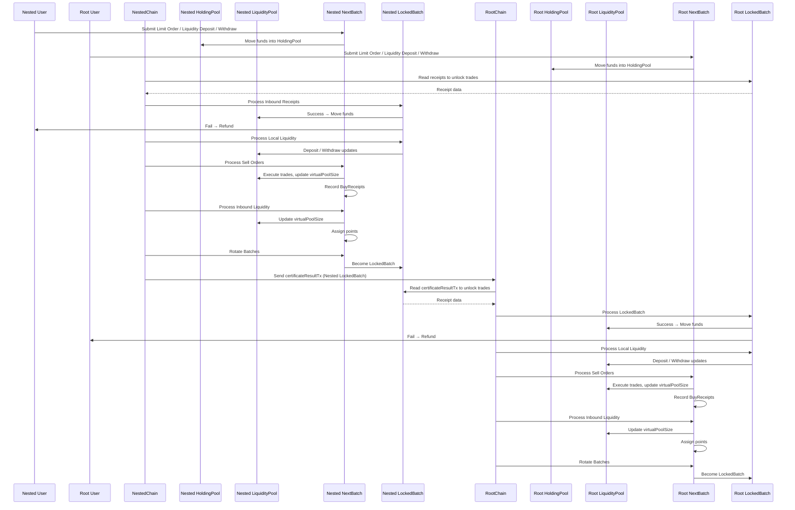

## dex.go - implements AMM style atomic swaps between root & nested chains
--
## 1. Overview

`dex.go` implements a Uniswap-style AMM that works **across two blockchains**: a **Nested Chain (master)** and a **Root Chain (slave)**.

- Like Uniswap, liquidity providers deposit two tokens into a pool, and traders swap between them at prices set by the constant product rule (`x*y=k`).
- Unlike Uniswap, swaps are **batched and mirrored across chains**.
- The batching ensures both chains always agree on pool state and LP accounting.

**Why this design?**
- To enable trustless swaps across chains without drift.
- To guarantee that liquidity and LP shares remain consistent no matter where orders are submitted.
- To preserve the familiar economics of Uniswap V2, while adding deterministic, cross-chain finality.

---

## 2. How It Works

- Both chains gather new commands in parallel (`Orders`, `Deposits`, `Withdraws`) into `NextBatch`.
- Batches are only finalized once the counterparty confirms them with receipts.
- Locks prevent overlapping work; receipts prove success or failure.

**Cycle Summary:**
1. Nested submits its `LockedBatch` to Root, including receipts proving the last Root batch was processed.
2. Root checks receipts. If valid, it finalizes Nested’s batch and then locks its own new batch.
3. Nested checks Root’s batch. If valid, it finalizes Root’s batch and then locks its own next batch.  
   → Repeat cycle

**Key properties:**
- No batch is processed twice.
- Both chains always agree on liquidity and LP points.
- Failed or incomplete batches are retried or refunded.

**Mental model:**  
Think of it as two ledgers walking in lockstep. Each step forward requires both chains to say, “Yes, I’ve seen and agreed to your last move.”

---

## 3. Core AMM Logic

Under the hood, swaps follow the exact Uniswap V2 formula:

```
x * y = k
```

- `x` = reserve of token A (add-side)
- `y` = reserve of token B (distribute-side)
- `k` = constant product

In `dex.go`:

```go
dY = (amountInWithFee * y) / (x*1000 + amountInWithFee)
```

This is literally the **Uniswap V2 formula** with fee `0.3%`. Every swap still satisfies `x * y` invariant (ignoring rounding errors).

---

## 4. Virtual Pool Mirrors Counterparty State

- Each chain maintains a `virtualPool` based on the **other chain’s last `PoolSize`**.
- When processing orders, it treats this as the effective reserve (`x`) for the “add” token.
- Trades are applied **against local liquidity (`y`)**, but the invariant is computed against the mirrored counterparty pool.

---

## 5. LP Points Are Standard Pro-Rata

Liquidity addition/withdrawal follows the classic Uniswap V2 integer math:

```go
// Geometric mean of the before and after states:
ΔL = L * (√((x+d)*y) - √(x*y)) / √(x*y) 
```

- LP points proportional to **square root of the pool product** (`√k`)
- 1-sided deposits work because counterparty’s pool size is included (`x` = remote PoolSize)
- Withdrawals are 2-sided and proportional to **LP share**

---

## 6. Batches Don’t Break Uniswap Logic

- Batches aggregate multiple orders → atomic execution, prevent reentrancy, ensure deterministic receipts.
- Within a batch:
    - Orders processed sequentially (pseudorandomly to prevent front-running)
    - Each trade updates `x` and `y` (virtual and local reserves)
    - `dY` computation is identical to Uniswap

---

## 7. Cross-Chain Receipts Ensure Determinism

- Nested reads Root’s locked batch and vice versa.
- Trades only finalize after receipts → both sides see the same LP state.
- Failed orders refunded → invariant preserved.

---

## 8. Fees Are Applied Identically

```go
amountInWithFee = dX * 997
dY = (amountInWithFee * y) / (x*1000 + amountInWithFee)
```

- Standard 0.3% Uniswap V2 fee
- Deducted from incoming token → same effect on `x*y` and LP gains

---

## Terminology & Symbols

- **Tokens**
    - `nested` — token on Nested Chain
    - `root` — token on Root Chain
- **Pools**
    - `HoldingPool[c]` — escrow for pending orders and deposits on chain `c`
    - `LiquidityPool[c]` — settled funds ready for swaps on chain `c`
- **Batches**
    - `NextBatch[c]` — collects new activity
    - `LockedBatch[c]` — awaiting cross-chain receipt processing
- **Orders & Liquidity**
    - `DexLimitOrder { Address, AmountForSale, RequestedAmount }`
        - `RequestedAmount` = minimum acceptable output
    - `DexLiquidityDeposit { Address, Amount }` (one-sided)
    - `DexLiquidityWithdraw { Address, Percent }`
- **LP Accounting**
    - `L[c]` = total LP points on chain `c`
    - `P[c, addr]` = LP points for address `addr`
- **AMM Pricing**
    - Let `x` = add-side pool (snapshot from counterparty)
    - Let `y` = distribute-side pool (local)
    - Invariant: `k = x * y`
- **Fees**
    - `f_taker = 0.003` (default, 30 bps)

---

## State & Storage

For each chain `c`:

- `HoldingPool[c].amount`
- `LiquidityPool[c].amount`
- LP ledger: `L[c]`, `P[c, addr]`
- `NextBatch[c]`:
    - `Orders`, `Deposits`, `Withdraws`
    - `PoolSize` snapshot of `LiquidityPool[c]`
- `LockedBatch[c]`:
    - Last sent batch awaiting receipts
    - Contains per-order `Receipts` once processed by counterparty

---

## Transaction Types

1. **DexLimitOrderTx(chain=c)**
    - Move `AmountForSale` → `HoldingPool[c]`
    - Append order to `NextBatch[c].Orders`
2. **DexLiquidityDeposit(chain=c)**
    - Move `Amount` → `HoldingPool[c]`
    - Append to `NextBatch[c].Deposits`
3. **DexLiquidityWithdraw(chain=c)**
    - Append to `NextBatch[c].Withdraws` (no immediate token move)
4. **certificateResultTx(from=c to=c')**
    - Encodes `LockedBatch[c]` with `PoolSize` and per-order receipts

---

## Batch Processing Cycle

Each chain processes its **locked batch** on a 'trigger'

**Trigger:**

- Nested Chain: `begin_block` after processing previous `certificateResult`
- Root Chain: `deliver_tx` on inbound `certificateResultTx`

Below are the **mirrored steps** that a nested and root chain takes to facilitate the AMM swaps.

**Steps (per chain `c`, counterparty `c'`):**

1. **Process Inbound Receipts (LockedBatch[c])**
    - If receipts incomplete → abort (retry next trigger)
    - Else:
        - Orders succeeded → move tokens from `HoldingPool` → `LiquidityPool`
        - Orders failed → refund from `HoldingPool` → seller
    - Process LockedBatch deposits & withdrawals

2. **Process Inbound Sell Orders (from counterparty batch)**
    - Snapshot: `x = remoteBatch.PoolSize`, `y = LiquidityPool[c].amount`
    - Sort orders pseudorandomly
    - For each order (`dX`):
        - `amountInWithFee = dX * 997`
        - `dY = (amountInWithFee * y) / (x*1000 + amountInWithFee)`
        - If `dY >= RequestedAmount` → accept, update `x += dX`, `y -= dY`, record receipt
        - Else reject

3. **Process Local Liquidity**
    - Withdrawals → burn points, distribute tokens pro-rata
    - Deposits → pro-rata mint LP points based on `(x + deposits) * y`

4. **Rotate Batches**
    - `NextBatch[c] → LockedBatch[c]` (embed receipts)
    - `PoolSize = LiquidityPool[c].amount`
    - Clear `NextBatch[c]`

**Safety Notes:**
- Locked batches prevent reentrancy; no new orders processed until receipts arrive
- Timeouts allow safe retry/failure handling

---

## One-Sided Liquidity Logic

***Two-chain LP accounting**
- Mirror liquidity ledger on both chains for symmetry
- Outbound deposits/withdraws: update ledger + move tokens (use dX from order clearing)
- Inbound deposits/withdraws: update ledger but only token movement for withdraws

**Deposits**
- Let `x = batch.PoolSize`, `y = counterPoolSize`, `d = deposit amount`, `L = total LP points`
- If `L == 0`: initialize with `L = √(x*y)`
- Compute:
    - `oldK = x * y`
    - `newK = (x + d) * y`
    - `ΔL = L * (√newK - √oldK) / √oldK`
- Distribute `ΔL` pro-rata to depositors
- Funds move from Holding → Liquidity

**Withdrawals**
- Burn LP points proportionally
- Distribute tokens according to share of reserves
- Both real (`yPoolSize`) and virtual (`batch.PoolSize`) reserves used

---


### Batch Frequency
- A batch is processed **once per block**.
- Nested chain triggers processing during `begin_block`.
- Root chain triggers processing upon receiving a `certificateResultTx`.

---

### Order Processing
- Orders within a batch are sorted pseudorandomly using the **hash of the previous block** on the processing chain.
- All computations, including LP points and swaps, use **integer math with floor rounding**.
- Limit orders that do not meet the requested output (`dY < RequestedAmount`) are **rejected**, and funds are **refunded back to the user**.
- Orders are rejected entirely if the relevant pool (local or virtual) has zero liquidity.

---

### One-Sided Deposits & LP Points
- If total LP points `L == 0`, initial deposits are assigned `L = √(x*y)`.
- LP points for deposits and withdrawals are **mirrored across both chains** for symmetry.
- LP points are **burned only after cross-chain confirmation** of withdrawals.

---

### Cross-Chain Token Security
- **Nested chain is the master**, Root chain is the slave.
- Root only reads a Nested `certificateResultTx` after it has been submitted.
- Nested will **not process a new batch** until the previous batch has been fully processed and receipts are confirmed.
- Token movements are **secured using a HoldingPool**.
- Tokens are moved from `HoldingPool` to `LiquidityPool` **only after cross-chain receipts confirm successful execution**, preventing double-spending or inconsistent states.

---

### Fees
- A standard **0.3% fee** is applied only to successful trades.
- Fees are **added to the liquidity pool** and accrue to LPs.
- Basic transaction fees still apply, even for failed trades.


---

### Liveness fallback
- If a batch cannot be processed due to incomplete cross-chain receipts, processing is aborted and retried in the next trigger.
- A batch may retry up to **3 times**, with each retry corresponding to **5 blocks**.
- After holding a locked batch for 15 blocks without success, the batch is dropped and all orders are refunded.
- Max batch size: 50,000 orders
- Max liquidity commands: 5,000 deposits & 5,000 withdrawals
- Min order amount: chain-specific dust threshold

---

## Edge Cases & Determinism

- Reject orders if `x == 0` or `y == 0`
- Always integer math with floor rounding
- Orders pseudorandomly sorted by block hash
- Withdrawals processed before deposits
- Deterministic across both chains

---

## Cross-Chain Flow Summary

- **Nested → Root**
    - Nested packages `LockedBatch` → `certificateResultTx` → Root
- **Root Chain**
    - Processes inbound batch
    - No result sent back
- **Trigger Table**

| Step           | Nested Chain                                 | Root Chain                                |
|----------------|---------------------------------------------|-------------------------------------------|
| Trigger        | `begin_block` after own CertificateResult   | `deliver_tx` on incoming certificateResultTx |
| Reads From     | Local + Root state                           | Local + incoming transaction              |
| Sends Result   | Yes (to Root)                                | No                                        |