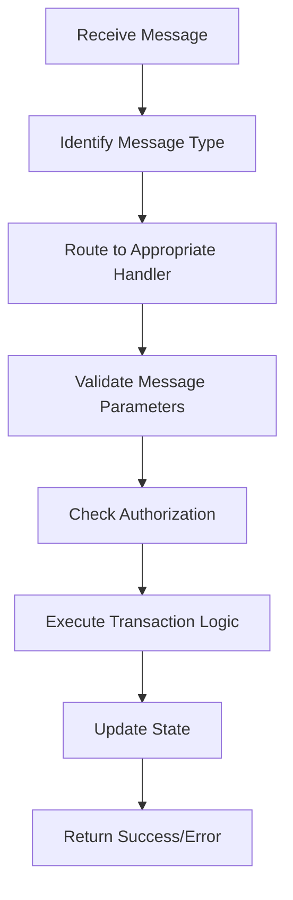
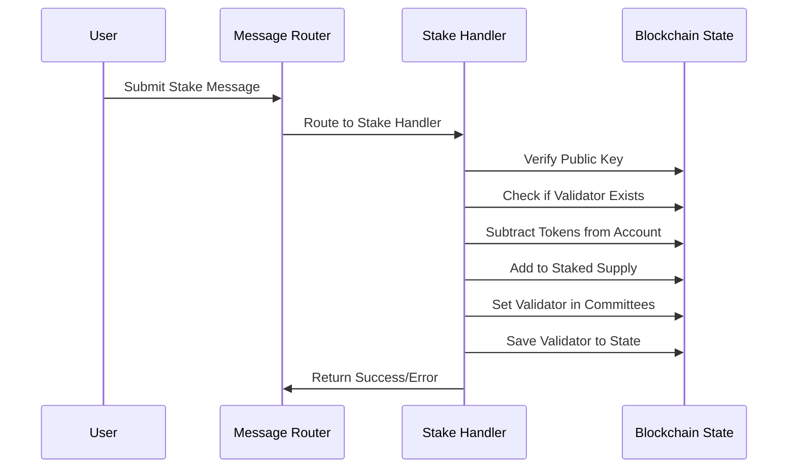

# message.go - Transaction Message Handling

This file implements the core message handling functionality for the Canopy blockchain, providing a routing mechanism that directs different types of transaction messages to their appropriate handlers within the state machine.

## Overview

This file is designed to handle:

- Routing incoming transaction messages to their specific handlers
- Processing various transaction types (send, stake, unstake, etc.)
- Validating transaction parameters before state changes
- Managing validator operations (staking, unstaking, pausing)
- Handling governance operations (parameter changes, DAO transfers)
- Processing committee-related operations (subsidies, certificate results)
- Managing marketplace operations (orders for token exchange)
- Determining transaction fees and authorized signers

## Core Components

### Message Router

The message router is the central component that receives incoming transaction messages and directs them to the appropriate handler based on their type. It uses a switch statement to examine the message type and call the corresponding handler function. This design pattern allows for clean separation of concerns, with each message type having its own dedicated handler function.

If a message type is not recognized, the router returns an "unknown message" error, ensuring that only valid message types are processed. This is an important security feature that prevents malformed or malicious messages from being processed.

### Transaction Handlers

The transaction handlers are a collection of functions that process specific types of messages. Each handler performs validation checks specific to its message type before making any changes to the blockchain state. These handlers implement the business logic for various blockchain operations:

- Token transfers between accounts
- Validator operations (staking, unstaking, pausing)
- Governance operations (parameter changes, DAO transfers)
- Committee operations (subsidies, certificate results)
- Marketplace operations (creating, editing, and deleting orders)

The handlers follow a consistent pattern: validate inputs, check preconditions, perform state changes, and return any errors encountered. This consistency makes the code more maintainable and easier to understand.

### Fee Management

The fee management component determines the appropriate transaction fee for each message type. Fees are retrieved from the blockchain's parameter store and vary depending on the complexity and resource requirements of the transaction. This mechanism helps prevent spam and ensures that users pay for the computational resources their transactions consume.

### Authorization System

The authorization system determines which addresses are allowed to sign for specific messages. This is a critical security component that ensures only authorized parties can perform certain operations. For example, only the owner of an account can send tokens from it, and only a validator's designated output address can modify its stake.

## Processes

### Transaction Processing Flow

### Staking Process

## Security & Integrity Mechanisms

- **Input Validation**: Each handler validates message parameters before processing to prevent invalid state transitions.
- **Authorization Checks**: Only authorized addresses can sign for specific operations, preventing unauthorized access.
- **Balance Verification**: Account balances are checked before transfers to prevent overdrafts.
- **Validator State Checks**: Validators are checked for existing conditions (already staked, unstaking, paused) before state changes.
- **Governance Controls**: Parameter changes and DAO transfers require supermajority approval from validators.
- **Committee Verification**: Certificate results are verified against the correct committee membership.
- **Minimum Order Size**: Orders must meet minimum size requirements to prevent spam.
- **Order Lock Protection**: Orders cannot be modified or deleted once they are locked (have a buyer).
