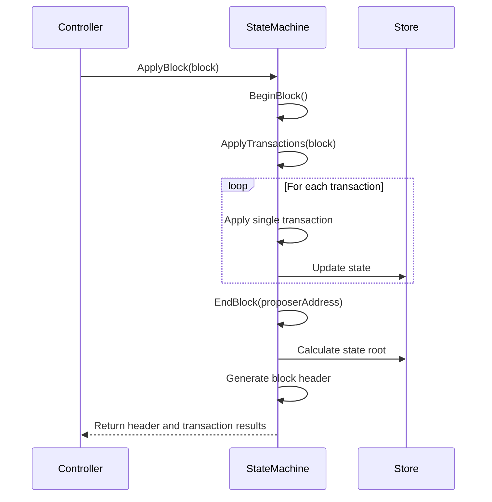

# state.go - State Machine Implementation for Canopy Blockchain

This file implements the core state machine for the Canopy blockchain, which is responsible for maintaining and updating the blockchain state as new blocks are processed. It provides the foundation for state transitions, transaction processing, and historical state access.

## Overview

The state machine serves as the central component that:

- Maintains the current state of the blockchain
- Processes incoming blocks and transactions
- Updates validator sets and committee information
- Provides access to historical blockchain states
- Manages atomic state transitions
- Ensures data integrity through merkle roots and hashing

## Core Components

### State Machine Type

The `StateMachine` struct is the central data structure that represents the collective state of the blockchain. It tracks critical information including:

- Protocol version and network ID
- Current blockchain height
- Total VDF (Verifiable Delay Function) iterations
- Validator information and slashing records
- Configuration settings
- Metrics and logging capabilities

This structure serves as the foundation for all state-related operations and provides a consistent interface for interacting with the blockchain state.

### Block Processing

The state machine implements a comprehensive block processing pipeline that handles the application of new blocks to the blockchain state. This process includes:

1. Executing pre-block operations via `BeginBlock`
2. Processing all transactions within the block
3. Executing post-block operations via `EndBlock`
4. Calculating merkle roots for state, transactions, and validators
5. Generating a new block header with updated state information

The block processing system ensures that all state transitions are performed atomically and consistently, maintaining the integrity of the blockchain.

### Historical State Access

The state machine provides mechanisms to access historical blockchain states through the "time machine" functionality. This allows:

- Creation of read-only views of the blockchain at specific heights
- Loading of historical validator committees
- Retrieval of past blocks and certificates
- Examination of blockchain state at any point in history

This capability is essential for verification processes and allows nodes to validate historical data without affecting the current state.

### State Storage and Manipulation

The state machine offers a comprehensive set of operations for manipulating the underlying state storage:

- Key-value operations (Get, Set, Delete)
- Iteration over state entries
- Atomic transactions with rollback capability
- Prefix-based state scanning

These operations provide the foundation for all higher-level state manipulations and ensure data consistency.

### Block Application Process

## Security & Integrity Mechanisms

- **Panic recovery**: Catches and handles panics during block processing to prevent node crashes.
- **Transaction deduplication**: Prevents duplicate transactions within the same block.
- **Block size limits**: Enforces maximum block size to prevent resource exhaustion attacks.
- **Merkle roots**: Calculates cryptographic roots for state, transactions, and validators to ensure data integrity.
- **Atomic transactions**: Provides rollback capability to maintain state consistency during complex operations.
- **Hash chaining**: Links blocks together through hash references to maintain blockchain continuity.
- **Validator set tracking**: Maintains cryptographic proofs of validator sets to ensure consensus integrity.
