# P2P Package

The P2P package provides a robust peer-to-peer networking layer for the Canopy Network. It implements a secure, multiplexed, and encrypted communication system between network nodes.

## Overview

The P2P package is designed to handle:
- TCP/IP transport
- Multiplexing of different message types
- Encrypted connections
- DOS mitigation
- Peer configuration and management
- Peer discovery and churn
- Message dissemination via gossip

## Core Components

### P2P

The main entry point for the P2P system. It manages the overall P2P network functionality, including:
- Starting and stopping the P2P service
- Listening for inbound peers
- Dialing outbound peers
- Managing peer connections
- Handling peer book exchanges
- Filtering bad IPs and countries

### PeerSet

Manages the active set of connected peers. It provides:
- Adding and removing peers
- Tracking inbound and outbound connections
- Managing peer reputation
- Sending messages to peers
- Handling must-connect peers

### PeerBook

Maintains a persistent list of potential peers. It provides:
- Storing and retrieving peer information
- Managing peer churn
- Exchanging peer information with other nodes
- Tracking failed connection attempts
- Persisting peer data to disk

### MultiConn

Represents a multiplexed connection to a peer. It provides:
- Multiple independent bi-directional communication channels
- Rate-limited message sending and receiving
- Ping/pong keep-alive mechanism
- Error handling and reporting

### EncryptedConn

Handles the encrypted communication with peers. It implements:
- ECDH key exchange for establishing shared secrets
- HKDF for deriving encryption keys
- ChaCha20-Poly1305 AEAD for message encryption and authentication
- Handshake protocol for peer authentication

### Stream

Represents a single communication channel within a MultiConn. It provides:
- Message queuing and sending
- Message assembly from packets
- Inbox for received messages

## Sequence Diagram

The following sequence diagram illustrates the core interactions in the P2P package:

```mermaid
sequenceDiagram
    participant App as Application
    participant P2P as P2P
    participant PS as PeerSet
    participant PB as PeerBook
    participant Peer as Remote Peer

    %% Connection flow
    Note over P2P,Peer: New peer connects
    Peer->>P2P: Connection request
    P2P->>P2P: Security handshake
    P2P->>PS: Add to active peers
    
    %% Message flow
    App->>P2P: Send message
    P2P->>PS: Forward to peer
    PS->>Peer: Send encrypted message
    
    Peer->>P2P: Receive message
    P2P->>App: Deliver to application
    
    %% Gossip protocol
    App->>P2P: Broadcast message
    P2P->>PS: Send to all peers except sender
    PS->>Peer: Forward message
    
    %% Peer discovery
    P2P->>P2P: Request peer list
    P2P->>PS: Send request to peers
    PS->>Peer: Forward request
    
    Peer->>P2P: Send peer list
    P2P->>PB: Update peer book
```



## Technical Details

### Multiplexing

The P2P system uses multiplexing to allow multiple independent communication channels over a single TCP connection. This is achieved by:

- **Topic-Based Channels**: Each message is assigned to a specific topic (like blocks, transactions, or peer discovery).
- **Independent Streams**: Each topic gets its own Stream with its own message queue and inbox.
- **Packet Headers**: Each packet includes a header that identifies which topic it belongs to.

This approach is similar to how a single phone line can carry multiple conversations using different frequencies. By multiplexing, the system can efficiently handle different types of messages without needing separate connections for each type, reducing overhead and improving performance.

It's important to note that this multiplexing is implemented entirely in our application code logic, not relying on transport-level multiplexing like HTTP/2. This gives us complete control over the multiplexing behavior and allows us to optimize it specifically for our blockchain network requirements.

### Encryption Protocol

The P2P system uses a robust encryption protocol to secure all communications:

1. **Key Exchange**: When two peers connect, they use the X25519 elliptic curve Diffie-Hellman (ECDH) algorithm to establish a shared secret. This allows them to generate the same encryption keys without ever transmitting the keys themselves.

2. **Key Derivation**: The shared secret is then processed using HMAC-based Key Derivation Function (HKDF) to derive:
   - An encryption key for sending messages
   - An encryption key for receiving messages
   - A nonce (number used once) for ensuring message uniqueness

3. **Message Encryption**: All messages are encrypted using the ChaCha20-Poly1305 authenticated encryption algorithm, which:
   - Provides confidentiality (messages can't be read by others)
   - Ensures authenticity (messages haven't been tampered with)
   - Verifies integrity (messages arrive exactly as sent)

This encryption approach provides end-to-end security, meaning that even if someone intercepts the traffic between two nodes, they cannot read or modify the messages without knowing the encryption keys.

## Component Interactions

### 1. Getting Started: P2P Initialization

When a node starts up, the P2P system initializes with these steps:

- **Creating the Foundation**: The P2P system creates a PeerSet to manage active connections and a PeerBook to keep track of potential peers. The PeerSet uses a thread-safe map to store active connections, while the PeerBook maintains a persistent database of known peers.
- **Setting Up Communication Channels**: It establishes channels for different types of messages (like blocks, transactions, or peer discovery). Each channel is implemented as a buffered Go channel with a configurable capacity to prevent memory overflow.
- **Loading Configuration**: It applies settings like maximum connections, timeouts, and security parameters. The configuration includes parameters for connection limits, timeouts, and security thresholds that are enforced throughout the system.

Think of this like setting up a phone system - you need a phone book (PeerBook), a list of active calls (PeerSet), and different lines for different types of conversations (channels).

### 2. Making Connections: Peer Connection Flow

When nodes connect to each other, several layers of security and functionality are added:

- **Listening for Calls**: The P2P system listens for incoming connection requests from other nodes using a TCP listener with rate limiting to prevent connection flooding.
- **Making Outgoing Calls**: It also proactively connects to other nodes it knows about, using exponential backoff for retry attempts when connections fail.
- **Secure Handshake**: When a connection is established, nodes perform a cryptographic handshake using X25519 for key exchange and HKDF for key derivation, establishing unique encryption keys for each direction of communication.
- **Multiplexing Setup**: The connection is then set up to handle multiple independent communication channels using a custom protocol that includes topic identifiers and sequence numbers in packet headers.

This is similar to how a phone call works - you dial a number (or receive a call), verify who's on the other end, and then can have a secure conversation.

### 3. Sending Messages: Message Flow

When a node wants to send information to another node:

- **Topic Selection**: The message is assigned to a specific topic (like `BLOCK` or `PEERS_REQUEST`) using a predefined enum that maps to specific message types.
- **Message Queuing**: The message is queued in the appropriate communication channel with priority handling for critical messages.
- **Packetization**: Large messages are broken down into smaller packets with a maximum size limit, each containing a header with topic ID, sequence number, and packet count.
- **Encryption**: Each packet is encrypted using ChaCha20-Poly1305 with a unique nonce to prevent replay attacks.
- **Transmission**: Packets are sent over the TCP connection with flow control to prevent overwhelming the receiver.
- **Reassembly**: On the receiving end, packets are reassembled into the complete message using sequence numbers and packet counts, with timeout handling for missing packets.

This is like sending a letter - you write your message, put it in an envelope (packet), seal it (encrypt it), and send it through the mail (TCP connection). The recipient opens the envelope and reads the message.

### 4. Discovering Peers: Peer Discovery and Management

The P2P system uses several techniques to discover and manage peers:

- **Peer Book Exchange**: Nodes periodically exchange lists of known peers with each other using a compact binary format that includes peer metadata and connection statistics.
- **Gossip Protocol**: When a node learns about a new peer or receives a message, it immediately forwards that information to all of its connected peers except the one who sent it. The gossip protocol includes a hop count to prevent infinite propagation and uses bloom filters to track recently seen messages.
- **Churn Management**: The system handles peers joining and leaving the network gracefully using connection timeouts and heartbeat messages to detect disconnections.
- **Reputation System**: It tracks how well peers behave using metrics like message delivery success rate, response times, and protocol compliance, with automatic disconnection for peers that fall below thresholds.

The gossip protocol is particularly interesting - it's like how rumors spread in a social network. If you hear something interesting, you tell all your friends except the one who told you, and they tell all their friends except you, and soon many people know about it. This is an efficient way to disseminate information in a decentralized network without a central authority, ensuring that important updates reach all nodes quickly.

### 5. Security Measures

The P2P system implements several security techniques:

- **Encryption**: All communication is encrypted using ChaCha20-Poly1305 with unique nonces for each message, providing both confidentiality and authenticity.
- **Rate Limiting**: Messages are rate-limited using a token bucket algorithm that allows for burst handling while maintaining long-term rate limits.
- **IP Filtering**: Known bad IPs and countries can be blocked using a combination of static lists and dynamic reputation scoring.
- **Connection Limits**: The number of connections is limited using a configurable maximum that considers both inbound and outbound connections, with priority given to trusted peers.

These measures work together to create a secure and resilient network that can operate even when some participants are malicious.

## Security Features

- **Encryption**: All communication is encrypted using ChaCha20-Poly1305 with unique nonces for each message, providing both confidentiality and authenticity. The encryption keys are derived using HKDF from a shared secret established through X25519 key exchange during the initial handshake. Each message includes an authentication tag to prevent tampering.

- **Authentication**: Peers are authenticated during the handshake process using their public keys, which are verified against a trusted list or through a chain of trust. The handshake includes a challenge-response mechanism to prove possession of the private key without revealing it. Failed authentication attempts are logged and can trigger temporary IP bans.

- **DOS Mitigation**: Rate limiting and connection limits prevent denial of service attacks through multiple layers:
  - Token bucket algorithm for message rate limiting with configurable burst sizes
  - Connection rate limiting using a sliding window counter
  - Maximum connection limits per IP with dynamic adjustment based on reputation
  - Automatic blacklisting of IPs that exceed thresholds
  - SYN cookie protection for TCP connections

- **IP Filtering**: Bad IPs and countries can be filtered out using:
  - Static blacklists of known malicious IPs
  - Dynamic reputation scoring based on behavior
  - Geographic filtering using IP geolocation
  - Automatic updates of threat intelligence feeds
  - Rate-based blocking of suspicious IP ranges

- **Reputation System**: Peers with bad behavior can be disconnected based on:
  - Message delivery success rate and latency
  - Protocol compliance and message validity
  - Resource usage patterns
  - Connection stability and uptime
  - Historical behavior tracking with decay over time
  - Automatic scoring adjustments based on observed behavior

## Usage

To use the P2P package:

1. Create a new P2P instance with appropriate configuration
2. Start the P2P service
3. Send and receive messages through the appropriate channels
4. Stop the P2P service when done

```go
// Example usage
p2p := p2p.New(privateKey, maxMembersPerCommittee, metrics, config, logger)
p2p.Start()
// Use p2p.Inbox(topic) to receive messages
// Use p2p.PeerSet.SendTo() to send messages
p2p.Stop()
``` 