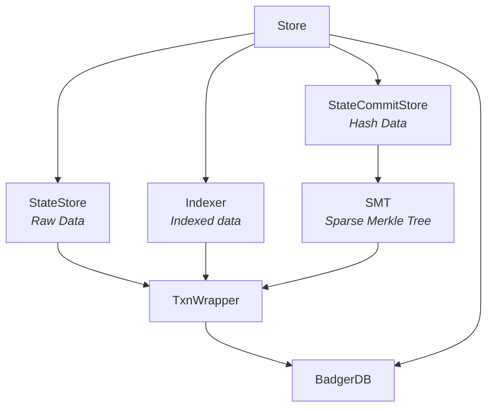
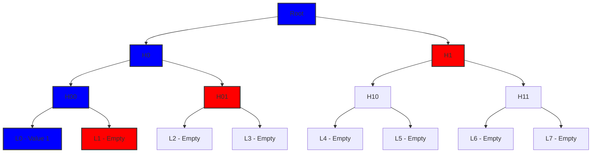
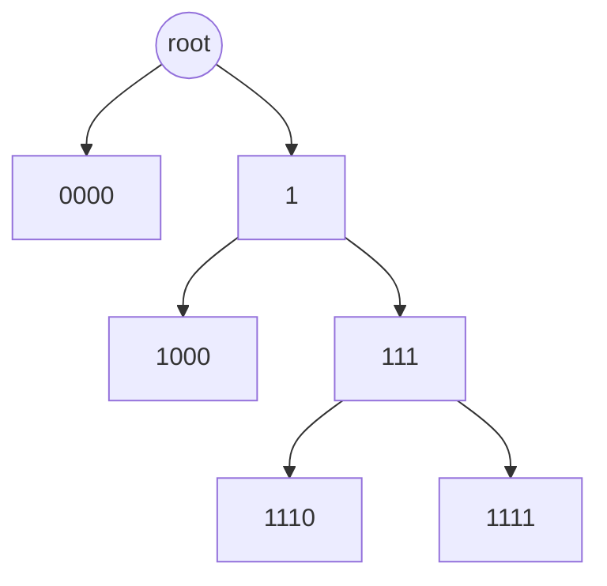
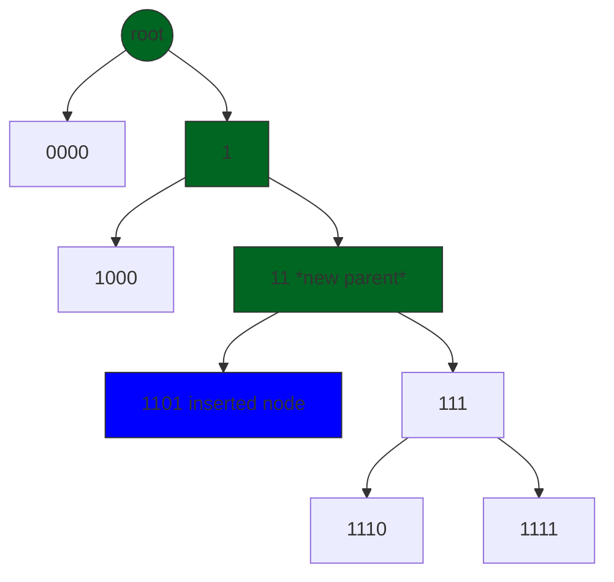
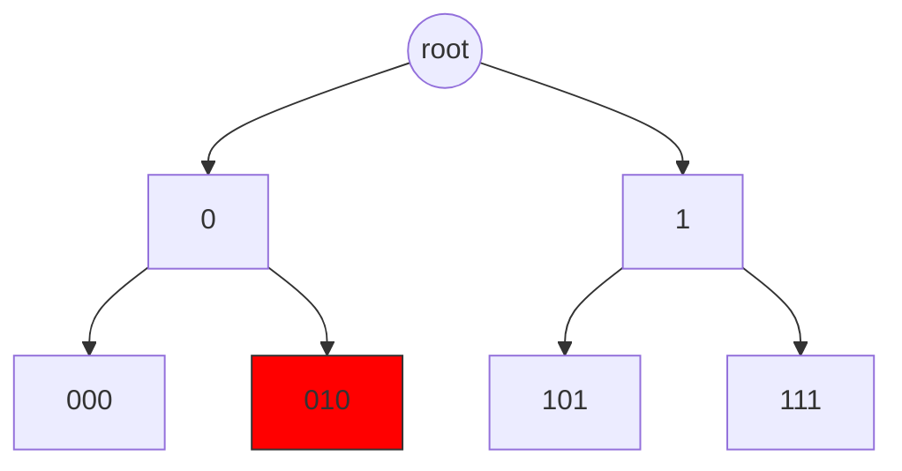
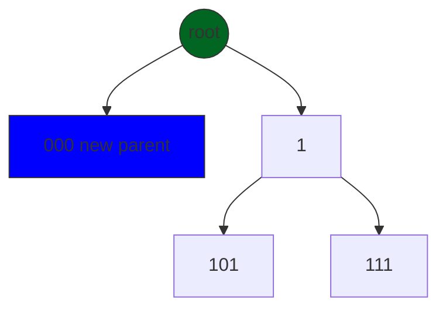
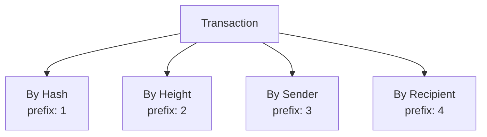
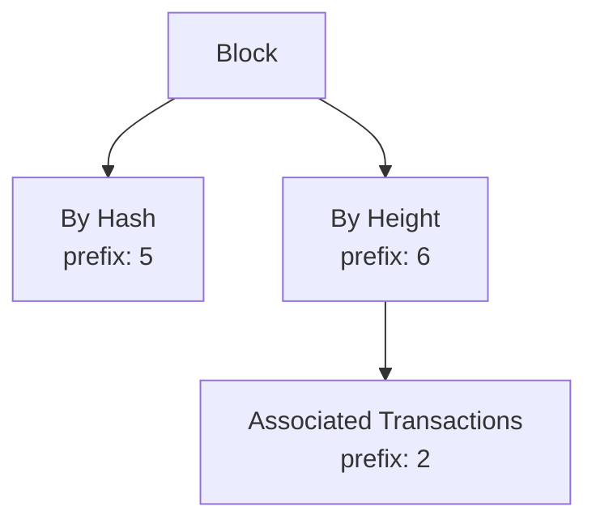

# Package store

[](https://pkg.go.dev/github.com/canopy-network/canopy/store)
[](https://github.com/canopy/canopy-network/blob/main/LICENSE)

The store package serves as the storage layer for the Canopy blockchain, utilizing
**[BadgerDB](https://github.com/hypermodeinc/badger)** as its underlying key-value store. It offers
structured abstractions for nested transactions, state management, and indexed blockchain data
storage. This document provides a comprehensive overview of the package's core components and their
functionalities, introducing key concepts while progressively building each component into a
complete storage solution.

## Why BadgerDB?

**[BadgerDB](https://github.com/hypermodeinc/badger)** is a fast, embeddable, persistent key-value
(KV) database written in pure Go. It's designed to be highly performant for both read and write
operations and is the underlying databased used by the Canopy Blockchain for all of its persistence
operations.

### Key Features

1. **LSM Tree-based**: Uses a
   [Log-Structured Merge-Tree](https://en.wikipedia.org/wiki/Log-structured_merge-tree)
   architecture, optimized for SSDs
2. **[ACID](https://en.wikipedia.org/wiki/ACID) Compliant**: Ensures data consistency through Atomicity, Consistency, Isolation, and
   Durability
3. **Concurrent Access**: Supports multiple readers and a single writer simultaneously
4. **Key-Value Separation**: Stores keys and values separately to improve performance
5. **Transactions**: Native support for both read-only and read-write transactions. Every action in
   BadgerDB happens within a transaction
6. **Iteration**: Provides efficient iteration over key-value pairs that are byte-wise
   lexicographically ordered

### Overview of Canopy store's module

In Canopy's store's module:

1. BadgerDB provides the persistent key-value store
2. Transactions ensure data consistency
3. Nested transactions enable complex operations
4. Key-value pairs store blockchain state and data
5. Blockchain data is frequently stored [hashed](https://en.wikipedia.org/wiki/Hash_function) to improve security

## **Store Package Components**

The store package is built from several key components that work together, like building blocks, to
create a complete storage system. It could be represented like a well-organized filing cabinet,
where each component has a specific job in managing and storing data. Each compoent from the
simplest to the most complex is described as follows:

1. *`TxnWrapper`*: It is a Wrapper around BadgerDB operations:
    - Makes sure all database operations follow the [`RWStoreI`](../lib/store.go) interface
    - Handles basic operations like storing and retrieving data
    - Allows iteration between ranges of data
    - Works like one of the translators between BadgerDB and the rest of Canopy

2. **`Txn`**: The transaction manager
    - Ensures that a group of operations happen together or not all (transactions)
    - Enhances BadgerDB by implementing in-memory nested transactions, to allows to write or discard
      groups of operations (like multiple read/writes) within a single BadgerDB transaction
    - Follows the [`RWStoreI`](../lib/store.go) interface to interact with the database

3. **`SMT`** (Sparse Merkle Tree): A special data structure for proving data existence
   - Organizes data in a tree-like structure
   - Makes it easy to prove whether data exists or doesn't exist
   - Uses smart optimizations to save space and work faster
   - Just like `TxnWrapper` it also follows the [`RWStoreI`](../lib/store.go) interface and
     leverages `TxnWrapper` itself in order to interact with the database

4. **`Indexer`**: The filing system
   - Organizes blockchain data (like blocks and transactions) in an easy-to-find way
   - Uses `TxnWrapper` under the hood to save the data in BadgerDB
   - Uses prefixes (like labels on filing cabinets) to group related data
   - Makes searching through data fast and efficient

5. **`Store`**: The main coordinator
   - Brings all other components together
   - Contains three main parts:
     - `Indexer`: Organizes and indexes blockchain data
     - `StateStore`: Stores the actual blockchain data using `TxnWrapper` under the hood
     - `StateCommitStore`: Stores hashes of the data using `SMT` under the hood
   - Is the only component that commits to the database directly

## **Key Interactions**



1. The `Store` manages three main components:
   - `Indexer` (for indexed blockchain data)
   - `StateStore` (for raw data)
   - `StateCommitStore` (for hash data)
   - Commits directly to the database the data on all the components

2. `TxnWrapper` acts as a bridge to BadgerDB:
   - Both `StateStore` and `Indexer` use it directly
   - `SMT` also uses it for data storage
   - Provides consistent way to interact with the database

3. `BadgerDB` serves as the foundation:
   - All data ultimately gets stored here
   - Everything flows through `TxnWrapper` to reach BadgerDB

This architecture ensures each component handles its specific tasks while maintaining consistent data storage and access patterns.

### TxnWrapper

BadgerDB's native transaction system provides atomic operations through its `Txn` type, supporting
both read-only and read-write transactions. Each transaction works with a consistent snapshot of the
database, ensuring data integrity during concurrent operations.

The `TxnWrapper` in Canopy builds upon this foundation by providing a clean abstraction layer over
BadgerDB's transaction system. It serves two main purposes:

1. **Interface Compliance**: Implements the `RWStoreI` interface, establishing a consistent contract
   for all storage operations within Canopy. This standardization ensures that different components
   can interact with the storage layer uniformly.

2. **Transaction Management**: Encapsulates BadgerDB's transaction handling, supporting both
   read-only and read-write operations. This wrapper simplifies transaction management by:
   - Providing a cleaner API for common database operations
   - Extending support of BadgerDB's iterator functionality
   - Returning errors in a consistent manner based on the project's error handling conventions

The main operations `TxnWrapper` is set to support according to the `RWStoreI` interface are:

- `Get(key []byte) ([]byte, ErrorI)`: Retrieves the value associated with the given key.
- `Set(key, value []byte) ErrorI`: Sets the value for the given key.
- `Delete(key []byte) ErrorI`: Deletes the value associated with the given key.
- `Iterator(prefix []byte) (IteratorI, ErrorI)`: Creates an iterator over byte-wise
  lexicographically sorted key-value pairs that start with the given prefix.
- `RevIterator(prefix []byte) (IteratorI, ErrorI)`: Creates a reverse iterator over byte-wise
  lexicographically sorted key-value pairs that start with the given prefix.

Note that all operations within `TxnWrapper` are neither committed nor rolled back directly, as
`TxnWrapper` operates within the broader transaction scope managed by the `Store` struct, which
handles the final commit or rollback decisions.

#### Key prefixing

All keys in `TxnWrapper` are automatically prefixed with a unique identifier (e.g., "s/" for state
store, "c/" for commitment store) to achieve two main purposes:

1. **Data Isolation**: Each component (`StateStore`, `StateCommitStore`, `Indexer`) maintains its own
   prefix-based namespace, preventing key collisions in the shared BadgerDB instance.

2. **Efficient Iteration**: Since BadgerDB stores keys in lexicographical order, prefixes enable
   efficient range queries within specific components. For example, iterating through all state
   store entries ("s/...") without touching commitment store data ("c/...").

These prefixes are only used internally and never exposed to the user.

## Txn: Ad Hoc Nested Transactions Implementation

The `Txn` type provides a transaction-like interface for the store, allowing for atomic operations and rollbacks. This is particularly useful for testing block proposals and managing ephemeral states.

### Core Components

#### Txn Structure
The `Txn` type consists of three main structures:

1. **Txn**: The main transaction type that embeds both the parent store interface and internal transaction state
2. **txn**: Internal state structure containing:
   - A map of pending operations (set/delete)
   - A sorted list of keys for efficient iteration
   - A length counter for the sorted list
3. **op**: Operation type that represents either a set or delete operation with its associated value

### Key Features

- **In-Memory Operations**: 
  - All write operations (Set/Delete) are stored in memory until explicitly written to the parent store
  - Provides fast access to pending changes without disk I/O
  - Enables efficient rollback of operations before they're committed

- **Atomic Operations**: 
  - Write() method ensures all operations are applied atomically to the parent store
  - Either all operations succeed or none are applied
  - Maintains data consistency even during concurrent access

- **Rollback Support**: 
  - Discard() method allows rolling back all pending operations
  - Useful for testing block proposals or handling failed operations
  - Cleans up memory resources associated with pending operations

- **Efficient Iteration**: 
  - Maintains sorted keys for efficient iteration and merging with parent store
  - Supports both forward and reverse iteration patterns
  - Enables efficient range queries and prefix-based filtering

- **Prefix-Based Iteration**: 
  - Supports both forward and reverse iteration with prefix filtering
  - Enables efficient scanning of related data
  - Useful for batch operations on related keys

### Performance Considerations

- **Memory Usage**: 
  - All operations are kept in memory until Write() or Discard()
  - Memory footprint grows linearly with the number of pending operations
  - Efficient memory management through buffer pooling and automatic cleanup

- **Iteration Efficiency**: 
  - Uses binary search for O(log n) key lookups in sorted list
  - Maintains sorted order for efficient range queries
  - Optimized merging of in-memory and parent store data during iteration

- **Write Performance**: 
  - Write() operation is O(n) where n is the number of pending operations
  - Batch operations are more efficient than individual writes
  - Memory operations are significantly faster than disk operations

- **Read Performance**: 
  - Get() is O(1) for in-memory operations, falls back to parent store
  - In-memory operations take precedence over parent store data
  - Efficient key lookup through hash map and sorted list combination

### Implementation Details

#### Write Operations
- Set() and Delete() operations are stored in an in-memory map
- Keys are automatically added to a sorted list for efficient iteration
- Operations are not applied to the parent store until Write() is called
- The sorted list enables efficient binary search for key lookups

#### Read Operations
- Get() first checks the in-memory operations, then falls back to the parent store
- Iterator() and RevIterator() merge in-memory operations with parent store data
- Deleted keys are properly handled during iteration
- Prefix-based filtering is supported for both forward and reverse iteration

#### Memory Management
- Uses a map for O(1) operation lookups
- Maintains a sorted slice for efficient iteration
- Implements buffer pooling for memory efficiency
- Automatically manages memory for pending operations

### Usage Example

The Txn type is typically used in scenarios requiring atomic operations or rollback capabilities:

1. Create a new transaction with a parent store
2. Perform multiple Set() and Delete() operations
3. Either commit the changes using Write() or rollback using Discard()
4. The transaction maintains all operations in memory until explicitly committed

### Limitations

- Not thread-safe (should not be used across multiple goroutines)
- Write() is not atomic when writing to another memory store
- Keys must be smaller than 128 bytes
- Nested transactions are supported but iteration becomes increasingly inefficient with depth

## Canopy's Optimized Sparse Merkle Tree

A [Merkle Tree](https://en.wikipedia.org/wiki/Merkle_tree) is a data structure that enables
efficient and secure verification of large data sets. It works by hashing pairs of nodes and
progressively combining them upwards to create a single "root" hash that cryptographically commits
to all the data below it.

A Sparse Merkle Tree (SMT) extends this concept by efficiently handling sparse key-value mappings -
meaning it's optimized for situations where only a small subset of possible keys are actually used,
such as in blockchain state storage like this module. This optimization is crucial because a
traditional Merkle tree would require storing all possible keys, even empty ones, making it
impractical for large key spaces.

Instead, a SMT allows us to both store and prove the existence (or non-existence) of key-value pairs
while maintaining a minimal memory footprint and providing efficient verification capabilities.

### Traditional Sparse Merkle Tree



In a traditional Sparse Merkle Tree, as illustrated above, each level splits into two child nodes,
creating a binary tree structure. The blue nodes show the path to `Value 1`, while the red nodes
represent the sibling hashes needed for proof verification. For example, to prove the existence of
`Value 1`, we need:

1. The hash of `Value 1` itself
2. Its immediate sibling hash (L1)
3. The sibling hash at the next level (H01)
4. And finally, H1 to reconstruct the root

This approach has significant limitations:

- **Storage overhead**: Even for sparse data, the tree maintains placeholder nodes for empty
  branches
- **Computational cost**: Proof generation requires multiple hash computations along the path
- **Scalability challenges**: As the tree grows, both storage and computational requirements
  increase exponentially

These limitations become particularly problematic in blockchain environments where efficiency and
scalability are crucial. Canopy's SMT implementation introduces several optimizations to address
these challenges while maintaining the security properties of traditional Sparse Merkle Trees.

### Canopy's Sparse Merkle Tree

Canopy's SMT implementation introduces key optimizations to address traditional SMT limitations:

1. **Optimized Node Structure**:
   - Nil leaf nodes for empty values
   - Parent nodes with single non-nil child are replaced by that child
   - A tree starts and always maintains two root children for consistent operations

2. **Efficient Tree Operations**:
   - Key organization via binary representation and common prefix storage for internal nodes
   - Targeted traversal that only visits relevant tree paths
   - Dynamic node creation/deletion with automatic tree restructuring

3. **Space and Performance**:
   - Eliminates storage of empty branches
   - Reduces hash computation overhead
   - Maintains compact tree structure without compromising security

### Core Algorithm Operations

1. **Tree Traversal**
   - Navigates downward to locate the closest existing node matching the target key's binary path

2. **Modification Operations**

   a. **Upsert (Insert/Update)**
   - Updates node directly if the target node matches current position
   - Otherwise:
     - Creates new parent node using the greatest common prefix between target and current node keys
     - Updates old parent's pointer to reference new parent
     - Sets current and target as children of new parent

   b. **Delete**
   - When target matches current position:
     - Removes current node
     - Updates grandparent to point to current's sibling
     - Removes current's parent node

3. **ReHash**
   - Progressively updates hash values from modified node to root after each operation
   - Ensures cryptographic integrity of tree structure.

#### Example operations

#### Insert 1101

<div style="display: flex;">
<div style="width: 50%;">
Before



</div>
<div style="width: 50%;">
After



</div>
</div>

Steps:

1. **Path Finding**: Navigate down the tree following the binary path of '1101' until reaching the closest existing node ('111')

2. **Position Check**: Determine target node ('1101') doesn't exist at current position

3. **Parent Creation**: Form new parent node with key '11' (greatest common prefix between '1101' and '111')

4. **Restructure**: Update old parent to reference new parent node, making previous node ('111') a child of new parent

5. **Insert**: Add new node ('1101') as the second child of the new parent, maintaining binary tree properties

6. **ReHash**: Progressively updates hash values from the modified node'parent to the root after each
   operation, ensuring cryptographic integrity of tree structure as shown in the diagram in green.

#### Delete 010

<div style="display: flex;">
<div style="width: 50%;">
Before



</div>
<div style="width: 50%;">
After



</div>
</div>

Steps:

1. **Path Finding**: Navigate down the tree following the binary path of '010' until reaching the
   target node

2. **Node Removal**: Remove target node ('010') from tree structure

3. **Parent Update**: Replace parent node '0' in grandparent with target's sibling '000'

4. **Tree Rehash**: Recalculate hash values upward from '000' parent to the root (on this case is the
   same as root) to maintain integrity as shown in the diagram in green.

### Proof Generation and verification

Canopy's SMT implementation supports both proof-of-membership and proof-of-non-membership through
the `GetMerkleProof` and `VerifyProof` methods. These proofs enable verification of whether a
specific key-value pair exists in the tree without requiring access to the complete tree data.

#### Proof Generation (`GetMerkleProof`)

The proof generation process constructs an ordered path from the target leaf node (or the closest
existing node where the key would reside if present) back to the root, by including every sibling
node encountered along each branch of this traversal.

1. **Initial Node**: The first element in the proof is always the target node (for membership
   proofs) or the node at the potential location (for non-membership proofs)

2. **Sibling Collection**: For each level from the leaf to the root:
   1. Record the sibling node's key and value
   2. Store the sibling's position (left=0 or right=1) in the bitmask
      - These siblings are essential for reconstructing parent hashes

#### Proof Verification (`VerifyProof`)

The verification process reconstructs the root hash using the provided proof and compares it with
the known root, if the hashes match, the resulting tree is then used in order to verify the
existence of the requested key-value pair. As a side note, unlike traditional sparse merkle trees,
both the key and value are required in order to generate the parent's hash:

1. **Initial Setup**:
    - Create a temporary in-memory tree
    - Add the first proof node (target/potential location)
    - The first proof node's key and value hash are then used to build the parent of the upcoming node

2. **Hash Reconstruction**:
    - For each sibling in the proof:
      - Use the bitmask to determine sibling position
      - Combine the current hash with the sibling's hash
      - Compute the parent hash using the same function as the main tree
      - Compute the parent's key by calculating the Greatest Common Prefix (GCP) of the current
        node's key and the sibling's key
      - Save the resulting parent node in the temporary tree

3. **Root Hash Validation**:
    - Compare reconstructed root hash with provided root
      - If the hashes do not match, the proof is invalid and the verification fails

4. **Final Verification**:
    - Traverse the temporary tree to verify the existence of the requested key-value pair
      - For membership proofs: Verifies target exists and value matches
      - For non-membership proofs: Confirms target doesn't exist at expected position

## Indexer operations and prefix usage to optimize iterations

The Indexer component serves as an organized filing system for blockchain data, using prefix-based
storage patterns to enable efficient data retrieval and iteration. It manages four primary types of
data: transactions, blocks, quorum certificates, and checkpoints.

### Prefix-Based Storage Structure

The Indexer uses unique prefix bytes to segregate different types of data:

```go
var (
    txHashPrefix       = []byte{1} // Transaction by hash
    txHeightPrefix     = []byte{2} // Transactions by height
    txSenderPrefix     = []byte{3} // Transactions from sender
    // and more...
)
```

This prefix system creates distinct "namespaces" in the database, allowing for:

1. Data isolation between different types
2. Efficient range queries within specific data types
3. Prevention of key collisions

### Key Operations

#### 1. Transaction Indexing



- **Multiple Access Patterns**: Each transaction is indexed in four ways:
  - By hash: Direct lookup
  - By height: Group transactions in same block
  - By sender: Find all transactions from an address
  - By recipient: Find all transactions to an address

#### 2. Block Indexing



- **Dual Indexing**: Blocks are indexed by both:
  - Hash: For direct lookups
  - Height: For chronological access
- **Associated Data**: Links to related transactions using height references

#### 3. Special Purpose Indices

- **Quorum Certificates**: Indexed by height for consensus validation
- **Double Signers**: Track validator misbehavior
- **Checkpoints**: Store chain security checkpoints

### Optimized Iteration Patterns

The Indexer leverages BadgerDB's lexicographical ordering to implement iterations:

1. **Forward/Reverse Iteration**:

```go
// Example: Get transactions newest to oldest
it, err := indexer.db.RevIterator(txHeightPrefix)
// Example: Get transactions oldest to newest
it, err := indexer.db.Iterator(txHeightPrefix)
```

While the Indexer supports iteration capabilities, this approach should be used cautiously due to
its performance overhead. When dealing with large datasets, it is strongly recommended to retrieve
multiple elements in a single bulk operation and unmarshal them collectively, rather than performing
individual iterations and unmarshalling operations, as this pattern has proven to be significantly
more performant in practice.

### Key Encoding Strategy

The Indexer uses the following key encoding strategy:

1. **Big-Endian Height Encoding**:
    - Ensures proper lexicographical ordering
    - Enables range queries by height

2. **Length-Prefixed Keys**:
    - Prevents key collision
    - Maintains clear separation between key components
    - Enables prefix scanning

This structured approach to data indexing and storage enables efficient querying and iteration over blockchain data while maintaining data integrity and accessibility.

## `Store` struct: Putting it all together

The `Store` struct serves as the central coordinator for Canopy's storage system, integrating all previously described components into a cohesive whole. It provides a clean, high-level API that abstracts away the complexity of the underlying storage components.

## Core Integration

The `Store` struct brings together three main components:

1. **State Store**: Manages the actual data blobs representing blockchain state
2. **State Commit Store**: Maintains a Sparse Merkle Tree of state hashes
3. **Indexer**: Organizes blockchain elements for efficient retrieval

## Atomic Operations

The `Store` ensures atomicity through BadgerDB's transaction system:

1. All operations across components occur within a single BadgerDB transaction
2. The `Commit()` method finalizes changes with a single atomic write
3. Failed operations are automatically rolled back to maintain data integrity

### Latest State and Historical State Stores

Canopy separates the data of the state into two types of stores: the Latest State Store (LSS) and the Historical State Store (HSS).

#### Latest State Store (LSS)

The Latest State Store maintains the most current version of all state data, using the prefix `s/` for all keys. It:

1. **Provides Fast Access**: Optimized for frequent read/write operations on current state (i.e., latest heights)
2. **Supports Iteration**: Enables efficient traversal of current state data
3. **Maintains Versioning**: Uses BadgerDB's version capabilities to track state changes

#### Historical State Store (HSS)

The Historical State Store maintains historical state data in partition-based snapshots, using the prefix `h/{partition_height}/` (e.g., `h/10000/`). It:

1. **Preserves History**: Maintains complete state snapshots at regular intervals
2. **Enables Time Travel**: Allows querying state at any historical block height
3. **Supports Efficient Queries**: Optimized for historical data retrieval
4. **Supports Safe Pruning**: Partitioning enables safe deletion of older state data

#### Partitioning Strategy

The partitioning approach works as follows:

1. **Partition Creation**: At regular intervals (every `partitionFrequency` blocks, e.g., 10,000), a complete state snapshot is created in a new HSS partition
2. **Complete Snapshots**: Each partition contains the full state as it existed at that height
3. **Automatic Switching**: The `Store` automatically determines whether to use LSS or HSS based on the query height

## Versioning and State Roots

The Store maintains two critical pieces of information:

1. **Version**: The current blockchain height
2. **Root**: The Merkle root hash of the current state

These are tracked in the `CommitIDStore`, enabling:

1. **State Verification**: Other nodes can verify state consistency using just the root hash
2. **Historical Access**: Previous states can be accessed by version number
3. **Synchronization**: New nodes can verify they've correctly synchronized state

This comprehensive approach to storage management provides Canopy with a robust, efficient, and secure foundation for blockchain state handling, enabling both high-performance current operations and flexible historical data access.
