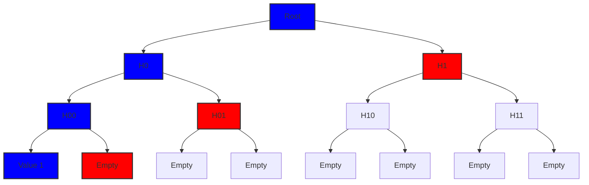
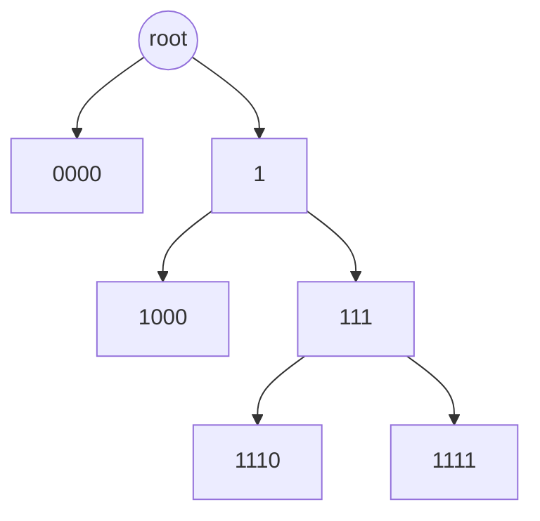
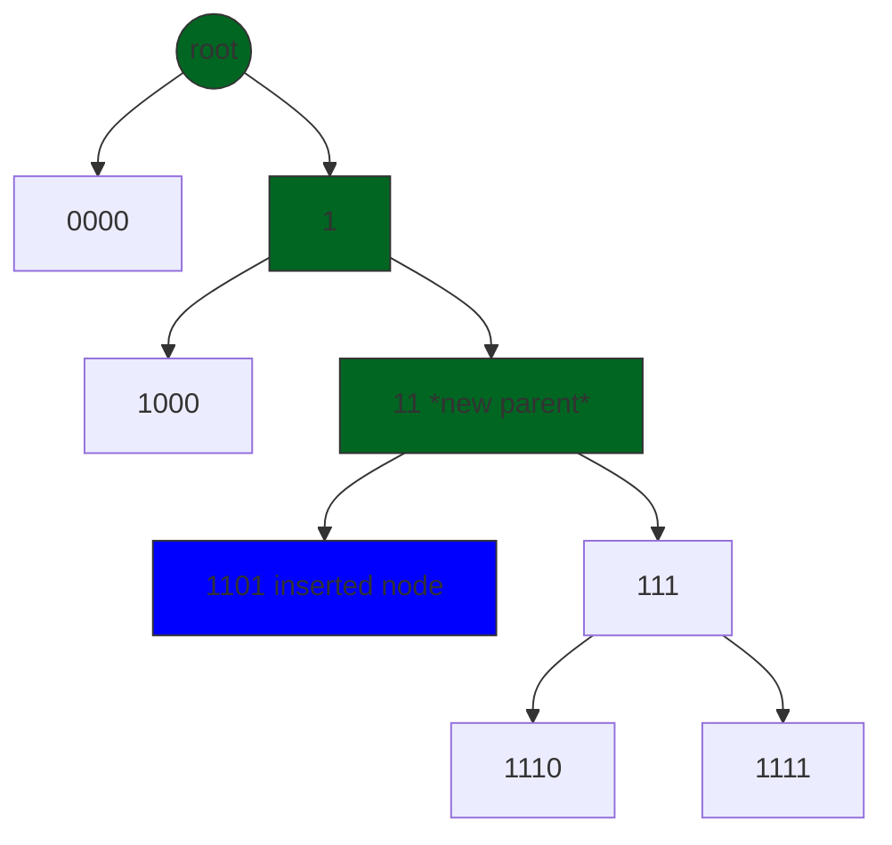
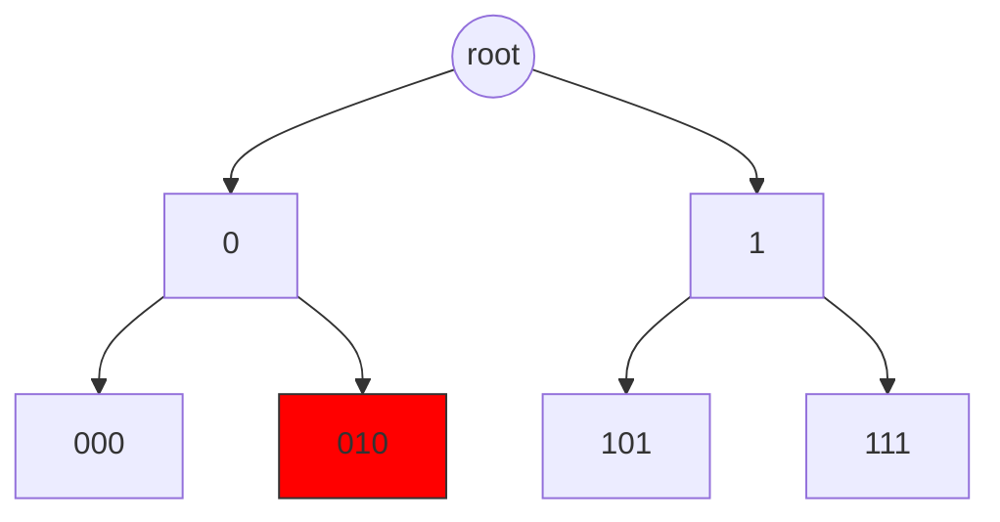
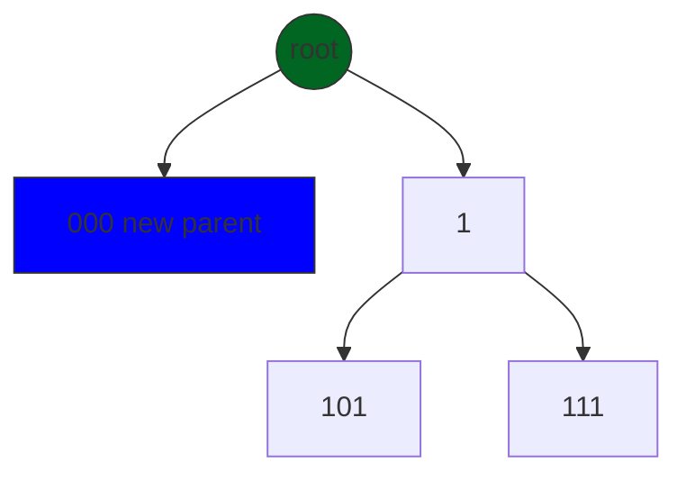

# Package store

The `store` package implements the storage layer for the Canopy blockchain, leveraging
**[BadgerDB](https://github.com/hypermodeinc/badger)** as its underlying key-value store. It
provides structured abstractions for nested transactions, state management, and indexed blockchain
data storage.

## **Core Components**

1. **`Txn`**: The foundational transactional layer. This implements ad-hoc **nested transactions** on top
   of BadgerDB, enabling atomic operations and rollbacks for complex storage workflows.

2. **`TxnWrapper` & `SMT`**:
   - **`TxnWrapper`**: Wraps BadgerDB to conform to the `RWStoreI` interface, providing a simple
     read/write abstraction with transaction support.
   - **`SMT`**: An optimized Sparse Merkle Tree implementation backed by BadgerDB. It adheres to the
     `RWStoreI` interface and enables efficient cryptographic commitment to state data and proof of
     membership/non-membership of the keys.

3. **`Indexer`**: Built on `TxnWrapper`, this component organizes blockchain data (blocks,
   transactions, addresses, etc.) using **prefix-based keys**. This design allows efficient
   iteration and querying of domain-specific data (e.g., "all transactions in block X").

4. **`Store`**: The top-level struct coordinating the storage layer:
   - **`Indexer`**: Manages indexed blockchain operations.
   - **`StateStore`**: Stores raw blockchain state data (blobs) using `TxnWrapper`.
   - **`StateCommitStore`**: Uses the `SMT` implementation to cryptographically commit hashes of
     `StateStore` data into the Sparse Merkle Tree, ensuring tamper-evident state verification.

## **Key Interactions**

- **Transactions**: `Txn` provides atomicity for operations across BadgerDB.
- **State Management**: `StateStore` (raw data) and `StateCommitStore` (hashes in SMT) work in
  tandem to balance performance with cryptographic integrity.
- **Querying**: The `Indexer`’s prefix-based structure enables fast, type-specific data retrieval.

This layered design decouples storage concerns while ensuring compatibility with BadgerDB’s
performance characteristics and the blockchain’s integrity requirements.

## Understanding BadgerDB and Transaction Management in Canopy

**[BadgerDB](https://github.com/hypermodeinc/badger)** is a fast, embeddable, persistent key-value
(KV) database written in pure Go. It's designed to be highly performant for both read and write
operations.

### Key Features

1. **LSM Tree-based**: Uses a Log-Structured Merge-Tree architecture, optimized for SSDs
2. **ACID Compliant**: Ensures data consistency through Atomicity, Consistency, Isolation, and
   Durability
3. **Concurrent Access**: Supports multiple readers and a single writer simultaneously
4. **Key-Value Separation**: Stores keys and values separately to improve performance
5. **Transactions**: Native support for both read-only and read-write transactions
6. **Iteration**: Provides efficient iteration over key-value pairs that are byte-wise
   lexicographically ordered

### TxnWrapper

BadgerDB's native transaction system provides atomic operations through its `Txn` type, supporting
both read-only and read-write transactions. Each transaction works with a consistent snapshot of the
database, ensuring data integrity during concurrent operations.

The `TxnWrapper` in Canopy builds upon this foundation by providing a clean abstraction layer over
BadgerDB's transaction system. It serves two main purposes:

1. **Interface Compliance**: Implements the `RWStoreI` interface, establishing a consistent contract
   for all storage operations within Canopy. This standardization ensures that different components
   can interact with the storage layer uniformly.

2. **Transaction Management**: Encapsulates BadgerDB's transaction handling, supporting both
   read-only and read-write operations. This wrapper simplifies transaction management by:
   - Providing a cleaner API for common database operations
   - Extending support of BadgerDB's iterator functionality
   - Returning errors in a consistent manner based on the project's error handling conventions

The main operations `TxnWrapper` is set to support according to the `RWStoreI` interface are:

- `Get(key []byte) ([]byte, ErrorI)`: Retrieves the value associated with the given key.
- `Set(key, value []byte) ErrorI`: Sets the value for the given key.
- `Delete(key []byte) ErrorI`: Deletes the value associated with the given key.
- `Iterator(prefix []byte) (IteratorI, ErrorI)`: Creates an iterator over byte-wise
  lexicographically sorted key-value pairs that start with the given prefix.
- `RevIterator(prefix []byte) (IteratorI, ErrorI)`: Creates a reverse iterator over byte-wise
  lexicographically sorted key-value pairs that start with the given prefix.

Note that all operations within `TxnWrapper` are neither committed nor rolled back directly, as
`TxnWrapper` operates within the broader transaction scope managed by the `Store` struct, which
handles the final commit or rollback decisions.

#### Key prefixing

All keys in `TxnWrapper` are automatically prefixed with a unique identifier (e.g., "s/" for state
store, "c/" for commitment store) to achieve two main purposes:

1. **Data Isolation**: Each component (`StateStore`, `StateCommitStore`, `Indexer`) maintains its own
   prefix-based namespace, preventing key collisions in the shared BadgerDB instance.

2. **Efficient Iteration**: Since BadgerDB stores keys in lexicographical order, prefixes enable
   efficient range queries within specific components. For example, iterating through all state
   store entries ("s/...") without touching commitment store data ("c/...").

These prefixes are only used internally and never exposed to the user.

## Txn ad hoc nested transactions implementation

## Canopy's Optimized Sparse Merkle Tree

A [Merkle Tree](https://en.wikipedia.org/wiki/Merkle_tree) is a data structure that enables
efficient and secure verification of large data sets. It works by hashing pairs of nodes and
progressively combining them upwards to create a single "root" hash that cryptographically commits
to all the data below it. A Sparse Merkle Tree (SMT) is a specialized variant that efficiently
handles sparse key-value mappings, making it particularly useful for storing state data and proof
the existence or non-existence of keys.

### Traditional Sparse Merkle Tree

In a traditional Sparse Merkle Tree, as illustrated above, each level splits into two child nodes,
creating a binary tree structure. The blue nodes show the path to `Value 1`, while the red nodes
represent the sibling hashes needed for proof verification. For example, to prove the existence of
`Value 1`, we need:

1. The hash of `Value 1` itself
2. Its immediate sibling hash (L1)
3. The sibling hash at the next level (H01)
4. And finally, H1 to reconstruct the root

This approach has significant limitations:

- **Storage overhead**: Even for sparse data, the tree maintains placeholder nodes for empty
  branches
- **Computational cost**: Proof generation requires multiple hash computations along the path
- **Scalability challenges**: As the tree grows, both storage and computational requirements
  increase exponentially

These limitations become particularly problematic in blockchain environments where efficiency and
scalability are crucial. Canopy's SMT implementation introduces several optimizations to address
these challenges while maintaining the security properties of traditional Sparse Merkle Trees.

### Canopy's Sparse Merkle Tree

Canopy's SMT implementation introduces key optimizations to address traditional SMT limitations:

1. **Optimized Node Structure**:
   - Nil leaf nodes for empty values
   - Parent nodes with single non-nil child are replaced by that child
   - A tree starts and always maintains two root children for consistent operations

2. **Efficient Tree Operations**:
   - Key organization via binary representation and common prefix storage for internal nodes
   - Targeted traversal that only visits relevant tree paths
   - Dynamic node creation/deletion with automatic tree restructuring

3. **Space and Performance**:
   - Eliminates storage of empty branches
   - Reduces hash computation overhead
   - Maintains compact tree structure without compromising security

### Core Algorithm Operations

1. **Tree Traversal**
   - Navigates downward to locate the closest existing node matching the target key's binary path

2. **Modification Operations**

   a. **Upsert (Insert/Update)**
   - Updates node directly if the target node matches current position
   - Otherwise:
     - Creates new parent node using the greatest common prefix between target and current node keys
     - Updates old parent's pointer to reference new parent
     - Sets current and target as children of new parent

   b. **Delete**
   - When target matches current position:
     - Removes current node
     - Updates grandparent to point to current's sibling
     - Removes current's parent node

3. **ReHash**
   - Progressively updates hash values from modified node to root after each operation
   - Ensures cryptographic integrity of tree structure.

#### Example operations

#### Insert 1101

Before

After

Steps:

1. **Path Finding**: Navigate down the tree following the binary path of '1101' until reaching the closest existing node ('111')

2. **Position Check**: Determine target node ('1101') doesn't exist at current position

3. **Parent Creation**: Form new parent node with key '11' (greatest common prefix between '1101' and '111')

4. **Restructure**: Update old parent to reference new parent node, making previous node ('111') a child of new parent

5. **Insert**: Add new node ('1101') as the second child of the new parent, maintaining binary tree properties

6. **ReHash**: Progressively updates hash values from the modified node'parent to the root after each
   operation, ensuring cryptographic integrity of tree structure as shown in the diagram in green.

#### Delete 010

Before

After

Steps:

1. **Path Finding**: Navigate down the tree following the binary path of '010' until reaching the
   target node

2. **Node Removal**: Remove target node ('010') from tree structure

3. **Parent Update**: Replace parent node '0' in grandparent with target's sibling '000'

4. **Tree Rehash**: Recalculate hash values upward from '000' parent to the root (on this case is the
   same as root) to maintain integrity as shown in the diagram in green.

### Proof Generation and verification

Canopy's SMT implementation supports both proof-of-membership and proof-of-non-membership through
the `GetMerkleProof` and `VerifyProof` methods. These proofs enable verification of whether a
specific key-value pair exists in the tree without requiring access to the complete tree data.

#### Proof Generation (`GetMerkleProof`)

The proof generation process constructs an ordered path from the target leaf node (or the closest
existing node where the key would reside if present) back to the root, by including every sibling
node encountered along each branch of this traversal.

1. **Initial Node**: The first element in the proof is always the target node (for membership
   proofs) or the node at the potential location (for non-membership proofs)

2. **Sibling Collection**: For each level from the leaf to the root:
   1. Record the sibling node's key and value
   2. Store the sibling's position (left=0 or right=1) in the bitmask
      - These siblings are essential for reconstructing parent hashes

#### Proof Verification (`VerifyProof`)

The verification process reconstructs the root hash using the provided proof and compares it with
the known root, if the hashes match, the resulting tree is then used in order to verify the
existence of the requested key-value pair. As a side note, unlike traditional sparse merkle trees,
both the key and value are required in order to generate the parent's hash:

1. **Initial Setup**:
    - Create a temporary in-memory tree
    - Add the first proof node (target/potential location)
    - The first proof node's key and value hash are then used to build the parent of the upcoming node

2. **Hash Reconstruction**:
    - For each sibling in the proof:
      - Use the bitmask to determine sibling position
      - Combine the current hash with the sibling's hash
      - Compute the parent hash using the same function as the main tree
      - Compute the parent's key by calculating the Greatest Common Prefix (GCP) of the current
        node's key and the sibling's key
      - Save the resulting parent node in the temporary tree

3. **Root Hash Validation**:
    - Compare reconstructed root hash with provided root
      - If the hashes do not match, the proof is invalid and the verification fails

4. **Final Verification**:
    - Traverse the temporary tree to verify the existence of the requested key-value pair
      - For membership proofs: Verifies target exists and value matches
      - For non-membership proofs: Confirms target doesn't exist at expected position

## Indexer operations and prefix usage to optimize iterations

## Store struct and how it adds up all together
